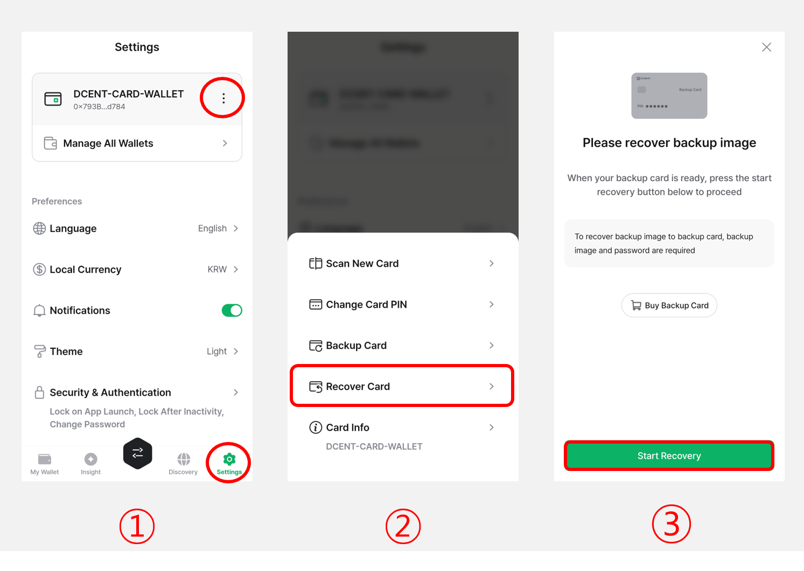
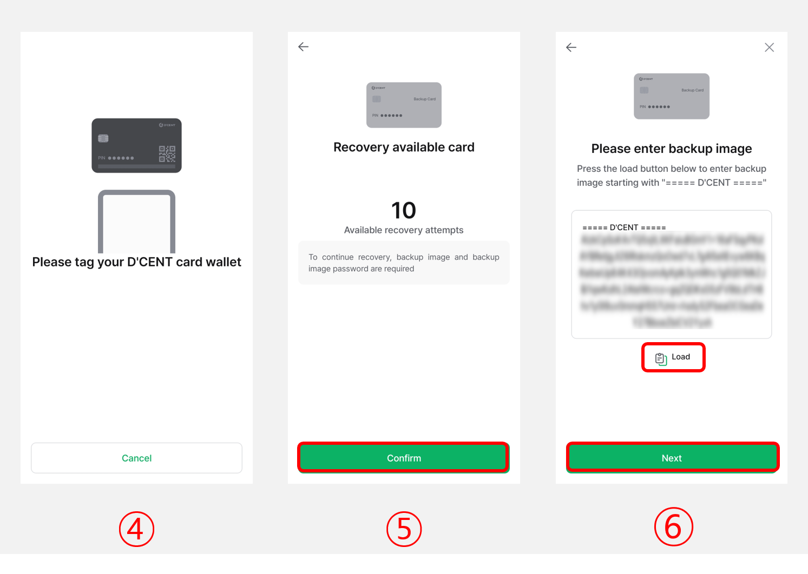
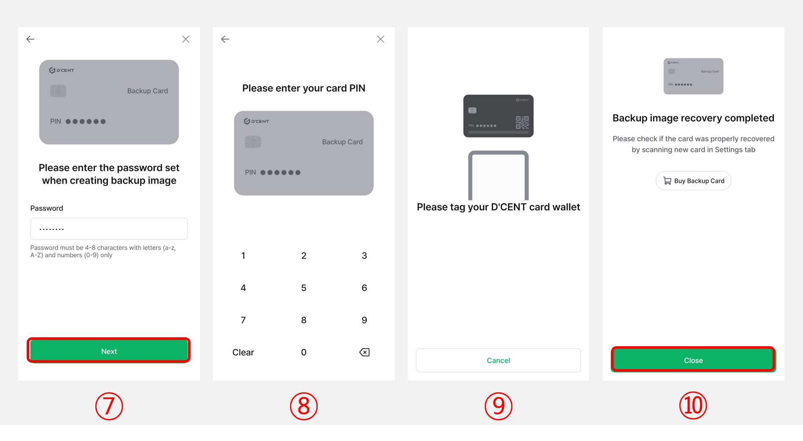
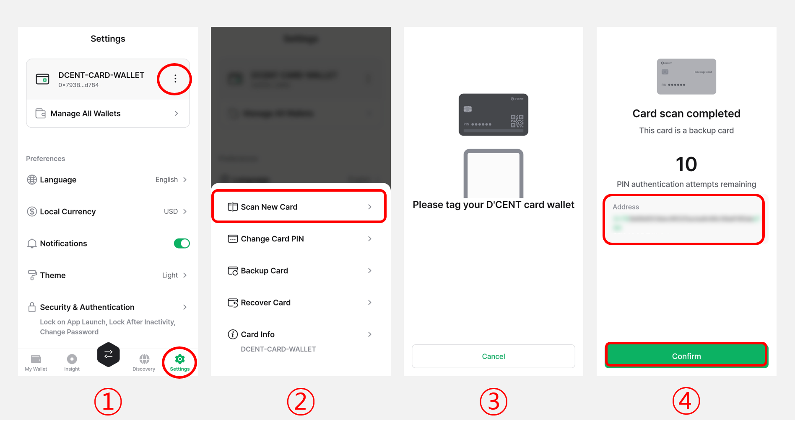

# Step 3: Recover backup image

## How to recover the backup image to a Backup Card

To recover a backup image,  please have your <mark style="background-color:green;">**Backup Card**</mark> ready.

<figure><figcaption></figcaption></figure>

**1)** Click the **More (⋮) button** in the **"Settings"** tab.

**2)** Select **"Recover Card"**.

**3)** Click on **"Start Recovery"**.

<figure><figcaption></figcaption></figure>

**4)** On the back of your phone, **tag the Backup Card**.&#x20;

**5)** The message **"Recovery available card"** will be shown along with the number of available recovery attempts. Click on **"Confirm"** to continue.


The number of recovery attempts indicates how many times you can try entering the backup image password. You are allowed up to **10 attempts**.


**6)** Click on the **"Load"** button to paste in the encrypted backup image data. Click on **"Next"** to continue.

<figure><figcaption></figcaption></figure>

**7)** Enter the **encryption password** which was used to encrypt the backup image. Click on **"Next"** to continue.

**8)** Enter the **PIN of your Backup Card**.

**9)** On the back of your phone, **tap the Backup Card**.

**10)** When the message **"Backup image recovery completed"** appears, **click on "Close"** to finish the recovery process.

## **How to check if the backup card has been successfully recovered**

<figure><figcaption></figcaption></figure>

**1)** Click the **More (⋮) button** in the **"Settings"** tab.

**2)** Select **"Scan New Card"**.

**3)** On the back of your phone, **tag the Backup Card**.&#x20;

**4)** If the message **"This card is a backup card"** is displayed, it means that the backup card has been successfully recovered. Please check whether the **address displayed on the screen** matches the **address shown on the original All-in-One Wallet**.
