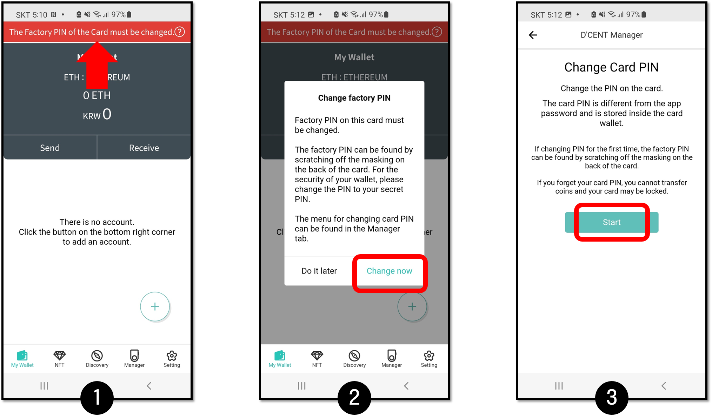
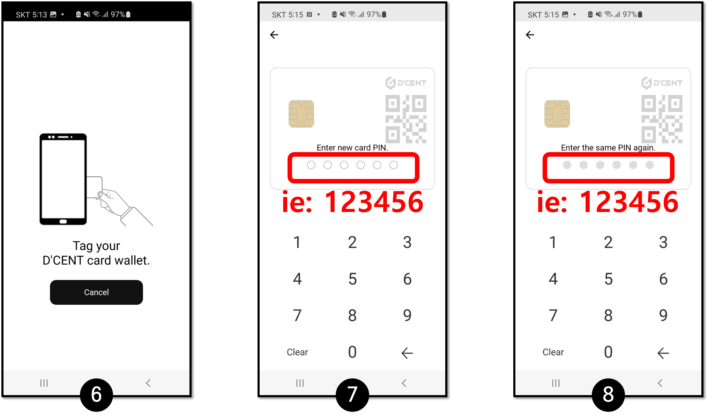
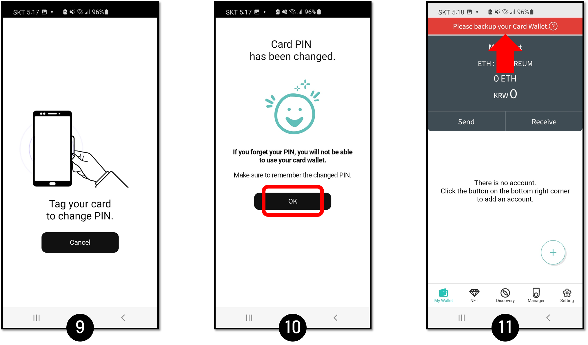

# Using Android mobile phone



## Enable NFC

First, you must enable NFC feature and set it to the "Standard mode" on your Android phone.

.png>)

## Mobile App download

If you have not installed the D'CENT mobile app, please proceed to download the mobile app.\
You can install mobile apps in one of three ways:

### Download D'CENT mobile app for Android

To download the D'CENT mobile app for Android, please click [here](https://play.google.com/store/apps/details?id=com.kr.iotrust.dcent.wallet).

### Download by tagging the Card type Wallet

If your NFC is enabled on your phone, tag the card type wallet against the back of your phone. If the tagging was read correctly,  you will be directed to the mobile app download site.

.png>)


If D'CENT mobile app is already installed on your phone, tagging the card type wallet will automatically run the D'CENT mobile app.


### Install by searching from the Google Play Store

You can install D'CENT mobile app by searching for the app directly from the Google Play Store.

Search for the keyword "**D'CENT Wallet**".

.png>)

## Mobile App basic setting

### Choose the Card type mode

When D'CENT mobile app is run for the first time, please make your selection as "**D'CENT Card Wallet**".

.png>)

### Register Mobile App password

To protect access to your mobile app, please register password. Your password will be 6-digit PIN and you must enter it twice. Each time you run the mobile app, you will need to enter your PIN to unlock it. Choose your PIN wisely and make sure to remember it.

### Card wallet tagging

Tag your card wallet against the reader on the back of your mobile phone. The position of the RFID reader on the phone varies by models.

.png>)

After tagging your card wallet, you are finished with the mobile app basic setup.

## Changing the factory PIN to your own PIN

Before you can use the Card type wallet, you must first change the factory PIN to your own PIN.

**1.** For a new card wallet, PIN change is required. There will be a message at the top of the screen. Click the message to proceed with the factory PIN change.

**2.** Click Change now.

**3.** Click Start.

.png>)

**4.** On your card wallet, **GENTLY** scratch off the masking to reveal the factory PIN.

**5.** Enter this factory PIN (6 digits).

**6.** Tag the card wallet to the back of your phone.

**7.** Enter your own new PIN. (ie: 123456)

**8.** Enter the same PIN. (ie: 123456)

**9.** Tag the card wallet to the back of your phone.

**10.** Press OK.

**11.** After a new PIN is set to your card wallet, the D'CENT App will show a different message at the top of the screen. It is highly recommended to back up your original card wallet.


[backupcard-new](backupcard-new/)


## Create default Account

When the mobile app basic setup is completed, you will see Ethereum as the default account that has been created.&#x20;

.png>)

Now, you can add ERC20 Token account. More information on how to add new token accounts can be found [here](../mobile-app/create-account/).

For the ERC721 (NFT) Tokens, you do not need to create any separate accounts. You can receive any NFT tokens directly to your Ethereum address.

* What is ERC20? To learn more about the basics of ERC20, please visit this [link](../cryptocurrency-basic/erc20.md).
* What is ERC721? To learn more about the basics of ERC721, please visit this [link](../cryptocurrency-basic/erc721-nft.md).

Card type Wallet supports the following : [https://dcentwallet.com/SupportedCoin](https://dcentwallet.com/SupportedCoin)

## Basic Usage Guide

To learn about how to use the Card type Wallet, please reference the following categories.


[receive.md](../coin-send-receive/receive.md)



[send](../coin-send-receive/send/)


