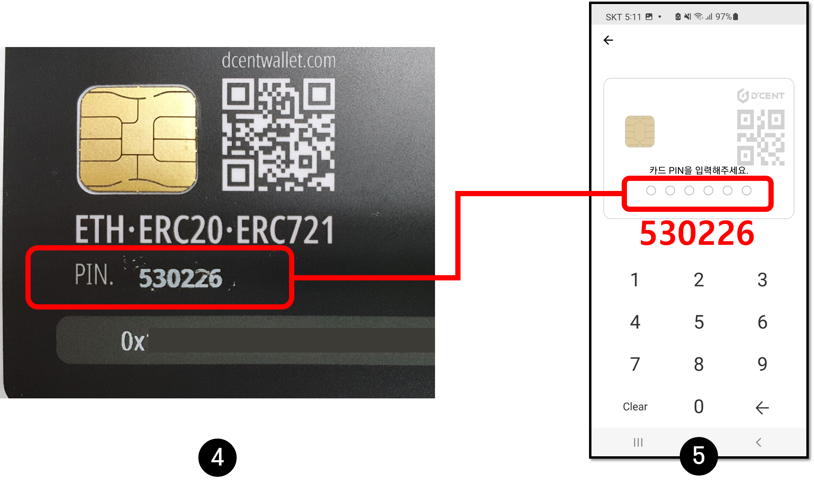
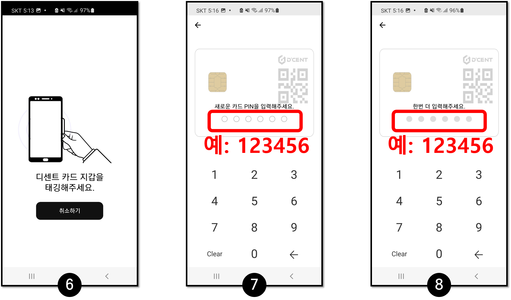
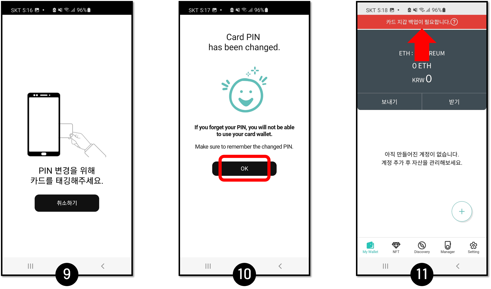

# 아이폰에서 사용하기



## 아이폰에서 NFC 기능 사용하기

아이폰에서 NFC기능은 아이폰7 이후 버전과 iOS 13 이후 버전에서만 사용할 수 있습니다.&#x20;

## 모바일 앱 다운로드

디센트 모바일 앱을 설치하지 않았다면 모바일 앱 다운로드를 진행해주세요. 다음 방법 중 하나를 통하여 모바일 앱을 설치할 수 있습니다.

### 아이폰 앱 다운로드 링크

디센트 모바일 앱을 다운로드 받으시려면 [여기](https://apps.apple.com/kr/app/dcent-hardware-wallet/id1447206611)를 클릭하세요.

### 앱 스토어에서 검색하여 설치

앱 스토어에서 검색하여 디센트 모바일 앱을 설치할 수도 있습니다.

앱 스토어에서 "디센트" 또는 "D'CENT" 검색하세요.

.png>)

## 모바일 앱 초기 설정

### 카드 타입 모드 선택

디센트 모바일 앱을 처음 실행하면 지갑 타입을 선택해야 합니다. "D'CENT Card Wallet"을 선택해주세요.

.png>)

### 앱 비밀번호 등록

앱을 보호하기 위해 앱 비밀번호를 등록해주세요. 6자리 숫자를 두 번 입력하시면 됩니다. 앱 비밀번호는 디센트 모바일 앱을 실행할 때마다 필요합니다. 꼭 기억해두세요.

### 카드 월렛 태깅

가지고 있는 카드 월렛을 모바일 폰에 태깅해 주세요. 폰에서 카드를 인식할 수 있는 위치는 폰의 종류마다 다릅니다. 아이폰은 주로 상단에 NFC 센서가 위치하고 있습니다.&#x20;

.png>)

카드 태깅이 성공하면 모바일 앱 초기화가 완료됩니다.

## 초기 PIN을 자신만의 새로운 PIN으로 변경

카드형 지갑을 사용하기 위해서는 먼저 초기 비밀번호를 자신만의 비밀번호로 변경해야 합니다.

.png>)

**1.** 신규 카드지갑은 비밀번호 변경이 필요합니다. 화면 상단에 메시지가 표시됩니다. 메시지를 클릭하여 초기 PIN 변경을 진행합니다.

**2.** 지금 변경하기를 클릭합니다.

**3.** 시작하기를 클릭합니다.

**4.** 카드 지갑에서 마스킹을 부드럽게 긁어서 초기 PIN을 확인합니다.

**5.** 초기 PIN(6자리)을 입력합니다.

**6.** 카드 지갑을 휴대폰 뒷면에 태그합니다.&#x20;

**7.** 새로운 PIN을 입력합니다. (예: 123456)&#x20;

**8.** 동일한 PIN을 입력합니다. (예: 123456)

**9.** 카드 지갑을 휴대폰 뒷면에 태깅하세요.&#x20;

**10.** 확인(OK)을 누릅니다.&#x20;

**11.** 카드지갑에 새로운 비밀번호가 설정되면 디센트 앱의 화면 상단에 다른 메시지가 표시됩니다. 원본의 카드 지갑을 백업하시는 것을 강력하게 추천합니다.


[backupcard-new](backupcard-new/)


## 기본 생성 계정

카드 타입 콜드월렛 모드로 초기화되면, 기본적으로 이더리움 계정이 생성되어 있습니다.&#x20;

.png>)

이제 ERC20 토큰 계정을 추가할 수 있습니다. 계정 추가에 대한 자세한 내용은 [여기](../mobile-app/create-account/)를 참고하세요.

ERC721 토큰(NFT)은 계정 추가 없이 바로 사용할 수 있습니다.

* ERC20 토큰이란? [여기](../cryptocurrency-basic/erc20.md)를 참고하세요.
* ERC721 토큰이란? [여기](../cryptocurrency-basic/erc721-nft.md)를 참고하세요.

카드타입 콜드월렛에서 지원하는 코인 리스트는 [https://dcentwallet.com/SupportedCoin](https://dcentwallet.com/SupportedCoin) 에서 확인할 수 있습니다.
