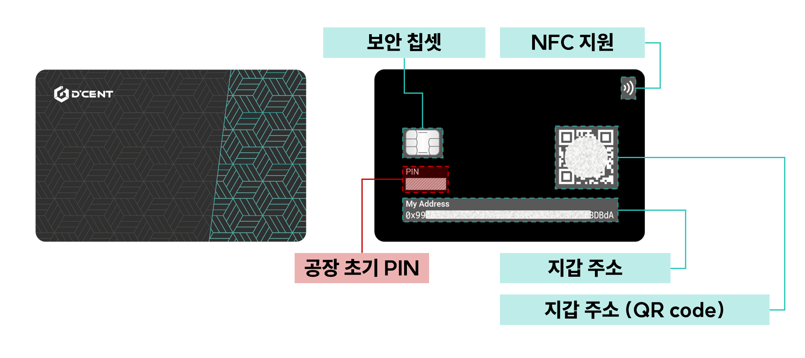

# 올인원 지갑 (소개)

<figure><figcaption>
디센트 올인원 지갑 - 이더리움 EVM 호환 네트워크를 위한 가장 혁신적인 카드형 하드웨어 지갑
</figcaption></figure>

## 디센트 올인원 지갑이란? 

**디센트 올인원 지갑**은 암호화폐 자산을 안전하고 편리하게 보관하고 관리할 수 있는 방법을 찾는 모든 분들을 위한 최고의 솔루션입니다. <mark style="color:red;">은행 등급 인증을 받은 보안 칩셋과 개인키를 위한 암호화된 저장소</mark>를 통해 사용자는 자산을 안전하게 보호할 수 있습니다.&#x20;

<figure><figcaption></figcaption></figure>

디센트 올인원 지갑은 이더리움, 바이낸스 스마트 체인, 폴리곤, 클레이튼, XDC 네트워크 및 기타 여러 인기 스마트 컨트랙트 플랫폼을 포함해 <mark style="color:red;">20개 이상의 이더리움 EVM 호환 블록체인 네트워크를 지원</mark>합니다.

| Ethereum (ETH)    | Ethereum Classic (ETC)     | Metadium (META)         |
| ----------------- | -------------------------- | ----------------------- |
| Klaytn (KLAY)     | KuCoin Chain (KCC)(KCS)    | Eneregy Web Chain (EWT) |
| XDC Network (XDC) | HECO (HT)                  | Boba (ETH)              |
| Polygon (MATIC)   | Binance Smart Chain (BNB)  | Palm (PALM)             |
| Oasys (OAS)       | Celo (CELO)                | Gnosis xDAI (XDAI)      |
| Avalanche (AVAX)  | Cronos (CRO)               | Harmony (ONE)           |
| Arbitrum (ETH)    | OEC - OKEX Chain (OKT)     | OpenChain (OPC)         |
| Optimism (ETH)    | Fantom (FTM)               | Orbit Chain (OORC)      |
| Flare (FLR)       | Songbird (SGB)             |                         |

하지만 올인원 지갑은 단순한 보안 스토리지 솔루션이 아닌 탈중앙화 세계로 가는 관문입니다. 사용자는 <mark style="color:red;">내장된 디앱 브라우저(디스커버리)</mark>를 통해 게임, NFT, NFT 마켓플레이스, 디파이, 대출, 메타버스 등 다양한 블록체인 기반 서비스에 지갑을 쉽게 연결할 수 있습니다. 또 다른 멋진 기능은 <mark style="color:red;">내장된 NFT 수집품 탭</mark>으로, 사용자가 지갑에 저장된 NFT를 쉽고 편리하게 관리 할 수 있습니다.

<figure><figcaption></figcaption></figure>

올인원 지갑의 주요 편의성 중 하나는 [**독특한 백업 방식**](../dcent-backup-card-wallet-recovery/)입니다. 기존의 니모닉 코드를 사용하는 대신 <mark style="color:red;">최첨단 암호화 기술을 사용해 개인키를 백업하고, 여분의 백업 카드로 개인키를 안전하게 복구</mark>합니다. 이 방식은 사용하기 쉽고 보안성이 뛰어나 사용자가 안심하고 자산을 보호할 수 있습니다.

올인원 지갑의 또 다른 편리한 기능은 휴대폰에 <mark style="color:red;">카드를 탭(태깅/터치)하는 것만으로 블록체인 거래에 서명</mark>할 수 있는 기능입니다. 이는 NFC 통신을 통해 사용자는 부피가 큰 하드웨어 장치나 복잡한 소프트웨어 없이도 이동 중에 자산을 매우 쉽게 관리할 수 있습니다.

전반적으로 디센트 올인원 지갑은 보안, 편의성, 접근성의 완벽한 조합으로, 암호화폐 자산을 관리하고 탈중앙화 세계를 탐험하고자 하는 모든 이들에게 이상적인 선택입니다.

## Specifications

<figure><figcaption></figcaption></figure>

**보안칩셋**\
개인 키를 안전하게 보관하기 위한 은행 등급의 인증된 보안 칩셋입니다.

<mark style="background-color:red;">**공장 초기 PIN**</mark>\
리본 마스킹으로 감춰진 하드웨어 지갑의 공장 출하 시 초기 PIN입니다. 하드웨어 지갑을 사용하려면 이 공장 초기 PIN을 본인의 PIN으로 변경해야 합니다.

**지갑 주소** \
지갑 주소는 카드 표면에 인쇄되어 있습니다. 사용자는 빠른 P2P 거래를 위해 QR 코드를 제시하여 암호화폐 자산을 받을 수 있습니다.

**NFC 지원** \
NFC를 사용하면 휴대폰 뒷면에 카드를 탭하는 것만으로 빠르게 거래에 서명할 수 있습니다.

<mark style="background-color:green;">**디센트 올인원 지갑 구매하기  👇👇👇**</mark>



