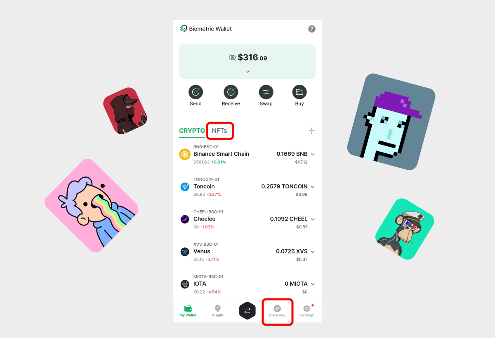

# All-in-One Wallet (Introduction)

<figure><figcaption>
D'CENT All-in-One card type wallet - the ultimate hardware wallet for the EVM compatible networks
</figcaption></figure>

## What is D'CENT All-in-One Wallet?

The **D'CENT All-in-One Wallet** is the ultimate solution for anyone looking for a secure and convenient way to store and manage their cryptocurrency assets. With its <mark style="color:red;">bank-grade certified secure chipset and encrypted storage for private keys</mark>, users can rest assured that their assets are safe and secure.&#x20;

<figure><figcaption></figcaption></figure>

The D'CENT All-in-One Wallet <mark style="color:red;">supports over 20+ Ethereum EVM-compatible blockchain networks</mark>, including Ethereum, Binance Smart Chain, Polygon, Klaytn, XDC Network, and many other popular smart contracts platforms.

| Ethereum (ETH)    | Ethereum Classic (ETC)     | Metadium (META)         |
| ----------------- | -------------------------- | ----------------------- |
| Klaytn (KLAY)     | KuCoin Chain (KCC)(KCS)    | Eneregy Web Chain (EWT) |
| XDC Network (XDC) | HECO (HT)                  | Boba (ETH)              |
| Polygon (MATIC)   | Binance Smart Chain (BNB)  | Palm (PALM)             |
| Oasys (OAS)       | Celo (CELO)                | Gnosis xDAI (XDAI)      |
| Avalanche (AVAX)  | Cronos (CRO)               | Harmony (ONE)           |
| Arbitrum (ETH)    | OEC - OKEX Chain (OKT)     | OpenChain (OPC)         |
| Optimism (ETH)    | Fantom (FTM)               | Orbit Chain (OORC)      |
| Flare (FLR)       | Songbird (SGB)             |                         |

But the All-in-One Wallet is more than just a secure storage solution, it's a gateway to the decentralized world. The <mark style="color:red;">built-in dApp browser (Discovery)</mark> allows users to easily connect their wallets to a wide range of blockchain-based services, including Games, NFTs, NFT marketplaces, DeFi, lending and borrowing, the metaverse, and more. Another cool feature is the <mark style="color:red;">built-in NFT collectibles tab</mark>, which allows users to conveniently manage and display NFTs stored in their wallets.

<figure><figcaption></figcaption></figure>

One of the key conveniences of the All-in-One Wallet is its [**unique backup method**](../dcent-backup-card-wallet-recovery/). Rather than using a traditional mnemonic code, <mark style="color:red;">the private key is backed up using state-of-the-art encryption technology, which securely transfers the private key to a spare Backup Card</mark>. This method is both easy to use and highly secure, giving users peace of mind that their assets are protected.

Another convenient feature of the All-in-One Wallet is its ability to <mark style="color:red;">sign blockchain transactions with just a tap of the card</mark> on a smartphone. This NFC communication makes it incredibly easy for users to manage their assets on the go, without needing a bulky hardware device or complicated software.

Overall, the D'CENT All-in-One Wallet is the perfect combination of security, convenience, and accessibility, making it an ideal choice for anyone looking to take control of their crypto assets and explore the decentralized world.

## Specifications

<figure><figcaption>
D'CENT All-in-One Wallet specification 
</figcaption></figure>

**Secure Chipset**\
It's a bank-grade certified secure chipset for safekeeping private keys.

<mark style="background-color:red;">**Factory PIN**</mark> \
This is the factory PIN of the hardware wallet which is concealed by ribbon masking. This factory PIN must be changed to your own PIN before the hardware wallet can be used.

**Wallet Address**\
Wallet address is printed on the card surface. Users can present the QR code for quick P2P transactions to receive cryptocurrency assets.

**NFC Support**\
NFC allows users to quickly sign transactions with a simple tap of the card on the smartphone.

<mark style="background-color:green;">**Buy a D'CENT All-in-One Wallet  👇👇👇**</mark>



