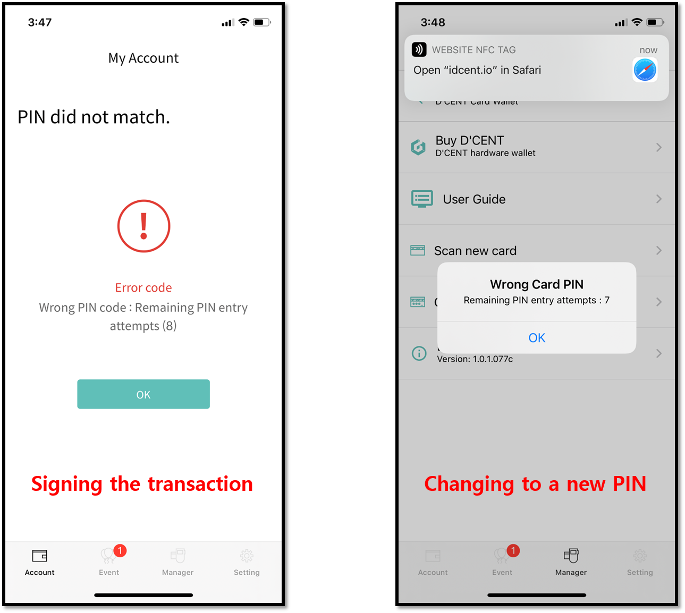

# 올인원 지갑 사용 방법

## 코인/토큰 계정 추가하는 방법

새로운 암호화폐 계정을 추가하는 방법은 매우 간단합니다. 앱 오른쪽 하단의 (+) 버튼을 누르고 지갑에 추가할 자산을 선택하기만 하면 됩니다.


[create-account](../../mobile-app/create-account/)


올인원 지갑은 모든 ERC20 유형의 토큰 자산을 지원합니다. 디센트 월렛에는 3,000개 이상의 토큰 자산이 등록되어 있으며, 목록 검색을 통해 간단히 추가할 수 있습니다. 목록에 없는 토큰 자산의 경우 사용자가 직접 토큰 계정을 추가할 수 있습니다.


[how-to-add-a-custom-token-account.md](../../mobile-app/create-account/how-to-add-a-custom-token-account.md)


## 암호화폐 자산을 받거나 보내는 방법

지갑에서 암호화폐 자산을 받는 방법은 간단합니다. 송금할 상대방과 지갑 주소를 공유하기만 하면 됩니다.


[receive.md](../../coin-send-receive/receive.md)


암호화폐 자산을 다른 사람에게 보내는 것도 마찬가지로 쉽습니다. 송금할 수취인의 지갑 주소만 알면 됩니다.


[send](../../coin-send-receive/send/)


## 수집품 탭(NFT 갤러리) 사용 방법&#x20;

올인원 지갑은 ERC721 및 ERC1155 표준을 기반으로 대체불가토큰(NFT)을 안전하게 보관할 수 있는 기능을 제공합니다. 디센트 앱(수집품 탭)을 통해 하드웨어 지갑에 저장된 NFT를 보고 관리(전송, 수신, 내역 보기)할 수 있습니다.&#x20;

아래 링크에서 수집품 탭 사용에 대한 자세한 정보를 확인할 수 있습니다.


[nft.md](../../coin-send-receive/nft.md)


## 디스커버리 탭(디앱 브라우저) 사용 방법&#x20;

올인원 지갑은 디스커버리 탭(디센트 앱에 내장된 디앱 브라우저)을 제공하여 게임, NFT, NFT 마켓플레이스, 디파이, 대출, 메타버스 등 다양한 블록체인 기반 서비스에 쉽게 연결할 수 있습니다.&#x20;

아래 링크에서 디스커버리 탭 사용에 대한 자세한 정보를 확인할 수 있습니다.


[discovery](../../native-service/discovery/)


## 🚨 <mark style="color:red;">주의</mark>: 올인원 지갑 영구 차단

올인원 지갑을 사용하는 동안 다음과 같은 경우에 하드웨어 지갑의 PIN을 입력하라는 메시지가 표시됩니다:

1\) 트랜잭션에 서명할 때

2\) 현재 PIN을 새로운 PIN으로 변경할 때


<mark style="color:red;">보안을 위해 올바른 PIN을 입력하기 위해 총 10번의 시도를 할 수 있습니다. 올인원 지갑의 보안 칩셋은 인증 시도가 실패한 횟수를 계속 카운트합니다. 잘못된 PIN을 10회 연속으로 입력하면 하드웨어 지갑의 보안 칩셋이 영구적으로 차단됩니다. 즉, 올인원 지갑에 저장된 모든 암호화폐 자산에 더 이상 액세스할 수 없고 영원히 손실됩니다.</mark>

<mark style="color:red;">**미리 여분의 디센트 백업 카드로 올인원 월렛의 백업을 만들어 두시기 바랍니다.**</mark>


<mark style="background-color:green;">**디센트 백업 카드 구매하기  👇👇👇**</mark>

{% embed url="https://store-kr.dcentwallet.com/collections/frontpage/products/%EB%B0%B1%EC%97%85%EC%B9%B4%EB%93%9C" %}

