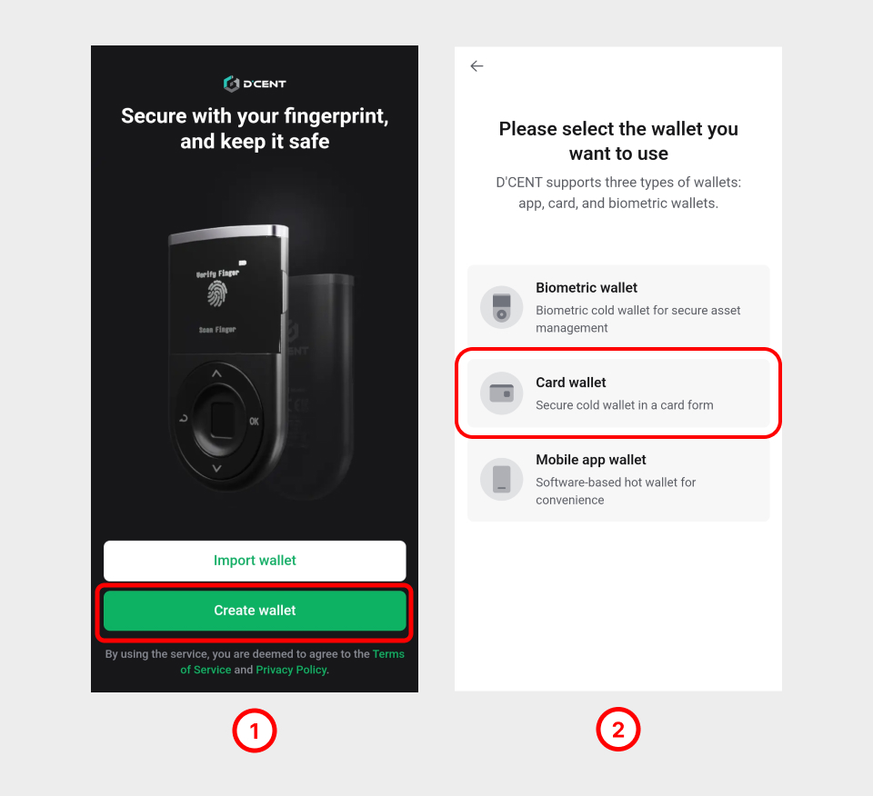

# Set up your All-in-One Wallet


<mark style="color:red;">To use All-in-One Wallet with iOS phone devices, the NFC function is required. NFC function is supported by models starting from iPhone7 and newer. Additionally, the iOS version must be 13 or higher.</mark>&#x20;


## Enable NFC on your phone

For iOS phones, the NFC function is enabled by default.&#x20;

For Android, enable the NFC function as '**Standard mode**'.

## Download D'CENT App (Android & iOS)

To download from the mobile app stores, type <mark style="background-color:green;">D'CENT Wallet</mark> as the keyword search or use the official download links below.





## First, set up your D'CENT App

<figure><figcaption></figcaption></figure>

**1.** Click on '**Create wallet**'.&#x20;

**2.** Click on '**Card wallet**'.&#x20;

### Set up a password to D'CENT App

Register your own 6-digit password for D'CENT App. **This is the password to unlock your D'CENT App.** If you don't remember the 6-digit password, you will have to reinstall the D'CENT App.

<figure><figcaption></figcaption></figure>

**3.** Enter your own 6-digit PIN for the App.

**4.** Re-enter the same 6-digit PIN.

**5.** Skip or Enable Biometric authentication. You can skip if you want to use only the 6-digit PIN to unlock the D'CENT App.

## Set up the All-in-One Wallet

### Scan your All-in-One Wallet

<figure><figcaption></figcaption></figure>

**1.** On the back of your phone, **tag the All-in-One Wallet** to scan.

**2.** Click on '**OK**' to continue.


Each phone model has an RFID reader positioned at a different part of the phone device. If the card wallet is not recognized, try tapping it in different areas to find the exact position of the RFID reader.

If you have a protective cover on your phone, it may interfere with scanning the card wallet. Please remove the phone cover to improve the scanning performance of your phone and try again.&#x20;


### Change the factory PIN to your own PIN

The factory PIN of the All-in-One Wallet must be changed to your own PIN before it can be used.

<figure><figcaption></figcaption></figure>

**3.** At the top of the screen, click on the message to change the factory PIN.

**4.** Click on '**Change now**'.

<figure><figcaption></figcaption></figure>

**5.** From your All-in-One Wallet, find the factory PIN by removing the ribbon masking.

**6.** Enter this **6-digit factory PIN**. (ie: 530226)

**7.** On the back of your phone, **tap the All-in-One Wallet** to scan.


When removing the ribbon masking, please be careful not to use sharp tools as this may damage the card wallet.


<figure><figcaption></figcaption></figure>

**8.** Enter a **new PIN** for your All-in-One Wallet. (ie: 123456)

**9.** Enter the **same new PIN**. (ie: 123456)

**10.** On the back of your phone, **tag the All-in-One Wallet** to scan.

<figure><figcaption></figcaption></figure>

**11.** Click on '**OK**' to complete the setup.

**12.** You can start using the All-in-One Wallet from this point.

