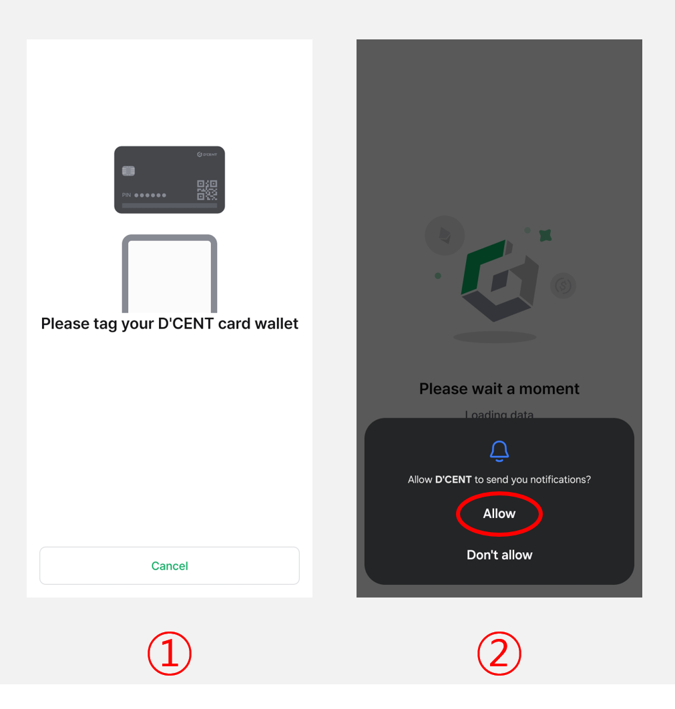

# Set up your All-in-One Wallet


<mark style="color:red;">To use All-in-One Wallet with iOS phone devices, the NFC function is required. NFC function is supported by models starting from iPhone7 and newer. Additionally, the iOS version must be 13 or higher.</mark>&#x20;


## Enable NFC on your phone

For iOS phones, the NFC function is enabled by default.&#x20;

For Android, enable the NFC function as **"Read/write NFC tags"**.

## Download D'CENT App (Android & iOS) 

To download from the mobile app stores, type <mark style="background-color:green;">**D'CENT Wallet**</mark> as the keyword search or use the official download links below.





## Mobile App basic setting

### Select Wallet mode

If you are launching the mobile app for the first time, you will need to go through the initial setup and select a wallet mode.


This guide is based on **D’CENT mobile app version 8.0.0**.


When the app launches, select **“Card Wallet”** as shown below.

<figure><figcaption></figcaption></figure>

## **App Password Registration**

To protect your **D'CENT mobile app**, you must set a **6-digit password**. This **app password** will be required **every time you launch the D'CENT mobile app**, so be sure to remember it.

If you don't remember the 6-digit password, you will have to reinstall the D'CENT App.

<figure><figcaption></figcaption></figure>


You can change your **app password** later through the app [**Settings menu**](https://userguide.dcentwallet.com/mobile-app/mobile-app-setting-menu)**.**&#x20;

In addition to the app password, you can also **enable fingerprint recognition** for added security.


## **Mobile App Permission Settings** 

A permission request popup will appear when you launch the D’CENT mobile app. Review the permissions being requested, then click **“Confirm”** button to proceed.

<figure><figcaption></figcaption></figure>

## Set up the All-in-One Wallet

### Scan your All-in-One Wallet

<figure><figcaption></figcaption></figure>

**1)** On the back of your phone, **tag the All-in-One Wallet** to scan.

**2)** Tap the **"Allow"** button to proceed with notification permission. You can turn notifications **On / OFF** at any time from the **"Settings"** menu.\
For more details about the notification feature, please refer to [**this guide**](https://userguide.dcentwallet.com/mobile-app/mobile-app-setting-menu#notification).


**Each phone model has an NFC reader positioned at a different part of the phone device. If the card wallet is not recognized, try tapping it in different areas to find the exact position of the NFC reader.**

If you have a protective cover on your phone, it may interfere with scanning the card wallet. Please remove the phone cover to improve the scanning performance of your phone and try again.&#x20;


<figure><figcaption></figcaption></figure>

**3)** Once the All-in-One Wallet is successfully scanned, **wallet synchronization will begin**.

**4)** After the sync is complete, the **My Wallet** tab will display **three default coin accounts**: Ethereum, Kaia, and Polygon. You can also tap the **“+ Add Account”** button to add more coin accounts.

### Change the factory PIN to your own PIN

When you first scan the All-in-One Wallet, a banner will appear prompting you to change the factory PIN.

To use the All-in-One Wallet for sending coins or backing up the card, **you must change the factory PIN to your own PIN.**

<figure><figcaption></figcaption></figure>

**1)** At the top of the screen, click on the banner to change the factory PIN.

**2)** Click on **"Change now".**

**3)** Check **“I have checked the information”**, then click the **“Start”** button.

<figure><figcaption></figcaption></figure>

**4)** From your All-in-One Wallet, find the factory PIN by removing the ribbon masking.


**When removing the ribbon masking, please be careful not to use sharp tools as this may damage the card wallet.**


**5)** Enter this **6-digit factory PIN**. (ie: 530226)

**6)** On the back of your phone, **tap the All-in-One Wallet** to scan.

<figure><figcaption></figcaption></figure>

**7)** Enter a **new PIN** for your All-in-One Wallet. (ie: 123456)

**8)** Enter the **same new PIN**. (ie: 123456)

**9)** On the back of your phone, **tag the All-in-One Wallet** to scan.

**10)** Click the **“Confirm”** button to complete the PIN change process.
