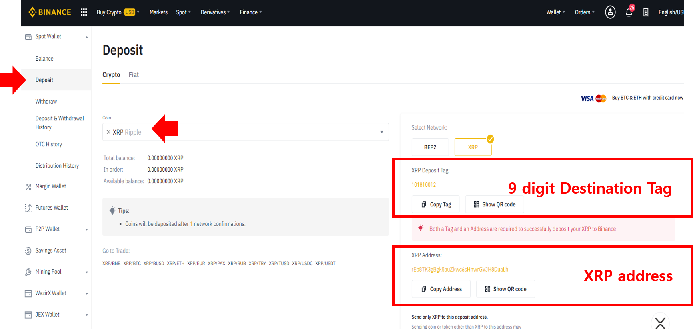
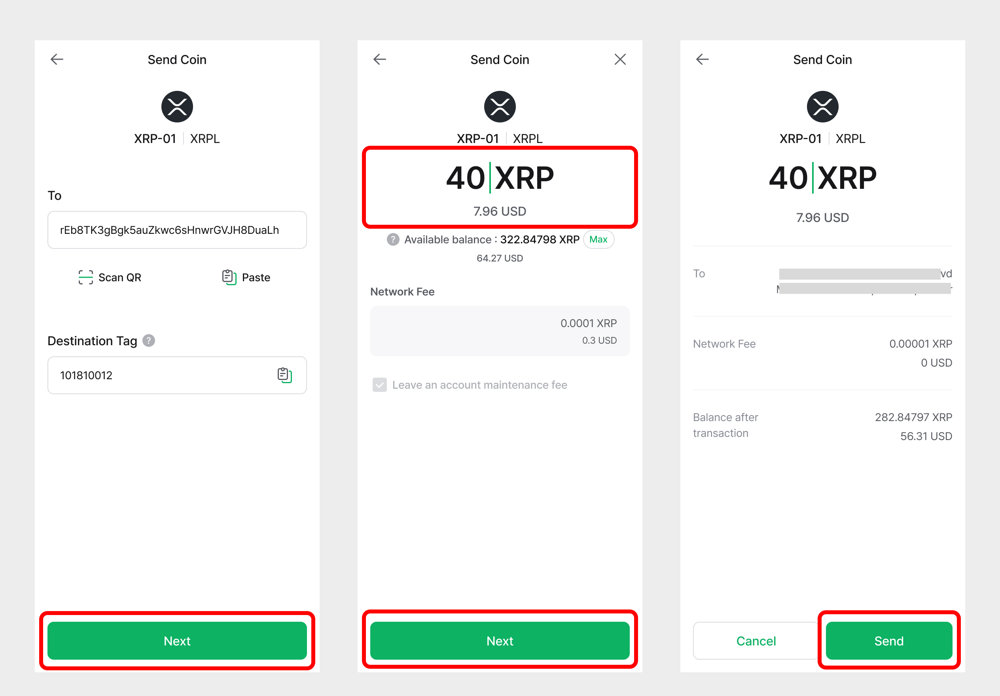
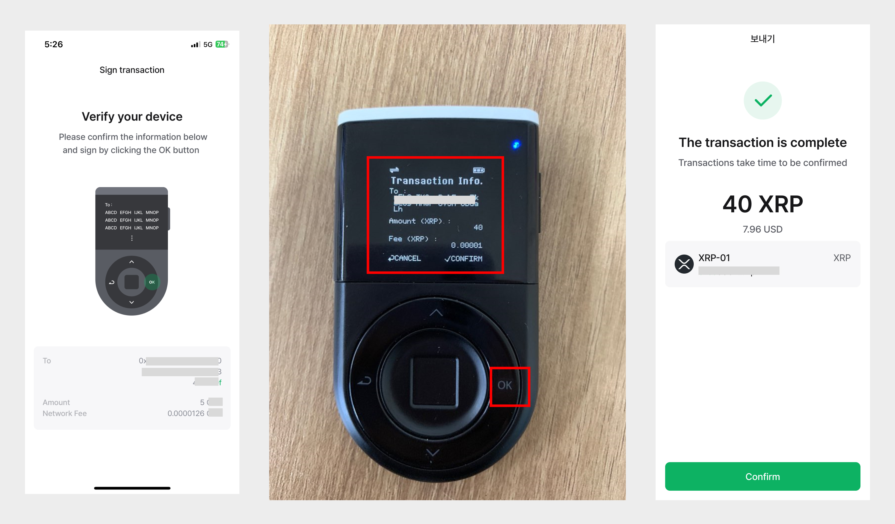
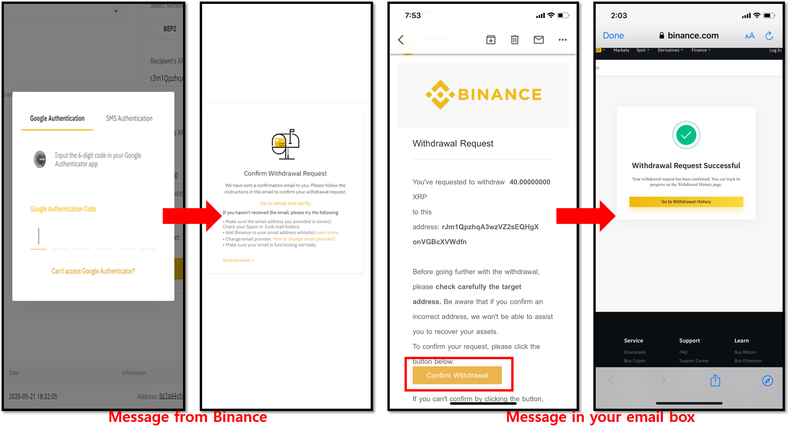
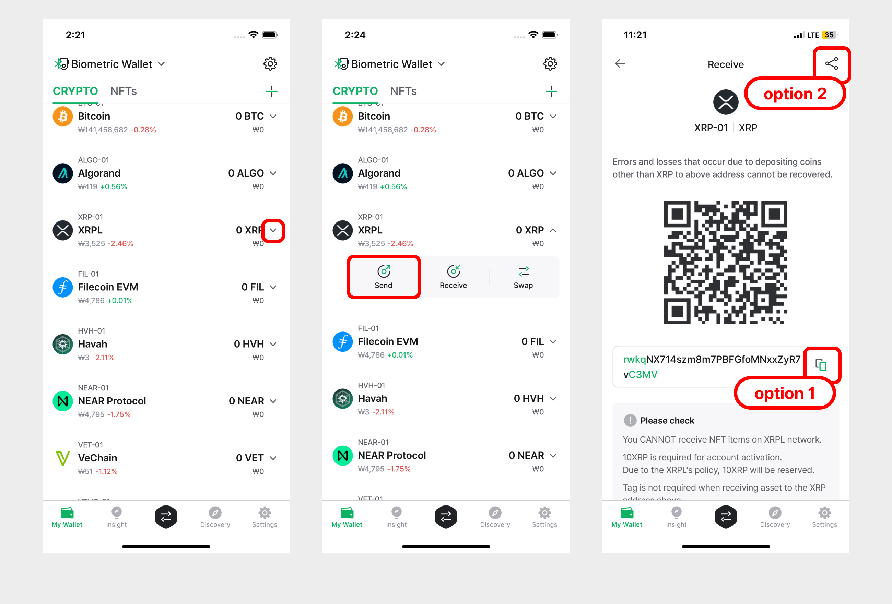

# 바이낸스 거래소 사용법 (리플 예시)

## 바이낸스 월렛 주소로 입금 받기&#x20;

### 바이낸스 월렛에서 송금 받을 주소 확인

바이낸스 계정으로 암호화폐를 보내려면 주소를 알아야합니다. 먼저 바이낸스 계정에 로그인하여 사용할 지갑(예: '**Spot Wallet**')을 선택하십시오.

1\) '**Deposit**' 메뉴를 선택합니다.

2\) 거래하려는 암호화폐를 드랍다운 목록에서 선택합니다 (예: **XRP**).

3\) 9자리 XRP Deposit Tag가 존재하는 것을 확인하실 수 있습니다. **해당 태그는 거래소의 지갑 주소로 송금을 보내는 경우 반드시 필요합니다.**&#x20;

4\) 추가적으로 바이낸스 거래소의 XRP 지갑 주소가 표시된 것을 확인하실 수 있습니다.

### 디센트 월렛에서 송금 거래 준비

모바일 앱을 먼저 실행하고 디센트 기기과 함께 연결된 상태인지 반드시 확인하시기 바랍니다.

.jpg>)

1\) 암호화폐 계정 (예 : XRP)에서 '**보내기**' 버튼을 누릅니다.

2\) '**QR 스캔**' 버튼을 눌러 바이 낸스가 제시 한 QR 코드를 스캔하면 주소가 자동으로 입력됩니다.

3\) 바이낸스 거래소에서 XRP 계정과 함께 할당받은 Destination Tag(또는 Deposit Tag)를 반드시 입력해야정상적으로 입금이 됩니다.

.jpg>)

4\) 거래소의 주소와 태그를 모두 입력했으면 '**다음**'을 눌러 계속하십시오.&#x20;

5\) XRP 갯수 또는 법정화폐로 보낼 금액을 입력하십시오.&#x20;

6\) 계속하려면 'Next'를 누르십시오.&#x20;

7\) 거래 내역을 검토하고 '**보내기**'를 눌러 계속하십시오.

8\) 디센트 기기에서 거래 정보를 확인하고 '**OK**' 버튼을 눌러 승인하십시오. **지문을 입력하거나 또는 PIN을 사용하여 인증해야합니다**.&#x20;

9\) 인증에 성공하면 송금 거래가 블록체인 네트워크로 전송이됩니다.&#x20;

10\) 바이낸 계정으로 돌아가 디센트월렛에서 송금을 보낸 암호화폐가 입금되었는지 확인하십시오.

## 디센트 월렛 주소로 입금 받기&#x20;

### 디센트 월렛에서 송금 받을 주소 확인

디센트 월렛 계정으로 암호화폐를 송금 받으려면 주소를 알아야합니다. \
모바일앱에서 '**받기**' 버튼을 눌러 계정 주소를 확인하십시오.

16 진수 형식의 계정 주소를 복사 할 수있는 방법으로 두 가지 옵션이 있습니다. \
Option1) **복사** - 메시지나 이메일에 붙여넣기를 위한 주소를 복사합니다. \
Option2) **공유** - 주소를 복사하여 스마트폰에 설치된 특정 SNS 앱을 통하여 공유가 가능합니다.

### 바이낸스 계정에서 송금 거래 준비

바이낸스 계정에 로그인 후 사용할 지갑을(예: '**Spot Wallet**') 선택하십시오.

1\) '**Withdraw**'를 선택하십시오&#x20;

2\) 드롭다운 목록에서 암호화폐 유형을 선택하십시오 (예 : XRP).

3\) 디센트 계정 주소를 '**Recipient's XRP Address**' 입력란에 붙여 넣습니다.&#x20;

4\) '**No Tag**' 박스를 체크하십시오. 디센트 지갑과 같은 개인 지갑에는 Destination Tag가 없습니다.&#x20;

5\) 보낼 금액을 입력하십시오.&#x20;

6\) '**Submit**' 버튼을 클릭하여 계속 진행하십시오.&#x20;

2차 인증 요소를 설정한 경우 다른 채널을 통해 추가로 인증하라는 메시지가 표시됩니다. 아래는 바이낸스 거래소에서 지원하는 Google 인증의 예입니다.

7\) 2차 인증을 확인하면 바이낸스 거래소에서 출금 요청이 처리됩니다.

8\) 바이낸스에서 해당 거래의 상태를 확인하십시오. 디센트 월렛에서도 확인이 가능합니다.

