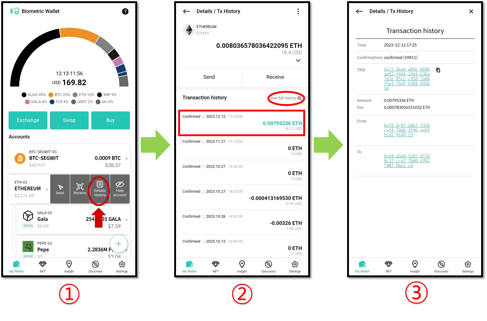

# Checking transaction status and history

## How to check transaction history

After **sending or receiving** a transfer to your wallet account address, you can check the transaction history from the mobile app.

1\) From thw mobile app, press the **"Details History"** button of the coin account you want to check transaction history.

2\) In the Details history screen, you can check the amount of coins you have and transaction history. The black color is indicate send transfers made and the green color is indicate receive transfers. It also displayed transaction status as **“Confirmed”, “Pending”, “Fail”,** etc.

Click the **“See full history”** button, you can access Blockchain Explorer and search your wallet address.

3\) More detailed information is shown when you press a transaction. Detailed information screen shows the "Confirmations", "TXID(Transaction ID) and the addresses involved in the transaction.
