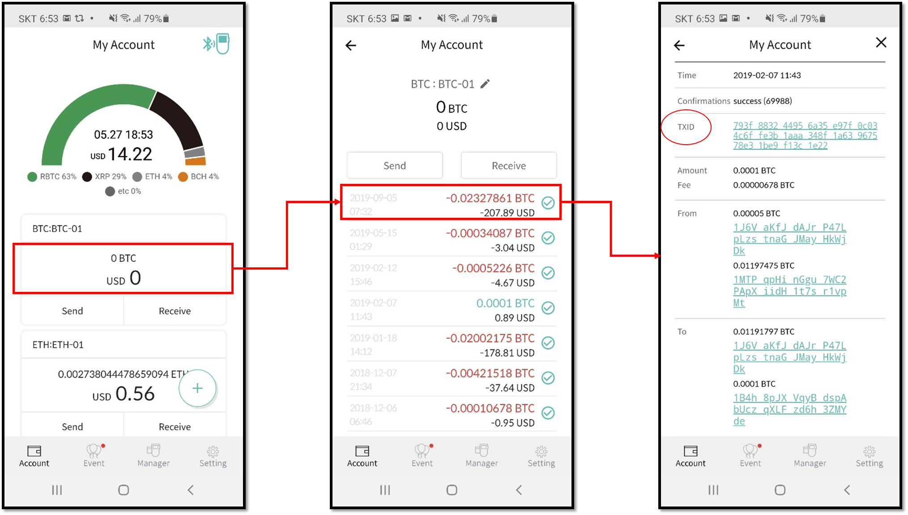

# Checking transaction status and history

## How to check transaction history

After **sending or receiving** a transfer to your wallet account address, you can check the transaction history from the mobile app.

1\) Press the main body of a cryptocurrency account.

2\) The picture in the middle is where your transactions are listed. The red numbers indicate send transfers made and the green numbers indicate receive transfers. Next to each transaction, there is a status icon such as a 'check' mark which indicates the state of the transaction. A 'check' mark for instance, indicates the transfer is completed.

3\) More detailed information is shown when you press a transaction. Detailed information screen shows the transaction ID\(txid\) and the addresses involved in the transaction.

