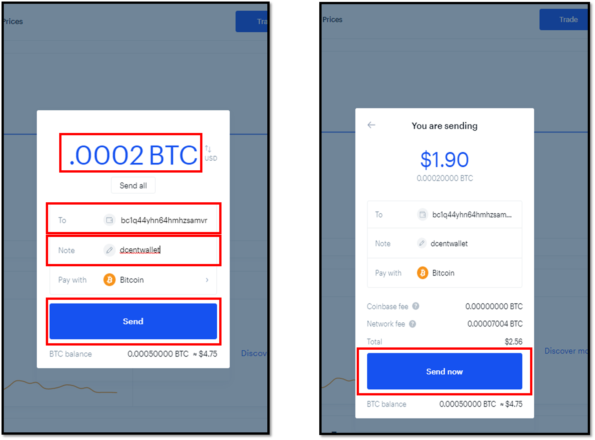

# 코인베이스 거래소 사용법 (비트코인 예시)

## 코인베이스 월렛 주로 입금 받기

### 코인베이스 월렛에서 송금 받을 주소 확인

코인베이스의 계정으로 암호화폐를 보내려면 주소를 알아야합니다. 먼저 코인베이스 계정에 로그인하고 '**Receive**' 버튼을 누르십시오.

아래 그림은 코이베이스가 계정 주소를 표시하는 방법의 예시입니다 (예 : Bitcoin). 상단은 QR 코드로 표시된 비트코인 주소이며 바로 아래는 16 진수 형식의 동일한 주소입니다.\
\
'**Currency**' 부분에서 선택을하면 다른 암호화폐 계정으로 전환 할 수 있습니다.

### 디센트 월렛에서 송금 거래 준비

모바일 앱을 먼저 실행하고 디센트 기기과 함께 연결된 상태인지 반드시 확인하시기 바랍니다.&#x20;

1\) 암호화폐 계정에서 (예 : Bitcoin) '**보내기**'버튼을 누르십시오.

2\) 코인베이스가 제공하는 QR 코드를 스캔하려면 '**QR 스캔**'버튼을 누릅니다.

3\) QR 코드를 올바르게 읽히면 입금받는 주소가 자동으로 입력된 것을 볼 수 있습니다. 입금받는 주소를 다시 확인하여 송금을 보내려는 올바른 주소인지 확인하는 것이 좋습니다.

4\) '**다음**' 버튼을 눌러 계속 진행하십시오.


빨간색 텍스트 메시지로 '주소 형식이 잘못되었습니다'가 표시되는 경우는 **'다음' 버튼이 비활성화되며** 이는 주소가 잘못 입력되었음을 의미합니다. 위 예시를 보면 주소의 시작 부분에 '**bitcoin:**'과 같이 여분의 텍스트가 존재하는 경우 이를 삭제하시면 '다음' 버튼이 활성화됩니다.


5\) 거래 수수료를 먼저 설정하십시오. 슬라이더 버튼을 사용하여 수수료 금액을 변경할 수 있습니다. 수수료를 '높음'으로 설정하면 거래가 우선적으로 수락될 확률이 높아지며 블록체인 네트워크에서 더 빨리 처리 될 가능성이 큽니다.

6\) 다음으로 보낼 금액을 설정하십시오. 암호화폐의 개수를 입력하시거나 법정화폐로 계산된 금액을 입력 할 수 있습니다. 사용 가능한 전체 금액을 보내려면 '**전액**' 버튼을 누르십시오.

7\) '**다음**' 버튼을 눌러 계속 진행하십시오.

8\) 다음 화면에서 표시된 입금받는 주소와 거래 내역의 송금액을 다시 확인하십시오. 세부 사항이 올바르면 '**보내기**' 버튼을 누르십시오.

&#x20;9\) 디센트 기기에서 거래 정보를 확인하고 '**OK**' 버튼을 눌러 승인하십시오. **지문을 입력하거나 또는 PIN을 사용하여 인증해야합니다**.&#x20;

10\) 인증에 성공하면 송금 거래가 블록체인 네트워크로 전송이됩니다.&#x20;

11\) 코인베이스 계정으로 돌아가 디센트월렛에서 송금을 보낸 암호화폐가 입금되었는지 확인하십시오.&#x20;

코인베이스에서 최근 거래 내역을 확인할 수 있습니다. 상태가 'PENDING (보류 중)'으로 표시되면 블록체인 네트워크에서 송금 거래 처리가 진행중인 상태입니다. 자세한 거래 내역을 조회하려면 '**View Transaction**'을 클릭합니다. 새 창에서 block explorer 사이트로 연결되며 송금 거래의 상태를 확인할 수 있습니다.

## 디센트 월렛 주소로 입금 받기

### 디센트 월렛에서 송금 받을 주소 확인

디센트 월렛 계정으로 암호화폐를 송금 받으려면 주소를 알아야합니다. \
모바일앱에서 '**받기**' 버튼을 눌러 계정 주소를 확인하십시오.

16 진수 형식의 계정 주소를 복사 할 수있는 방법으로 두 가지 옵션이 있습니다. \
Option1) **복사** - 메시지나 이메일에 붙여넣기를 위한 주소를 복사합니다. \
Option2) **공유** - 주소를 복사하여 스마트폰에 설치된 특정 SNS 앱을 통하여 공유가 가능합니다.

### 코인베이스 계정에서 송금 거래 준비

코인베이스 계정에서 '**Send**' 버튼을 누르십시오.

아래 스크린샷은 코인베이스 지갑의 인터페이스입니다.

1\) 송금 보낼 금액을 입력합니다.

2\) '**To**'가 표시된 부분에는 디센트 월렛에서 복사한 주소를 붙혀넣습니다.

3\) '**Note**'가 표시된 부분에는기록을 위한 정보를 입력합니다. (예시: dcentwallet).

4\) '**Send**' 버튼을 눌러 다음으로 진행합니다.

5\) 오른쪽 2번째 스크린샷은 송금을 보내려는 거래 정보가 표시됩니다. '**Send now**' 버튼을 눌러 진행합니다.

6\) SMS로 받은 2-step 인증 코드를 입력합니다.

7\) '**Confirm**' 버튼을 누르면 송금 거래를 요청하게 됩니다.
