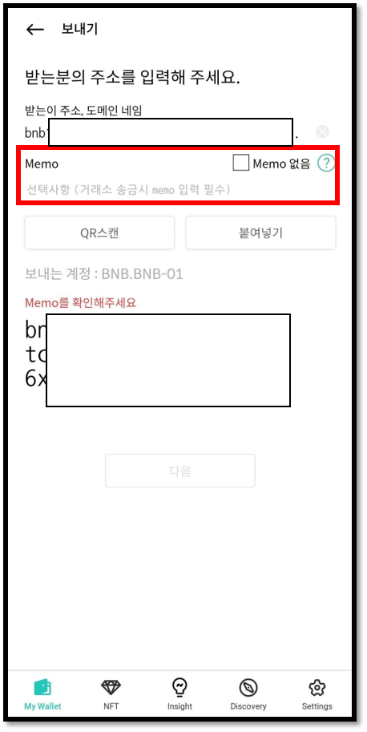

# 바이낸스 (BNB) 지갑 계정 사용법

## 계정 생성

바이낸스 계정이 없다면 생성해 주세요. 코인 이름은 "Binance (BNB)"로 되어 있습니다.

계정 생성에 대한 자세한 내용은 다음 항목을 참고하세요.


[create-account](../../mobile-app/create-account/)


## 바이낸스 (BNB) 메모

거래소에서 사용되는 바이낸스(BNB) 지갑은 한개의 주소를 사용합니다. 즉, 거래소 사용자 모두 같은 주소를 사용함으로 사용자의 계정을 구별하기 위해 고유 식별 문자(Memo)를 할당하여 관리합니다. \
**따라서, 거래소에서 생성한 바이낸스(BNB) 계정 주소로 송금을 보낼 경우 반드시 Memo를 입력해야 사용자의 거래소 지갑 계정으로 정상적인 입금이 완료됩니다.**

## 바이낸스 (BNB) 코인 받기

생성된 바이낸스 코인 계정의 “받기”를 클릭하면 바이낸스 코인 주소를 확인 할 수 있습니다.

코인 받기에 대한 자세한 내용은 다음 항목을 참고하세요.


[receive.md](../receive.md)


## 바이낸스 (BNB) 코인 보내기

바이낸스 (BNB) 코인을 거래소 계정으로 보내는 경우 반드시 Memo를 입력하셔야 합니다. 거래소가 아닌 디센트 월렛과 같이 개인이 직접 생성한 바이낸스 (BNB) 지갑 주소의 Memo는 옵션입니다. 임의의 Memo를 입력하거나 Memo 없음을 체크하세요.

<figure><figcaption></figcaption></figure>

송금 시에는 송금 확인 창에서 다시 한번 주소와 메모를 확인해주세요

<figure><figcaption></figcaption></figure>

### 바이낸스 (BNB) 코인 수수료

바이낸스 코인의 수수료는 고정 값을 사용합니다. 바이낸스 코인 보내기를 할 때마다 “0.000075 BNB” 가 발생합니다.

[강력한 보안, 지문으로 완성하다 **\[디센트 암호화폐 지갑\] 보러 가기 >>**](https://store-kr.dcentwallet.com/pages/dcent-biometric-crypto-wallet?utm\_source=userguide\&utm\_medium=dcent-web\&utm\_campaign=202406\_binance-bnb)

