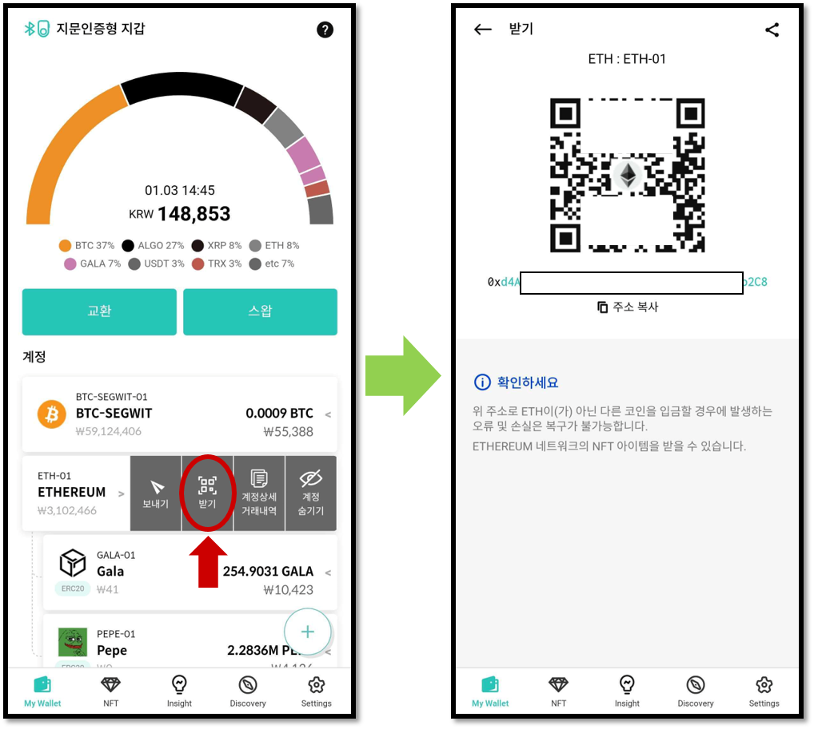
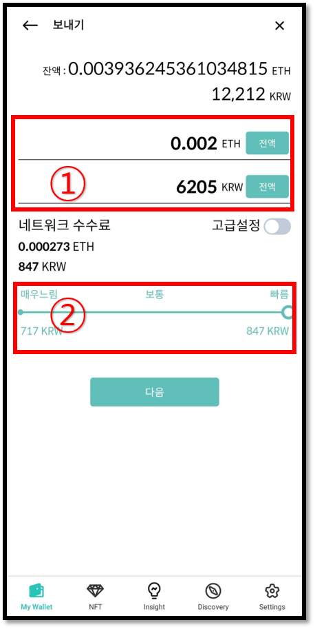
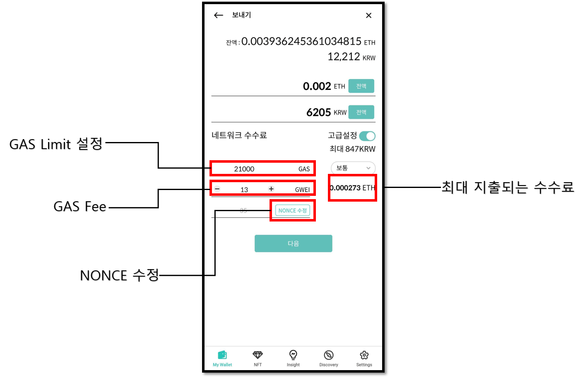

# 이더리움 지갑 계정 사용법

## 계정 생성

이더리움 계정이 없다면 생성해 주세요. 코인 이름은 "Ethereum (ETH)"로 되어 있습니다.

계정 생성에 대한 자세한 내용은 다음 항목을 참고하세요.


[create-account](../../mobile-app/create-account/)


## 이더리움 코인(ETH) 받기

코인 계정에서 "받기"를 클릭하면 이더리움 계정 주소를 확인할 수 있습니다.

코인 받기에 대한 자세한 내용은 다음 항목을 참고하세요.


[receive.md](../receive.md)


## 이더리움 코인(ETH) 보내기

이더리움 코인을 전송하는 방법은 일반적인 코인 보내기와 같습니다. 코인 보내기에 대한 일반적인 방법은 다음 항목을 참고하세요.


[send](../send/)


### 이더리움 수수료 입력

이더리움의 수수료는 보내는 금액을 입력하면 자동으로 계산됩니다. 수수료는 현재 블록체인 트랜잭션의 평균 수수료를 바탕으로 기본 설정됩니다. 수수료 슬라이드를 조정하거나 고급 설정을 통해 수수료를 조정할 수 있습니다.


수수료를 너무 낮게 책정하면 트랜잭션이 블록체인에서 승인되지 않아 송금이 이루어지지 않을 수 있습니다.


### 수수료 고급 설정

이더리움의 수수료는 "GAS fee"와 "GAS Limit"으로 이루어져 있습니다. GAS fee의 단위는 ETH의 화폐 단위 중 하나인 gwei를 사용합니다.

**`1 ETH = 1,000,000,000 gwei`**

실제 지출되는 수수료는 **`“실제 사용한 GAS” x “GAS fee”`** 로 결정됩니다.

GAS Limit을 통해 트랜잭션에서 사용하는 GAS의 최대양을 설정할 수 있습니다. GAS fee가 높을수록 트랜잭션이 확정되는 시간이 빨라집니다. 수수료 설정 입력화면에서 GAS fee와 GAS Limit을 직접 설정할 수 있습니다.

[강력한 보안, 지문으로 완성하다 **\[디센트 암호화폐 지갑\] 보러 가기 >>**](https://store-kr.dcentwallet.com/pages/dcent-biometric-crypto-wallet?utm\_source=userguide\&utm\_medium=dcent-web\&utm\_campaign=202406\_ethereum)

<figure><figcaption></figcaption></figure>
