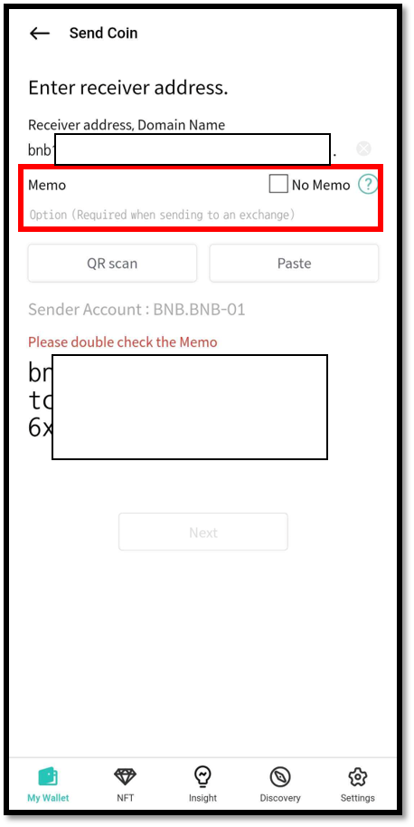

# How to use Binance (BNB) account

## How to create an Binance account

If you don't have Binance account, create new account. Coin name for Binance is "Binance chain(BNB)".

For more details of creating an account, click below link.


[create-account](../../mobile-app/create-account/)


## Binance (BNB) Memo

The Binance wallet used by an exchange service uses a single address. In other words, all users of the exchange have the same address. To distinguish each user's account, the exchange service manages the user accounts by assigning a unique identification character (Memo) to each user. \
**Therefore, when sending BNB to a recipient wallet address created from the Exchange, you MUST enter the Memo so that the Exchange will complete the deposit to the recipient's wallet account.**

## Receive Binance (BNB) coin

From your coin account, click "Receive" to view your account address.

For more details of receiving coin, click below link.


[receive.md](../receive.md)


## Send Binance (BNB) Coin

If you are sending Binance (BNB) coins to your exchange account, you MUST enter the Memo. If you are sending Binance (BNB) coins to a personal wallet such as D'CENT Wallet, entering Memo is optional. You can enter any notes in the Memo field or check No Memo.

<figure><figcaption></figcaption></figure>

When sending money, check the address and memo once again before making the final confirmation.

<figure><figcaption></figcaption></figure>

### The fee for Binance (BNB)

The fee of BNB is fixed as "0.000075 BNB" per transaction.
