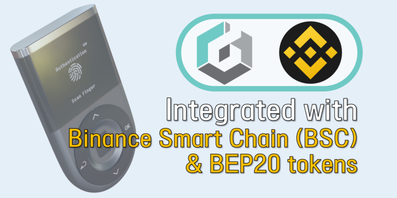

# 바이낸스 스마트 체인 계정 사용법

**디센트 지문인증형 지갑에서 바이낸스 스마트 체인(BSC)를 지원합니다.**\
디센트 지문인증형 지갑의 펌웨어 (**v.2.6.0 이상**)에서는 바이낸스 스마트 체인(BSC)과 BEP20 프로토콜에 대한 지원이 추가되었습니다. 또한 디센트 모바일 앱 (**v.5.1.0 이상**)에서도 앱지갑을 사용시 바이낸스 스마트 체인 및 BEP20 토큰을 지원합니다.&#x20;

### 바이낸스 스마트 체인이란?

Binance Smart Chain은 기존 Binance Chain에 프로그래밍 가능성과 상호 운용성을 제공하는 혁신적인 솔루션입니다. 이는 짧은 블록 시간과 낮은 수수료를 지원할 수있는 PoSA (Proof of Staked Authority) 합의 알고리즘을 통해 21 개의 검증자 시스템에 의존합니다. 바이낸스 스마트 체인은 또한 EVM 호환 스마트 계약을 지원하고 Cross-chain 전송을위한 상호 운용성(스왑 전송을 위한 별도의 서비스)를 제공합니다.

### 디센트 지갑 설정 방법

아래 링크에서 최신 버전의 디센트 모바일 앱을 다운로드 할 수 있습니다.\
👉 [**Android 용**](https://play.google.com/store/apps/details?id=com.kr.iotrust.dcent.wallet\&utm\_source=dcentwallet\&utm\_campaign=mobileapp)****\
**👉** [**iOS 용**](https://apps.apple.com/kr/app/dcent-hardware-wallet/id1447206611)****

디센트 지문인증형 지갑을 사용하시는 경우 공식 펌웨어 업데이트 사이트에서 최신 버전 (v.2.6.0 이상)으로 업그레이드하셔야합니다.\
👉 [**공식 펌웨어 업데이트 사이트**](https://dcentwallet.com/support/FirmwareUpdate)****

디센트 지문인증형 지갑의 펌웨어 업데이트 방법은 아래 링크를 참고해주세요. \
👉 [**디센트 펌웨어 업데이트 사용자 가이드**](https://userguide.dcentwallet.com/v/kr/biometric-wallet/firmware-update)****

## 디센트 지갑에 Binance Smart Chain 계정을 추가하는 방법

디센트 모바일 앱을 실행하고 인증하여 액세스를 잠금 해제하십시오.

.png>)

**Step 1)** 계정 탭에서 **(+)** 버튼을 눌러 지갑 계정을 추가하세요.\
**Step 2)** 검색 필드에 ‘**Binance’**를 입력하여 검색합니다.\
**Step 3)** 표시된 목록에서 **Binance Smart Chain**을 선택합니다.

.png>)

**Step 4)** ‘**만들기**’ 버튼을 눌러 계속 진행합니다.\
**Step 5)** 계정 탭에서 새로운 바이낸스 스마트 체인 계정이 포트폴리오에 추가되었음을 확인합니다.

## 디센트 지갑의 댑 브라우저에서 Binance Smart Chain 댑에 액세스하는 방법

‘Discovery’탭에있는 내장된 댑 브라우저를 사용하여 다양한 블록체인 서비스에 액세스 할 수 있습니다.

.png>)

S**tep 1)** 하단 메뉴의 ‘**Discovery**’탭으로 이동합니다.\
**Step 2)** 오른쪽 상단에있는 네트워크 아이콘 (지구 아이콘)을 클릭합니다.\
**Step 3)** 네트워크를 ‘**Binance Smart Chain**’으로 전환합니다.\
**Step 4)** 검색창에 URL을 입력하여 댑 서비스에 접속할 수 있습니다.

### **유용한 링크 : Binance Smart Chain 댑 서비스 목록**

👉 [https://dappradar.com/rankings/protocol/binance-smart-chain](https://dappradar.com/rankings/protocol/binance-smart-chain)
