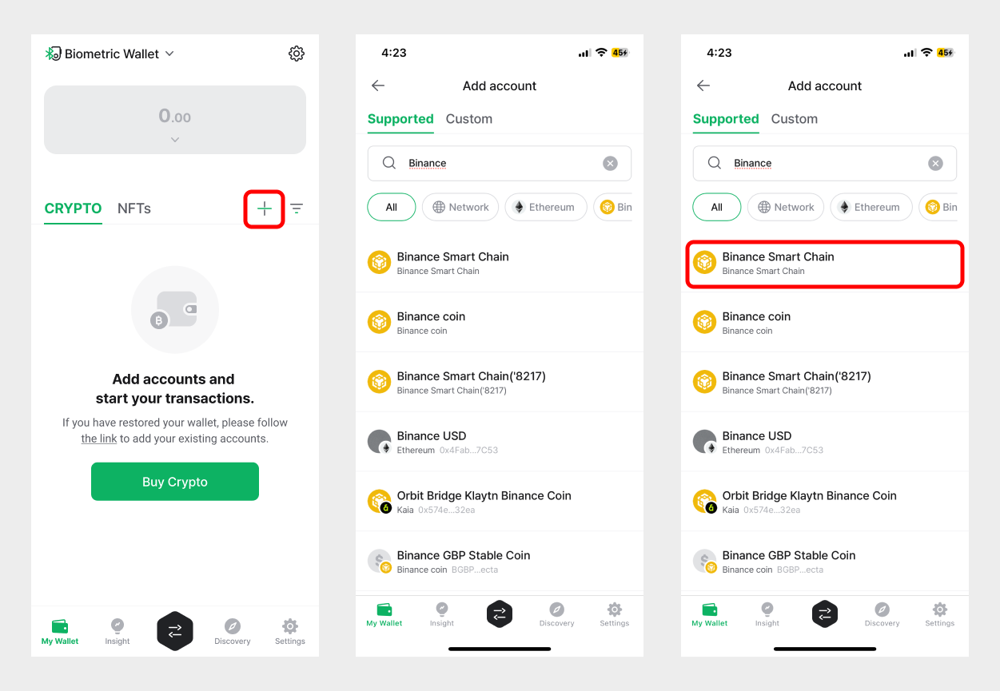

# How to use Binance Smart Chain account

.png>)

**D'CENT Wallet supports Binance Smart Chain (BSC) and BEP20 tokens**\
The firmware (**v.2.6.0 or higher**) for D’CENT Biometric Wallet supports Binance Smart Chain and the BEP20 protocol. Additionally, the D’CENT Mobile App (**v.5.1.0 or higher**) will also support Binance Smart Chain and BEP20 tokens.

### What is Binance Smart Chain?

[Binance Smart Chain](https://docs.binance.org/smart-chain/guides/bsc-intro.html) is an innovative solution to bring programmability and interoperability to Binance Chain. It relies on a system of 21 validators with Proof of Staked Authority (PoSA) consensus that can support short block time and lower fees. The Binance Smart Chain also supports EVM-compatible smart contracts and offers interoperability for Cross-chain transfer.

### How to set up D’CENT Wallet

You can download the latest version of the D’CENT Mobile App here:\
👉 For [**Android**](https://play.google.com/store/apps/details?id=com.kr.iotrust.dcent.wallet\&utm_source=dcentwallet\&utm_campaign=mobileapp) \
👉 For [**iOS**](https://apps.apple.com/kr/app/dcent-hardware-wallet/id1447206611)

If you are using an older version of the firmware on D’CENT Biometric Wallet, you will need to upgrade the firmware to the latest version (v.2.6.0 or higher) from the official firmware update site.\
👉 [**Official Firmware Update Site**](https://dcentwallet.com/support/FirmwareUpdate)

You can also find a fully detailed instructions guide below.\
👉 [**Firmware update user guide**](https://www.dcentwallet.com/en/firmwareupdate)

## How to add Binance Smart Chain account in D’CENT Wallet

Run the D’CENT Mobile App and authenticate to unlock access.

**Step 1)** From the Account Tab, press the **(+)** button to add a wallet account.\
**Step 2)** In the search field, type “**Binance**” to search.\
**Step 3)** Choose **Binance Smart Chain** from the list shown.&#x20;

.png>)

**Step 4)** Press the ‘**Create**’ button to proceed.\
**Step 5)** In the Account Tab, notice that a new Binance Smart Chain account has been added to the portfolio.

## How to access Binance Smart Chain Dapps from the native Dapp browser in D’CENT Wallet

You can access Dapp services using the built-in dapp browser found in the ‘Discovery’ Tab.

.png>)

**Step 1)** Go to the ‘**Discovery**’ tab in the bottom menu.\
**Step 2)** Click on the **Network icon(globe icon)** located in the upper right-hand corner.\
**Step 3)** Switch the network to ‘**Binance Smart Chain**’.\
**Step 4)** You can access a dapp service by entering the **URL** in the search field.

### **Useful Link: List of Binance Smart Chain Dapp Services**

👉 [https://dappradar.com/rankings/protocol/binance-smart-chain](https://dappradar.com/rankings/protocol/binance-smart-chain)
