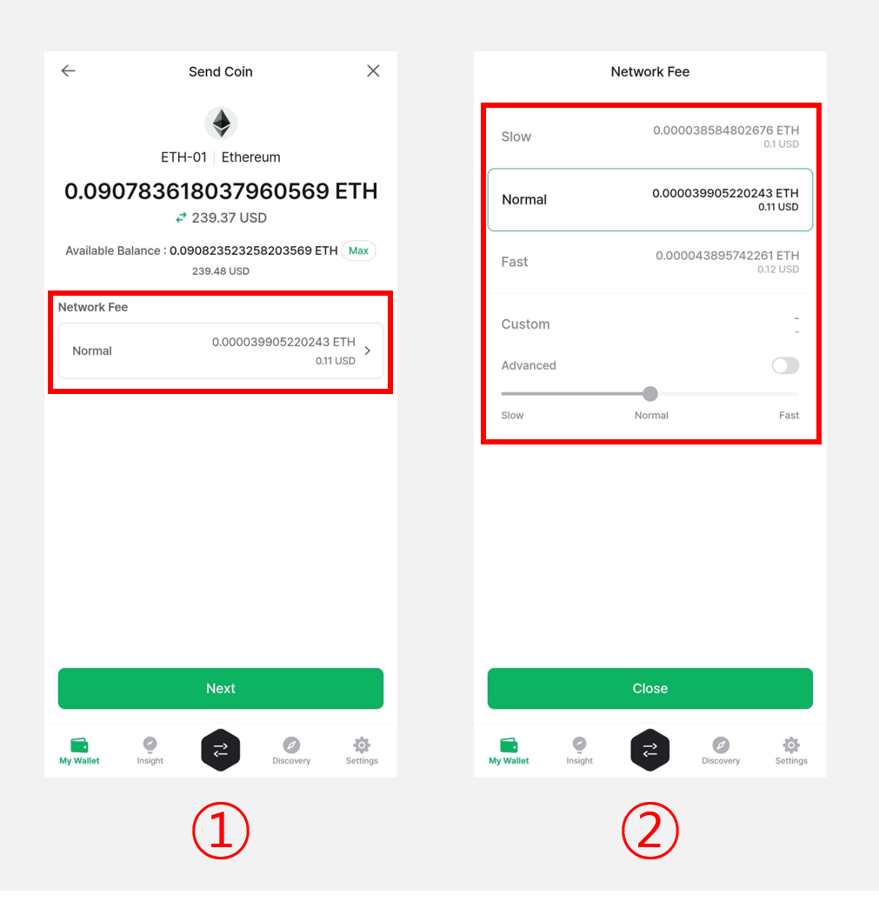

# How to use Ethereum account

## How to create an Ethereum account

If you don't have Ethereum account, create new account. Coin name for Ethereum is **"Ethereum (ETH)".**

For more details of creating an account, click below link.


[create-account](../../mobile-app/create-account/)


## Receive Ethereum coin

From your coin account, click **"Receive"** to view your account address.

For more details of receiving coin, click below link.


[receive.md](../receive.md)


## Send Ethereum Coin

The procedures to send ETH coin are same as sending general coin. You can see in the below link to check how to send coin.


[send](../send/)


### Set the fee for Ethereum

**1)** The fee of Ethereum is automatically calculated after setting the sending amount. The calculated fee is based on current average transaction fee on Ethereum blockchain network.

**2)** You can select the fee from **"Slow," "Normal" or "Fast"** or adjust it manually in the advanced fee settings.


**If the fee is set too low, the transaction may not get confirmed in the blockchain network.**


### Advanced Fee Setting

The fee of ethereum is consist of **"GAS fee"** and **"GAS Limit"**. You can manually set the GAS Limit and GAS fee on **"Advanced"** fee setting option.

The unit of GAS fee is **"Gwei"** which is one of ETH's sub unit.

**`1 ETH = 1,000,000,000 gwei`**

The real fee to be paid is calculated as **`“Used GAS amount” x “GAS fee”`** .

You can set the maximum amount of GAS as setting GAS Limit. **Transaction can be confirmed faster if GAS fee is higher.**&#x20;

