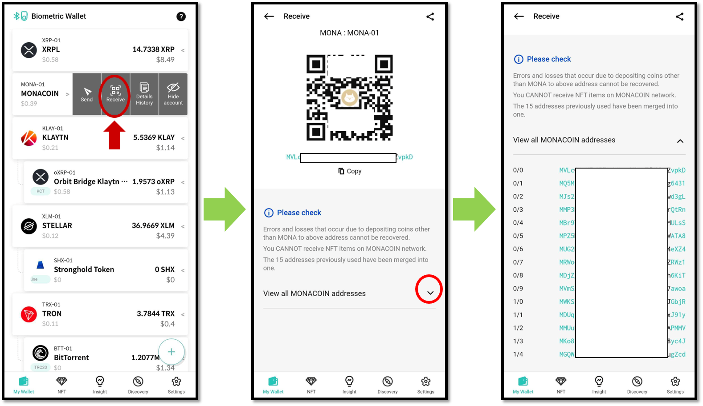

# How to use MONA account

## How to create a MONA account

If you don't have Monacoin account, create a new account. Coin name for Monacoin is "Monacoin (MONA)".

For more details of creating an account, click below link.


[create-account](../../mobile-app/create-account/)


## Receive Monacoin

From your coin account, click "Receive" to view your account address.

The account of Monacoin supports HD wallet. "HD wallet" is the technical standard suggested in BIP-44 from bitcoin improvement proposal. A monacoin account of D'CENT wallet manage 15 addresses. Any address in the account can be used to receive coin.

Click the down arrow (∨) button to the right of **“View all MONACOIN addresses”** to see all of the addresses list.

For your reference, the address shown on the "Receive" screen of your MONA account defaults to the first address in the list of 15 addresses.

For more information about receiving coin, click below link.


[receive.md](../receive.md)


## Sending Monacoin

The procedures to send monacoin are same as sending general coin. You can see in the below link to check how to send coin.


[send](../send/)


### Set the fee for Monacoin

The fee of Monacoin is automatically calculated after setting the sending amount. The calculated fee is based on current average transaction fee on Monacoin blockchain network.

You can change the fee by sliding the bar or by directly entering the fee value in the advanced fee mode.


If the fee is set too low, the transaction may not get confirmed in the blockchain network.

