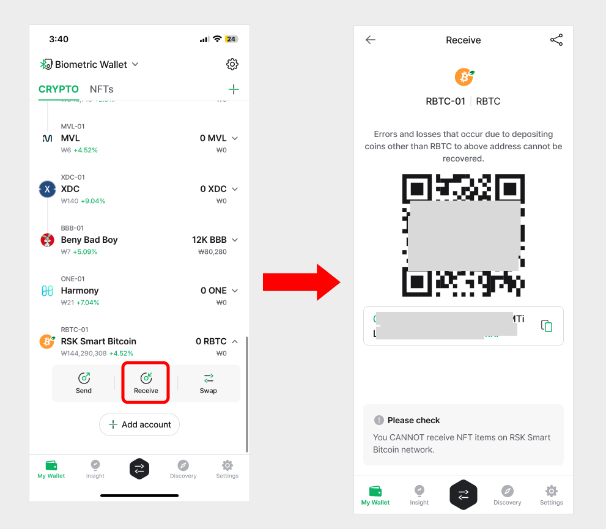

# How to use RSK account

## How to create an RSK account

If you don't have RSK account, create new account. Coin name for RSK is "RSK Smart Bitcoin(RBTC)".

For more details of creating an account, click below link.


[create-account](../../mobile-app/create-account/)


## Receive RSK (RBTC) coin

From your coin account, click "Receive" to view your account address.

For more details of receiving coin, click below link.


[receive.md](../receive.md)


## Send RSK (RBTC) Coin

The procedures to send RSK coin are same as sending general coin. You can see in the below link to check how to send coin.


[send](../send/)


### Set the fee for RSK

The fee of RSK is automatically calculated after setting the sending amount. The calculated fee is based on current average transaction fee on RSK blockchain network.

You can change the fee by sliding the bar or by directly entering the fee value in the advanced fee mode.


If the fee is set too low, the transaction may not get confirmed in the blockchain network.

