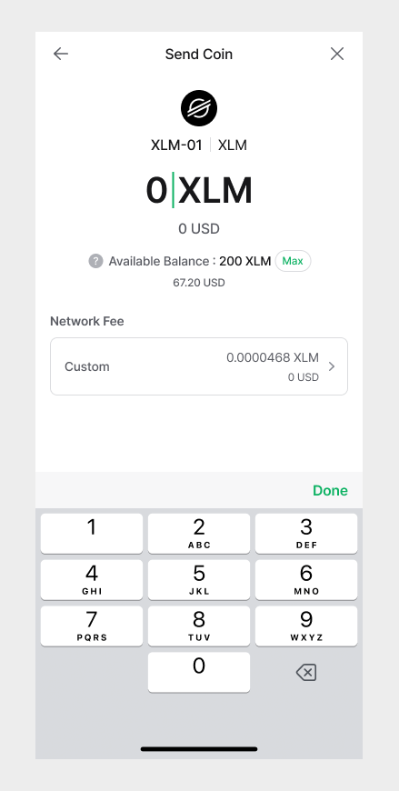

# How to use Stellar Lumens (XLM) account

## Check the Firmware version

Stellar (XLM) coin is supported on the Biometric Wallet installed with firmware version **v2.1.0 or higher**. Please refer to the link below for instructions on how to update the firmware.


[firmware-update-from-computer](../../../biometric-wallet/firmware-update-from-computer/)



[firmware-update-from-mobile.md](../../../biometric-wallet/firmware-update-from-mobile.md)


## How to create a Stellar Lumen (XLM) account

If you don't have a Stellar Lumen account, create a new account. The coin name for Stellar Lumen is **"Stellar (XLM)"**.

For more details on how to create an account, click the link below.


[create-account](../../../mobile-app/create-account/)


## If you can't create a Stellar account


There is a case where the Stellar account cannot be created even though the current firmware version is v2.1.0 or higher. This is because the new algorithm used by Stellar cannot be used if the firmware version installed in the product was lower than v2.0.1 when it was originally purchased.


In the event when trying to create a Stellar account from the mobile app, the search result will not display Stellar coin as an account that can be added. See the picture below.

### Solution:

You can create a Stellar wallet account after recovering the wallet using the recovery words. But first, you must perform the **device wipe** from the settings menu of the Biometric Wallet.&#x20;

**1)** Click [**here**](https://userguide.dcentwallet.com/biometric-wallet/setting-menu#device-wipe) for instructions on how to initialize(device wipe) the Biometric Wallet.&#x20;

**2)** Click [**here**](https://userguide.dcentwallet.com/biometric-wallet/recovery) for instructions on how to recover your wallet.


**Warning! You MUST not reset(device wipe) your device if you do not have your recovery words!**


## Stellar (XLM) wallet activation

After adding a Stellar (XLM) wallet from your mobile app, it will be in the **disabled** (not created on the Stellar network) state. \
\
Due to Stellar's policy, **a minimum of 1 XLM must be transferred to the Stellar address to activate the account on the Stellar network**.&#x20;


Depending on the exchange services, transferring fund to an inactive XLM account address may be restricted.&#x20;


In addition, **1 XLM in the account will be permanently locked-up**. For example, if you have 100 XLM in your account after creating your wallet, you can only transfer 99 XLM (including fee). As shown in the figure, the remaining balance of 1 XLM cannot be sent to another account even when if you try to send the maximum amount.


In some cases, the lock-up amount may be different. See the link below for more details. [https://www.stellar.org/developers/guides/concepts/fees.html#minimum-account-balance](https://www.stellar.org/developers/guides/concepts/fees.html#minimum-account-balance)


## Stellar Memo

The Stellar wallet used by an exchange service uses a single address. In other words, all users of the exchange have the same address. To distinguish each user's account, the exchange service manages the user accounts by assigning a unique identification character (Memo) to each user.&#x20;

**Therefore, when sending XLM to a recipient wallet address created from the Exchange, you MUST enter the Memo so that the Exchange will complete the deposit to the recipient's wallet account**.

## Receive Stellar coin

From your XLM account, click **"Receive"** to view your account address.

## Sending Stellar coin

If you are sending Stellar coins to your exchange account, you **MUST** enter the **"Memo"**.&#x20;

If you are sending Stellar coins to a personal wallet such as D'CENT Wallet, entering Memo is optional. You can enter any notes in the Memo field or choose to change the Memo options.

When sending money, **check the address and Memo** once again before making the final confirmation.

