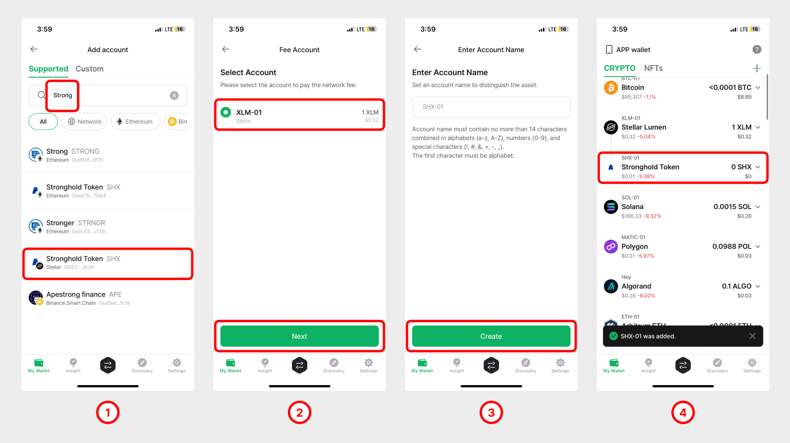
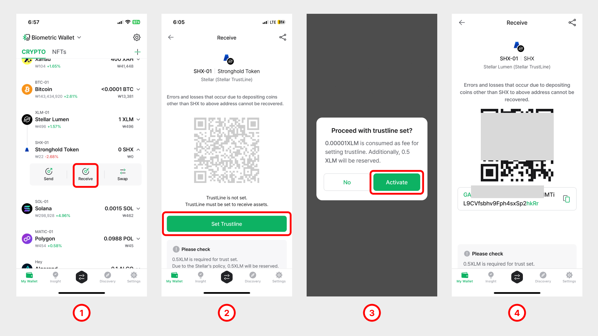
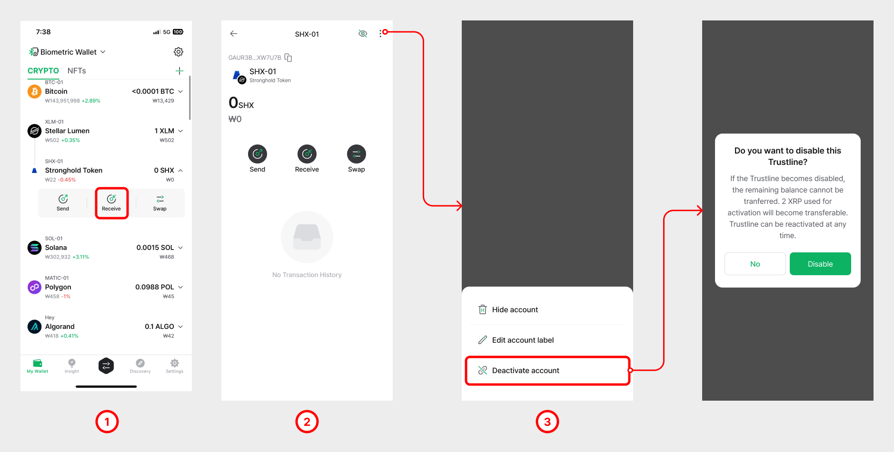

# Using TrustLine for XLML

## How to add a TrustLine 

**NOTE**: Adding a TrustLine on the Stellar (XLM) ledger will reserve **0.5 XLM**, meaning this reserved amount gets locked in the XLM account.

**1)** A TrustLine can be added by simply searching for the name of the TrustLine asset. In this example, we will add **Stronghold Token (SHX)**.

**2)** Select your XLM mainnet account which will be used to pay for transaction fees of the trustline activities. Click on the **"Next"** button.

**3)** Click on the **"Create"** button.

**4)** You can see that Stronghold Token (SHX) is added underneath the XLM mainnet account.

### (IMPORTANT!!) How to set (activate) TrustLine 

Remember that just adding a TrustLine does not mean you can receive the Trust Asset(issued currency) to this account. **You must first SET (activate) the TrustLine before you can receive funds**.

**1)** Click on the TrustLine account and click on the **"Receive"** button.

**2)** Notice that before activation, the address is not displayed. Click on **"Set Trustline"** to start the activation.

**3)** Note that setting(activating) a TrustLine will **reserve 0.5 XLM** (at the time of writing). To activate the TrustLine, click on the **"OK"** button.

**4)** When the TrustLine is activated, the account will display the address.

## How to disable a TrustLine 

A TrustLine can be deactivated at any time, only when the balance in the TrustLine account is completely emptied out. The 0.5 XLM that was reserved in the Stellar account will become liquid again.

**👉 Disabling a TrustLine account will free up 0.5 XLM which was reserved (locked) in your XLM account.**

**1)** Click on the TrustLine account (ie: SHX) that you wish to disable (deactivate) and click on **"Details History"**.

**2)** Tap the **\[︙] (More)** button in the top right corner and click on **"Disable Trustline"**

**3.** Click on **"Disable Trustline"**.

4\. Click on **"Disable"** to proceed with the TrustLine deactivation.

### How to remove a TrustLine account 

To remove any unused TrustLine account, click on the account and click **"Hide account"** button.

<figure><figcaption></figcaption></figure>

