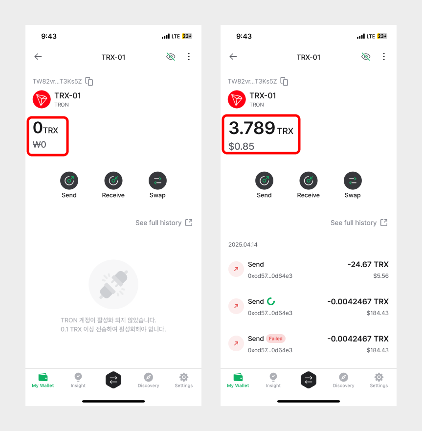

# 트론 지갑 계정 사용법 (TRX, TRC10, TRC20, TRC721)

## 트론 계정 추가 

트론 계정이 없다면 생성해 주세요. 코인 이름은 "Tron (TRX)"로 되어 있습니다.  계정을 생성하는 방법은 아래 링크를 참고해주세요.


[create-account](../../mobile-app/create-account/)


디센트 지갑에 새로운 Tron 계정을 추가했을 때 이 계정은 아직 Tron 블록체인에 존재하지 않습니다. Tron 계정을 사용하려면 먼저 [TRON 정책](https://developers.tron.network/docs/account#account-activation)에 따라 1 TRX의 계정 생성 수수료를 지불해야 합니다. 또한 API 쿼리나 블록체인 탐색기를 통해 정보를 찾으려면 Tron 계정을 활성화해야 합니다.

### 트론 계정 생성 

블록체인에 Tron 계정이 존재하게 하려면(계정 생성) 지갑에 있는 Tron 주소로 1개 이상의 TRX를 보내면 됩니다.&#x20;

<mark style="color:red;">**Tron 계정 생성 수수료 = 1 TRX**</mark>

### 트론 계정 활성화 

Tron 계정을 활성화된 상태로 유지하려면 Tron 계정의 잔액이 0.1 TRX 이상이어야 합니다. Tron 계정의 잔액이 0.1 TRX 미만으로 떨어지면 계정이 비활성화되고 더 이상 Tron 블록체인에서 계정 정보를 읽지 않습니다.

<mark style="color:red;">**Tron 계정 활성화 유지 비용 = 0.1 TRX**</mark>

<figure><figcaption></figcaption></figure>

## 자주 묻는 질문 

**Q. Tron 계정에 있는 내 USDT 토큰(TRC20)이 표시되지 않습니다. 어떻게 해야 하나요?**

A. Tron 계정의 TRX 잔액이 0.1 TRX 미만으로 떨어지면 비활성화됩니다. 최소 0.1 TRX의 잔액을 계정에 보유하고 있으면 Tron 계정(TRC10 및 TRC20 포함)이 활성화된 상태로 유지되고 Tron(TRX) 및 토큰 계정(TRC10 및 TRC20)에 대한 계정 정보가 표시됩니다.

[강력한 보안, 지문으로 완성하다 **\[디센트 암호화폐 지갑\] 보러 가기 >>**](https://store-kr.dcentwallet.com/pages/dcent-biometric-crypto-wallet?utm_source=userguide\&utm_medium=dcent-web\&utm_campaign=202406_how-to-use-tron-account-trx-trc10-trc20-trc721)

<figure><figcaption></figcaption></figure>
