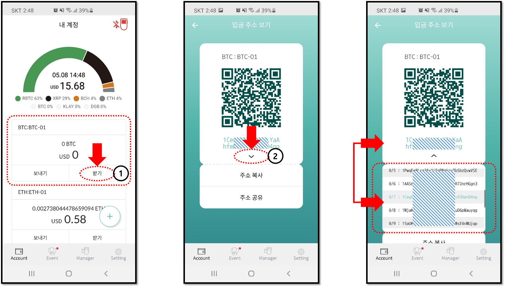

# 비트코인 지갑 계정 - 모든 공개 주소 확인하기

### 비트코인 계정 주소는 왜 바뀌나?

Bitcoin의 공개 주소는 전자 지갑의 xPub \(확장 공개 키\)에서 비롯된 것이므로 새로운 공개 주소를 생성할 수 있습니다. 현재 사용하는 Bitcoin 공개 주소에 **입금을 받으면** 새 주소가 자동으로 생성됩니다. 

### 모든 BTC 공개 주소 확인하는 방법

디센트 월렛에서 BTC 계정을 만들면 사용할 수 있는 15 개의 공개 주소가 자동으로 생성됩니다. BTC 공개 주소의 전체 목록을 보려면 모바일 앱을 실행하고 다음을 수행하십시오:  
  
1\) 비트 코인 계정에서 "**받기**" 버튼을 누르십시오.

2\) 다음 화면에서 현재 BTC 주소 아래에있는 아래쪽 화살표 \(∨\)를 누릅니다.   
  
마지막 스크린 샷에서 공개 주소 목록을 볼 수 있습니다. 현재 사용중인 BTC 주소는 "민트"색으로 강조되어 표시됩니다.

