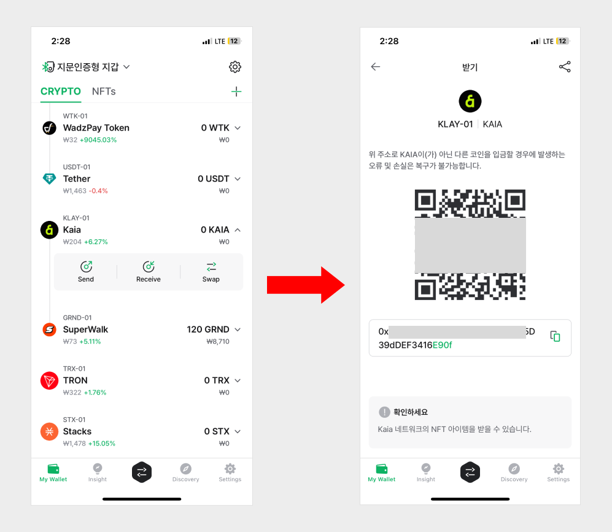
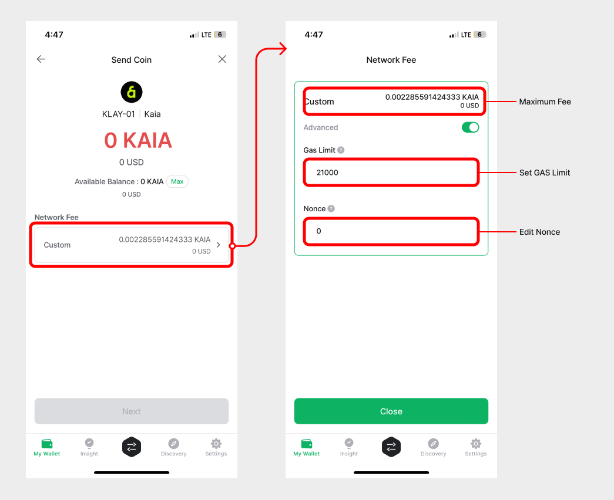

# How to use KAIA account

## How to create an KAIA account

If you don't have Kaia account, create new account. Coin name for KAIA is **"Kaia (KAIA)"**.

For more details of creating an account, click below link.


[create-account](../../mobile-app/create-account/)


## Receive KAIA coin

From your coin account, click **"Receive"** to view your account address.

For more details of receiving coin, click below link.


[receive.md](../receive.md)


## Sending KAIA Coin

The procedures to send KAIA coin are same as sending general coin. You can see in the below link to check how to send coin.


[send](../send/)


### Set the fee for Kaia

The fee of Kaia is consist of GAS fee and GAS limit. The unit of GAS fee is "Ston" which is one of KAIA's sub unit.

**`1 KAIA = 1,000,000,000 ston`**

The real fee to be paid is calculated as **`"Used GAS amount" x  "GAS fee"`**.

GAS fee is fixed on Kaia, and you can change GAS Limit on fee setting stage.


GAS Limit is automatically calculated in D'CENT mobile application.


