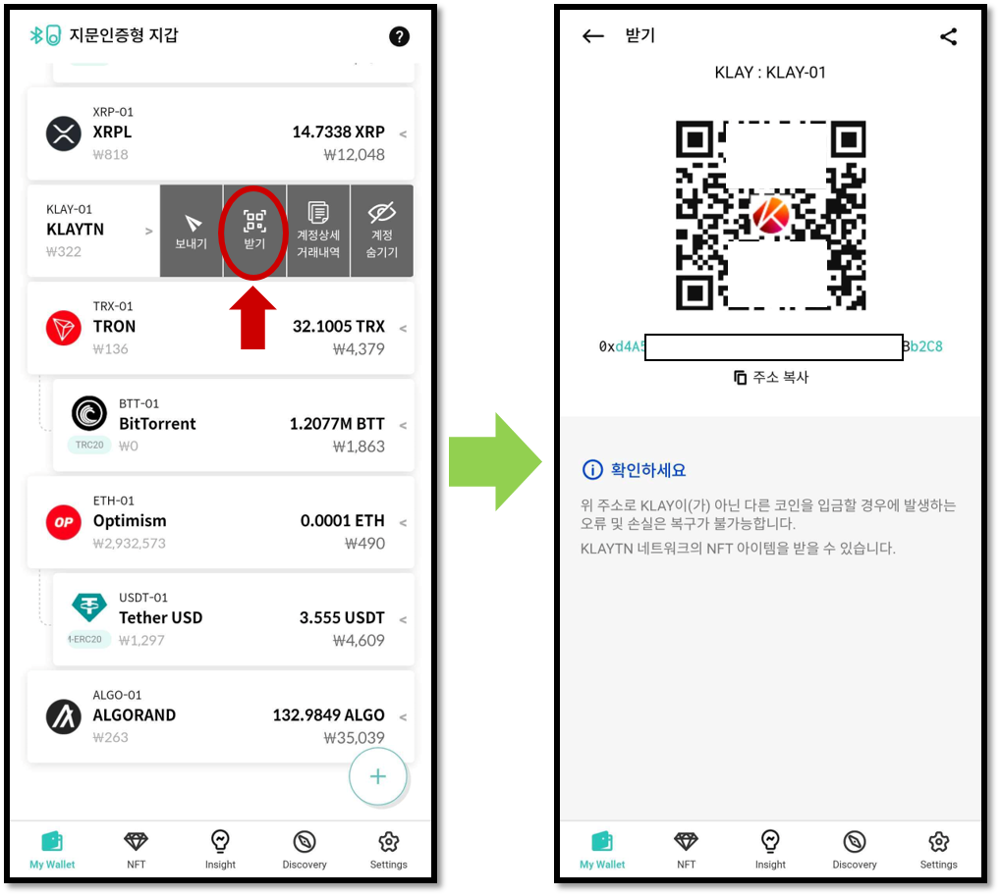
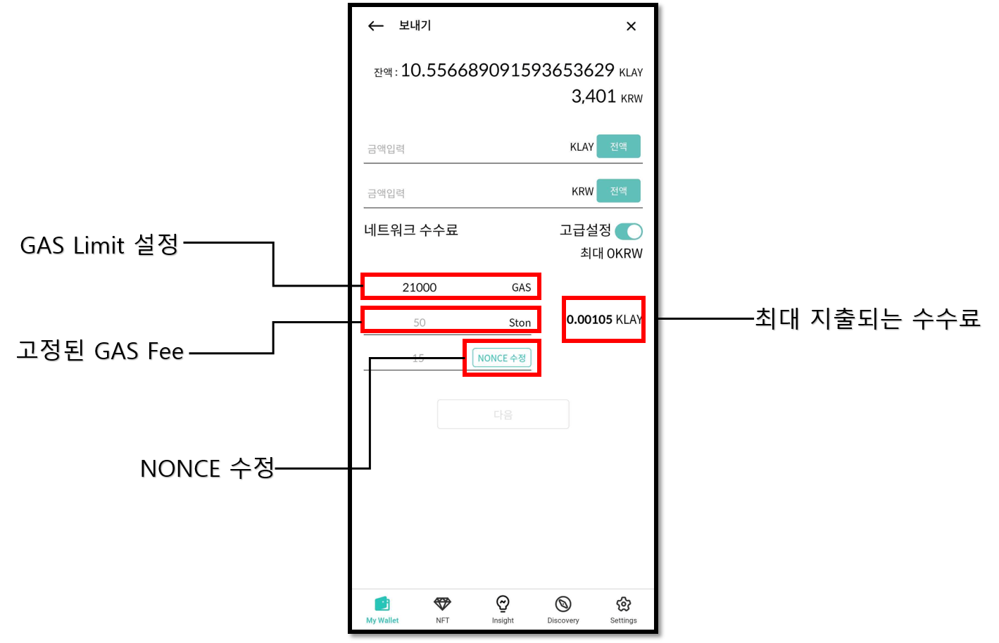

# 클레이튼 지갑 계정 사용법

## 계정 생성

클레이튼 계정이 없다면 생성해 주세요. 코인 이름은 **"Klaytn (KLAY)"**로 되어 있습니다.

계정 생성에 대한 자세한 내용이 필요하다면 [**여기**](../../mobile-app/create-account/)를 참고하세요.

## KLAY 코인 받기

코인 계정에서 **"받기"**를 클릭하면 클레이튼 계정 주소를 확인할 수 있습니다.

코인 받기에 대한 자세한 내용은 [**여기**](../receive.md)를 참고하세요.

## KLAY 코인 보내기

클레이튼 코인을 전송하는 방법은 일반적인 코인 보내기와 같습니다. 코인 보내기에 대한 일반적인 방법은 [**여기**](../send/)를 참고하세요.

### 클레이튼 수수료 입력 

클레이튼의 수수료는 GAS fee와 GAS Limit으로 이루어져 있습니다. GAS fee의 단위는 KLAY의 화폐 단위 중 하나인 ston을 사용합니다.

**`1 KLAY = 1,000,000,000 ston`**

실제 지출되는 수수료는 **`"실제 사용한 GAS" x  "GAS fee"`**로 결정됩니다.

클레이튼에서 GAS fee는 고정되어 있으며, 수수료 설정 입력화면에서 GAS Limit을 변경할 수 있습니다.


디센트 월렛에서 GAS Limit를 자동으로 계산해줍니다.


[강력한 보안, 지문으로 완성하다 **\[디센트 암호화폐 지갑\] 보러 가기 >>**](https://store-kr.dcentwallet.com/pages/dcent-biometric-crypto-wallet?utm\_source=userguide\&utm\_medium=dcent-web\&utm\_campaign=202406\_klaytn-klay)

<figure><figcaption></figcaption></figure>
