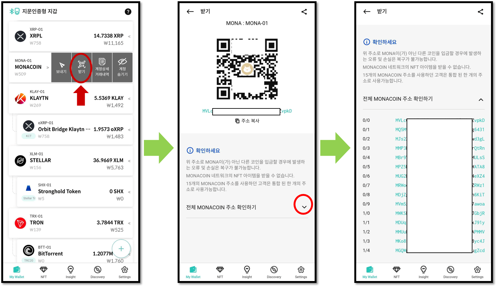

# 모나코인 지갑 계정 사용법

## 계정 생성

모나코인 계정이 없다면 생성해 주세요. 코인 이름은 “Monacoin(MONA)”로 되어 있습니다. 계정 생성에 대한 자세한 내용은 다음 항목을 참고하세요.


[create-account](../../mobile-app/create-account/)


## MONA 코인 받기

생성된 모나코인 계정의 “받기”를 클릭하면 모나코인 주소를 확인 할 수 있습니다.


모나코인은 HD 지갑 기술을 지원 합니다. HD 지갑 기술은 비트코인의 표준인 BIP-44에서 제안되었으며 하나의 계정에 여러 개의 모나코인 주소를 가지고 있을 수 있습니다. 디센트의 모나코인 계정은 15개의 모나코인 주소를 관리합니다. &#x20;

전체 주소 리스트는 받기 화면의 **"전체 MONACOIN 주소 확인하기"** 우측에 있는 아래쪽 화살표(v) 버튼을 클릭하면 확인 가능 합니다.&#x20;

참고로 모나코인 계정의 받기 화면에서 보여지는 주소는 15개 주소 목록 중 첫 번째 주소를 기본으로 사용하며, 어떤 주소로 코인을 받더라도 상관없습니다.

코인 받기에 대한 자세한 내용은 다음 항목을 참고하세요.


[receive.md](../receive.md)


## MONA 코인 보내기

모나코인을 전송하는 방법은 일반적인 코인 보내기와 같습니다. 코인 보내기에 대한 일반적인 방법은 다음 항목을 참고하세요.


[send](../send/)


### 모나코인 수수료

모나코인의 수수료는 보내는 금액을 입력하면 자동으로 계산됩니다. 수수료는 현재 블록체인 트랜잭션의 평균 수수료를 바탕으로 기본 설정됩니다. 수수료 슬라이드를 조정하거나 고급 설정을 통해 수수료를 조정할 수 있습니다.


수수료를 너무 낮게 책정하면 트랜잭션이 블록체인에서 승인되지 않아 송금이 이루어지지 않을 수 있습니다.

