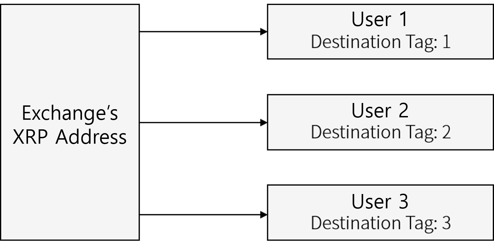
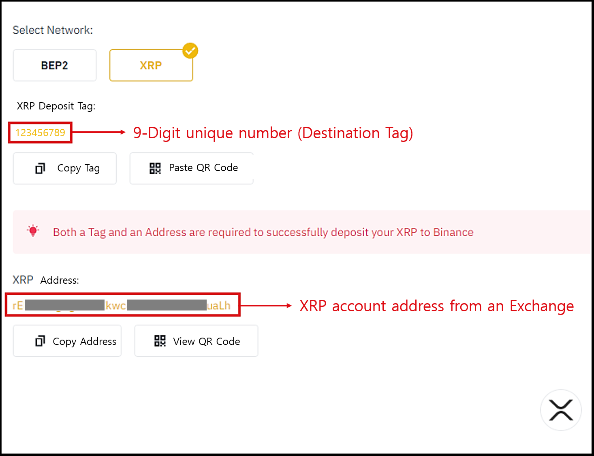

# How to use XRP account

## Ripple (XRP) account activation

If you have added your Ripple (XRP) wallet address for the first time, it is disabled. [Ripple's policy](https://xrpl.org/reserves.html) **requires a purchase or transfer of Ripple of 1 XRP or higher** to convert the Ripple wallet address to an activated state. Therefore, the corresponding 1 XRP will permanently lock-up at the corresponding wallet address.\
\
If a permanent lockup is made at the address of the Ripple wallet, it is assumed that only 99 XRP can be transferred, excluding the 1 XRP, which is the permanent lockup amount.


Depending on the exchange services, transferring fund to an inactive XLM account address may be restricted.&#x20;


## XRP Destination Tag

Users' ripple wallets assigned by the Exchanges use the same address. In other words, User # 1, User # 2, User # 3, all use the same ripple address. To distinguish a user's account from another user, the Exchange will assign a **Destination Tag** to the user's account, which is an uniquely identifiable number. \
\
**Therefore, when sending XRP to a recipient wallet address created from the Exchange, you MUST enter the Destination Tag so that the Exchange will complete the deposit to the recipient's wallet account**.

## Example of XRP account created from an Exchange

Picture above is an example of XRP wallet account created from an Exchange such as Binance.\
When you press "Deposit" for XRP, it will show the XRP deposit Tag (**9-digit unique number**).\
On the bottom, the XRP address is shown.


When sending funds to the Ripple wallet address that exists on the Exchange, you must enter the Destination Tag.


## XRP wallet created on D'CENT Wallet&#x20;

In the case of a XRP wallet created on a personal wallet such as D'CENT Wallet, there is no destination tag and only the address is created.&#x20;


Personal wallet such as D'CENT Wallet does not have a Destination Tag for its XRP account.

