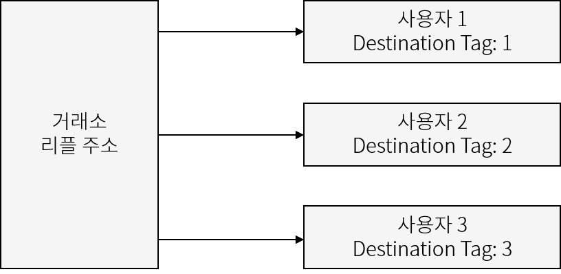

# 리플 (XRP) 지갑 계정 사용법

## 리플 (XRP) 지갑 활성화

리플 (XRP) 지갑 주소를 처음 추가하셨다면 비활성화된 상태입니다. [리플의 정책](https://xrpl.org/reserves.html)으로 리플 지갑 주소를 활성화(activate) 상태로 전환하기 위해서는 **10 XRP 이상의 리플을 구매 또는 양도 받아야 합니다**. 따라서, 해당 10 XRP는 해당 지갑 주소에서 영구 락업(lock-up)이 걸리게 됩니다.​

리플 지갑 주소에 영구 락업이되면, 지갑 생성 후 1,000 XRP 전액을 송금한다고 가정 시, 영구락업 물량인 10 XRP를 제외한 990 XRP만 송금이 가능하다는 뜻입니다. \

## 리플 데스티네이션 태그 (Destination Tag)

&#x20;거래소에서 사용되는 리플 지갑은 동일한 주소를 사용합니다. 즉, 사용자#1, 사용자#2, 사용자#3, 모두 같은 리플 주소를 사용함으로 사용자의 계정을 구별하기 위해 고유 식별 번호 (Destination Tag)를 할당하여 관리합니다. **따라서, 거래소에서 생성한 리플 계정 주소로 송금을 보낼 경우 반드시 Destination Tag를 입력해야 사용자의 거래소 지갑 계정으로 정상적인 입금이 완료됩니다**.

## 거래소에서 존재하는 리플 지갑 계정 (예시)

바이낸스와 같은 거래소에서 존재하는 리플 계정의 예시를 보겠습니다.\
리플 (XRP) 입금을 누르면 위 그림과 같이 XRP 입금 Tag (**9자리 고유 번호**)가 표시됩니다.\
하단 부분에는 거래소에 존재하는 나의 리플 계정 주소가 표시됩니다.


**거래소에 존재하는 리플 지갑 주소로 송금을 보낼 때는 반드시 Destination Tag를 입력해야 합니다.**


## 디센트에서 생성한 리플 지갑 계정&#x20;

디센트 월렛과 같이 사용자가 직접 생성한 리플 지갑의 경우에는 리플 계정 주소만 존재하며 Destination Tag가 없습니다.&#x20;


**디센트 월렛과 같이 개인이 직접 생성한 리플 지갑 주소는 Destination Tag가 없습니다.**&#x20;


[강력한 보안, 지문으로 완성하다 **\[디센트 암호화폐 지갑\] 보러 가기 >>**](https://store-kr.dcentwallet.com/pages/dcent-biometric-crypto-wallet?utm\_source=userguide\&utm\_medium=dcent-web\&utm\_campaign=202406\_ripple-xrp)

