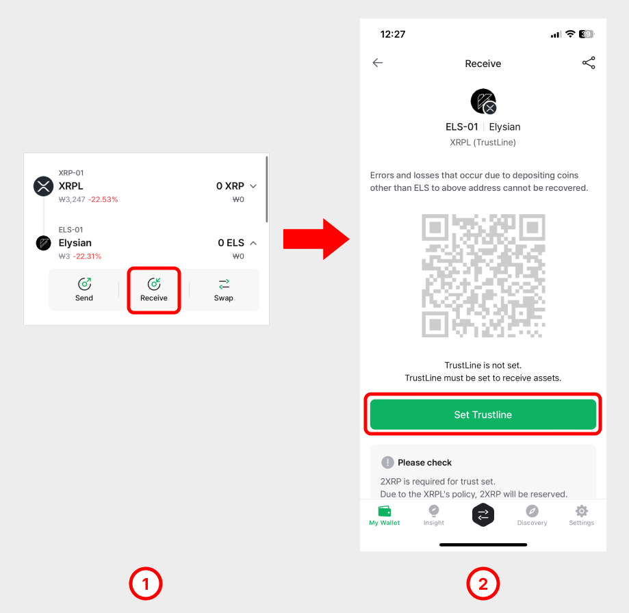

# 리플 Trust Line 사용법

리플 계정에 트러스트 라인 계정을 추가하는 방법과 Trust Asset (IOU)을 받기 위해 트러스트 라인을 활성화하는 방법에 대한 가이드입니다.

## **트러스트 라인 계정 추가하는 방법**

1\) My Wallet 탭 하단의 계정 추가(+) 버튼을 누르고 추가하려는 트러스트 라인 계정을 검색합니다.

2\) 예시로, Elysian (ELS)를 추가해보겠습니다. 검색란에 **"ELS"**&#xB97C; 입력하고 검색된 **Elysian (ELS) TrustLine**을 선택합니다.

3\) 수수료 계정으로 사용할 리플 계정을 선택합니다. "**다음"**&#xC744; 누르고 진행합니다.

4\) 트러스트 라인 계정의 이름을 새롭게 설정하거나 기존 이름을 사용합니다. **"만들기"** 버튼을 터치합니다.

5\) 트러스트 라인 계정이 추가되면 리플 계정 아래에 보입니다.

### **트러스트 라인 활성화 방법**

트러스트 라인을 지갑에 추가한 것 만으로 해당 계정에 Trust Asset (IOUs)를 받을 수 없습니다. **자산을 받으려면 트러스트 라인이 먼저 활성화 되어야합니다.**

1\) 추가한 트러스트 라인 계정을 터치하고 "**받기"** 버튼을 터치합니다.

2\) 트러스트 라인이 비활성화된 상태라면 주소가 표시되지 않음을 확인할 수 있습니다. "**트러스트 라인 설정"**&#xC744; 터치하여 활성화를 진행합니다.

3\) 트러스트 라인을 설정하면 **0.2 XRP가 추가로 락업됩니다** (공지 당시 기준). 트러스트 라인을 설정하려면 **"확인"** 버튼을 터치합니다.

4\) 트러스트 라인 활성화를 위해 리플 블록체인 네트워크에 메시지 전송이 필요합니다. 메시지 전송을 위한 수수료로 소량의 XRP가 필요합니다. 비밀번호를 입력하여 거래에 서명을 합니다. 지문인증형 지갑을 사용하는 경우 기기에서 서명합니다.

5\) 트러스트 라인이 활성화 되면 계정 주소가 표시됩니다.

## 트러스트 라인 활성화 해제하기 

트러스트 라인은 언제든지 원하는 시점에 활성화 해제가 가능합니다. 심지어 계정에 자산이 남아 있어도 활성화 해제가 가능합니다. 다만 비활성화 된 계정에 남아있는 자산은 전송이 불가능합니다. 트러스트 라인 활성화를 위해 락업되었던 0.2 XRP를 언락(잠금해제)하려면 활성화 해제하려는 트러스트 라인 계정에 잔액이 존재하지 않아야만 언락됩니다. \
따라서, 트러스트 라인 활성화를 해제 전에 해당 계정의 자산이 남아있지 않은 지 확인하시기 바랍니다.

**각 트러스트 라인 계정의 활성화를 해제하면 XRPL 계정에 락업(Reserved)되었던 0.2 XRP를 다시 사용하실 수 있습니다.**

1\) 활성화 해제하려는 트러스트 라인 계정을 선택하고 "**계정상세 거래내역"**&#xC744; 터치합니다.

2\) 우측 상단의 더보기 (3점) 버튼을 터치하고 아래 메뉴에서 **"트러스트 라인 활성화 해제"**&#xB97C; 선택합니다.

3\) 안내 팝업을 확인하고 **"활성화 해제"** 버튼을 누릅니다.

4\) 트러스트 라인 비활성화를 위해 리플 블록체인 네트워크에 메시지 전송이 필요합니다. 메시지 전송을 위한 수수료로 소량의 XRP가 필요합니다. 비밀번호를 입력하여 거래에 서명을 합니다. 지문인증형 지갑을 사용하는 경우 기기에서 서명합니다.

5\) 트러스트 라인 활성화 해제가 완료되면 해당 계정에서는 **“트러스트 라인이 활성화 되지 않았습니다”** 라는 메시지가 표시됩니다.

### 트러스트 라인 계정 제거하기 

더 이상 사용하지 않는 트러스트 라인 계정을 삭제하는 방법은 간단합니다.

1\) My Wallet 탭에서 제거하려는 트러스트 라인 계정을 선택합니다.

2\) **"계정 숨기기"**&#xB97C; 누르면 더 이상 지갑에서 표시되지 않습니다.
