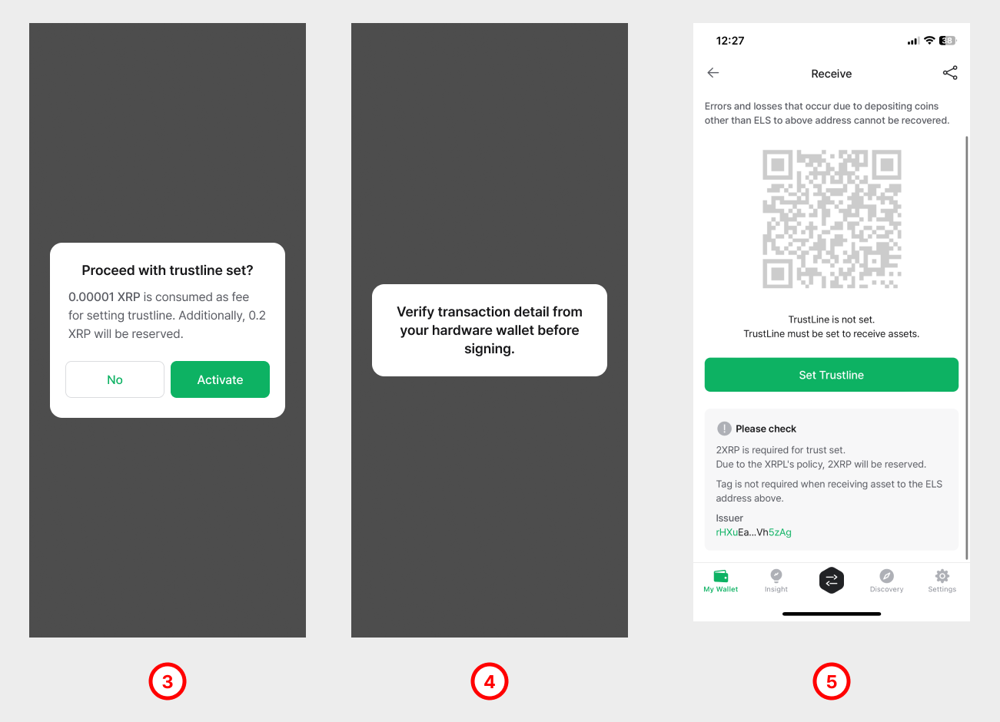
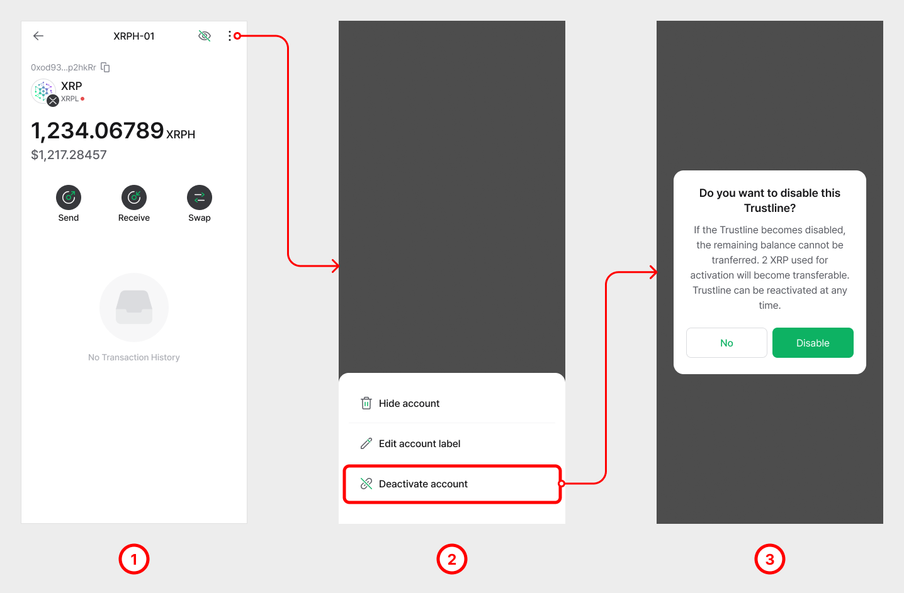
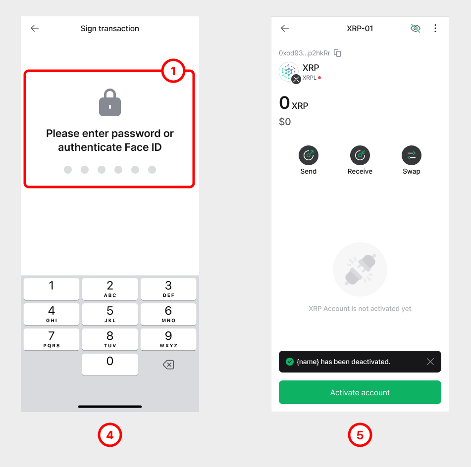

# Using Trust Line for XRPL

This is an instruction guide on **how to add** a Trust Line account to your XRPL and **how to activate** it in order to receive the Trust Asset (IOU).&#x20;

## **How to add a Trust Line account**

<figure><figcaption></figcaption></figure>

**1.** Click on the Add account **(+)** button and search for the name of the Trust Line account you’d like to add.

**2.** For example, we will add Elysian (ELS). Search for **"ELS"** and click on the **Elysian (ELS) TrustLine** from the list.

**3.** Select your XRP account to set it as the Fee Account. Click '**Next**' to continue.

<figure><figcaption></figcaption></figure>

**4.** You can label your account or set it as default. Click '**Create'** to add this Trust Line account.

**5.** The Trust Line account added should show up under the XRP account.

### **How to set (activate) Trust Line**

Remember that just adding a Trust Line account does not mean you can receive the Trust Asset (IOUs) to this account. **You must first set (activate) the Trust Line before you can receive funds**.

<figure><figcaption></figcaption></figure>

**1.** Click on the Trust Line account and click on the '**Receive'** button.

**2.** Notice that before activation, the address is not displayed. Click on '**Set Trustline'** to start the activation.

<figure><figcaption></figcaption></figure>

**3.** Note that setting(activating) a Trust Line will **reserve 0.2 XRP** (at the time of writing). To activate the Trust Line, click on the '**OK'** button.

**4.** Activating a Trust Line will send a transaction to the XRPL blockchain network and a small transaction fee is required. Enter your password to sign this transaction. If you are using a Biometric wallet, you will sign from that device.

**5.** When the Trust Line is activated, the account will display the address.

## How to disable a Trust Line 

A Trust Line can be deactivated at any time, even if there is remaining funds in that account. However, the funds remaining in the deactivated Trust Line account will become non-transferable. The 0.2 XRP reserved from setting a Trust Line will become liquid again only if the Trust Line has no remaining balance. Therefore, before you deactivate a Trust Line, it is highly recommended to empty the account.

**👉 Disabling a Trust Line account will free up 0.2 XRP which was reserved (locked) in your XRPL account.**

<figure><figcaption></figcaption></figure>

**1.** Select the Trustline account you want to deactivate and navigate to the Account Details screen.

**2.** Click on the '**ellipsis (the 3 vertical dots)'** and click on **'Disable Trustline'**.

**3.** Read the message and Click on '**Disable'.**

<figure><figcaption></figcaption></figure>

**4.** Disabling a Trust Line will send a transaction to the XRPL blockchain network and a small transaction fee is required. Enter your password to sign this transaction. If you are using a Biometric wallet, you will sign from that device.

**5.** Once the Trust Line gets disabled, you will see a message that shows **“Trustline is not activated yet”.**

### How to remove a Trust Line account 

Removing a Trust Line account from your wallet is fairly easy.

<figure><figcaption></figcaption></figure>

**1.** Click on the Trust Line account you wish to remove.

**2.** Click on "**Hide account"** to remove this account from the wallet.
