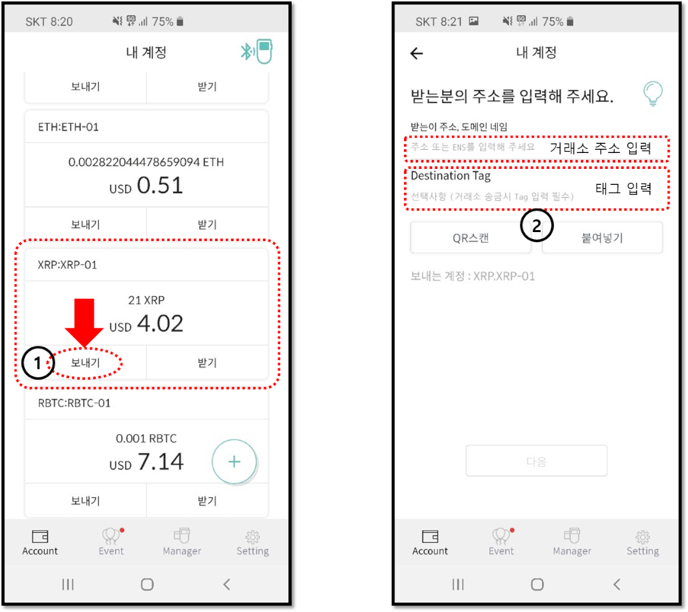

# 디센트 월렛에서 리플 (XRP) 보내기

### 상대방의 주소 및 Destination Tag 입력

1. 모바일앱에서 거래에 사용할 리플 (XRP) 계정의 “**보내기**” 버튼를 눌러줍니다.\

2. 주소 입력란에 상대방(받는이)의 주소를 직접 입력하고 거래소에 존재하는 주소로 송금을 보내는 경우 Destination Tag를 입력합니다.


거래소에 존재하는 주소로 송금을 보내는 경우 반드시 Destination Tag를 입력해야 사용자의 계정으로 정상적인 입금이 완료됩니다.\
\
거래소에 존재하는 주소로 Destination Tag를 입력하지 않고 송금을 보낼 경우 입금액이 유실될 수 있습니다.



디센트 월렛과 같은 개인이 생성한 리플 지갑 주소로 송금을 보내는 경우 Destination Tag가 필요없습니다. 상대방이 Destination Tag를 제공한 경우에는 입력합니다.

