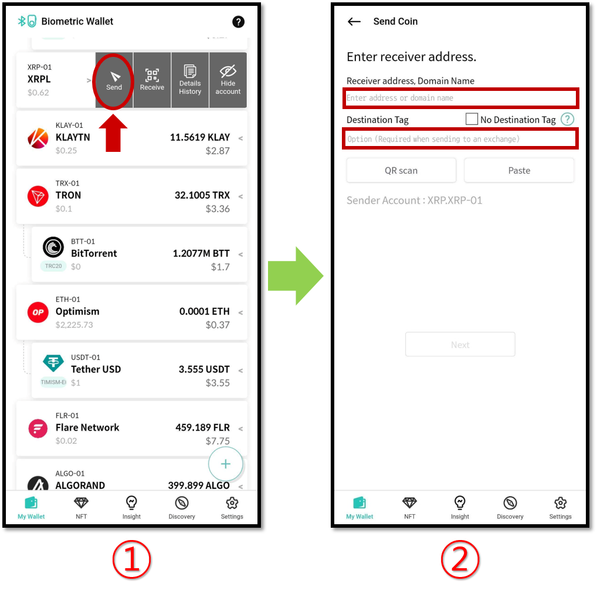

# Sending XRP using D'CENT Wallet

### Enter the receiver address and the Destination Tag

1\) From mobile app, press the “**Send**” button of the Ripple (XRP) account to be used for the transaction.

2\) Enter the wallet address of the other party (receiver) and enter the Destination Tag if you are sending XRP to an address that is created by an Exchange.


**When sending XRP to an address that exists on the Exchange, you MUST enter the Destination Tag to complete normal deposit into the receiver's account.**

**If you send XRP WITHOUT entering the Destination Tag to an address that exists on the Exchange, the deposit amount may be lost forever.**



A Destination Tag is not required if you send XRP to a personal wallet such as D'CENT Wallet.\
However, if the other party (receiver) provides you with a Destination Tag, you must enter it.

