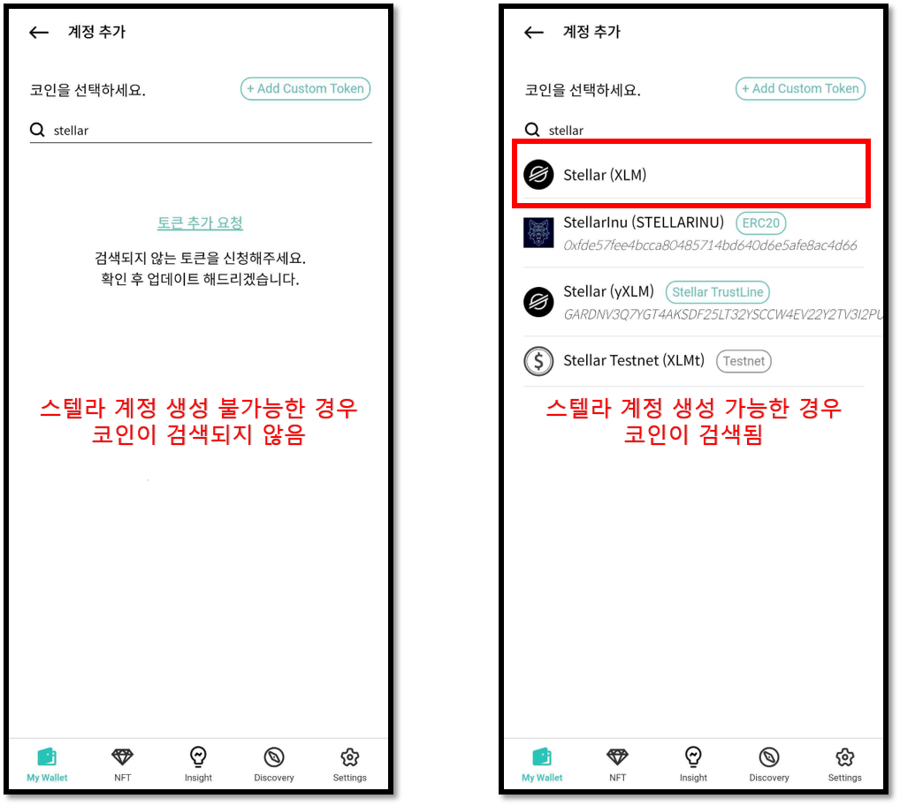
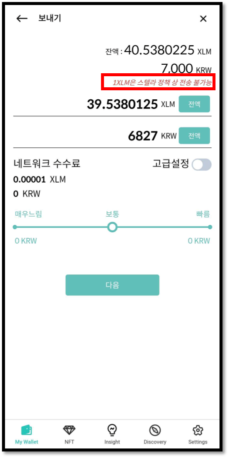
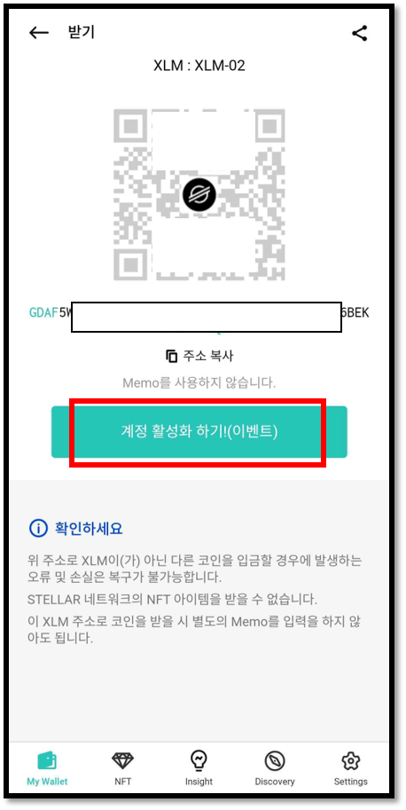
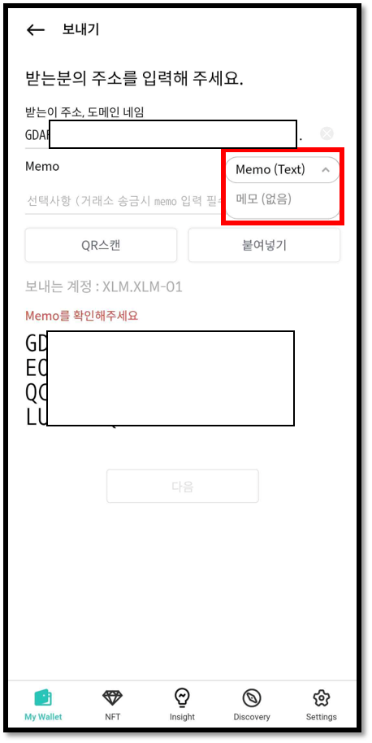
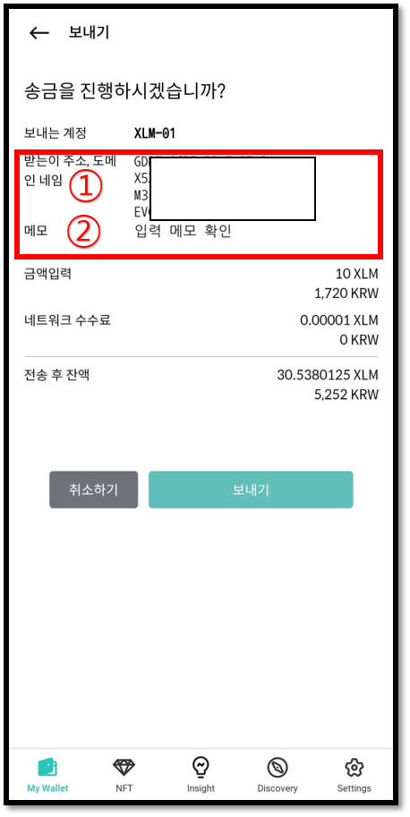

# 스텔라루멘 (XLM) 지갑 계정 사용법

## 펌웨어 버전 확인

하드웨어 지갑 펌웨어 버전 v2.1.0 부터 스텔라 코인을 지원합니다. 펌웨어를 업데이트하는 방법은 아래 링크를 참고해주세요.


[firmware-update-from-computer](../../../biometric-wallet/firmware-update-from-computer/)



[firmware-update-from-mobile.md](../../../biometric-wallet/firmware-update-from-mobile.md)


## 스텔라 계정 생성

스텔라 계정이 없다면 생성해 주세요. 코인 이름은 "Stellar (XLM)"로 되어 있습니다.  계정을 생성하는 방법은 아래 링크를 참고해주세요.


[create-account](../../../mobile-app/create-account/)


## 스텔라 계정을 생성할 수 없는 경우&#x20;


현재 사용중인 펌웨어 버전이 v2.1.0 이상인데 스텔라 계정을 생성할 수 없는 경우가 있습니다. 하드웨어 지갑을 처음 구매시 제품에 탑재된 펌웨어 버전이 v2.0.1 보다 낮은 경우 스텔라에서 사용하는 새로운 알고리즘을 사용할 수 없기 때문입니다.


모바일 앱에서 스텔라 계정을 생성할 수 없는 경우 아래 그림과 같이 스텔라 코인을 검색해도 표시가되지 않습니다.

### 해결 방안

하드웨어 지갑의 설정 메뉴에서 기기 초기화 후 복구단어를 사용하여 지갑을 복구하면 스텔라 지갑 계정을 생성할 수 있습니다.

1\) 하드웨어 지갑을 기기 초기화하는 방법은 [여기](https://userguide.dcentwallet.com/v/kr/biometric-wallet/setting-menu#undefined-8)를 참고해주시기 바랍니다.

2\) 콜드월렛을 복구하는 방법은 [여기](https://userguide.dcentwallet.com/v/kr/biometric-wallet/recovery)를 참고해주시기 바랍니다.&#x20;


주의!! 복구단어 분실 상태에서 절대로 기기를 초기화 하지 마세요!&#x20;


## 스텔라 (XLM) 지갑 활성화

스텔라 (XLM) 지갑을 추가하시면 비활성화(스텔라 네트워크에서 생성되지 않은) 상태입니다. 스텔라의 정책으로 스텔라 주소에는 **1XLM 이상의 자금을 양도 받아야 해당 계정이 스텔라 네트워크에서 활성화 됩니다**. 거래소에 따라 비활성화 계좌에 송금이 제한되어 있을 수 있습니다.&#x20;

또한, **해당 계정의 1XLM은 영구 락업(lock-up)이 걸리게 됩니다**. 만약, 지갑 생성 후 100XLM이 계정에 있다면 락업된 비용을 제외한 99XLM(수수료 포함)만 송금이 가능합니다. 그림과 같이 전액 전송 시에도 1XLM은 다른 계정으로 보낼 수 없습니다.


경우에 따라 락업 금액이 상이 할 수 있습니다. 보다 자세한 사항은 아래 링크를 참고하세요.\
[https://www.stellar.org/developers/guides/concepts/fees.html#minimum-account-balance](https://www.stellar.org/developers/guides/concepts/fees.html#minimum-account-balance)


현재 디센트 월렛에서는 생성한 스텔라 주소에 대해 계정 활성화를 위한 이벤트 중입니다. 아래 **스텔라 코인 받기** 항목을 참고하세요.&#x20;

## 스텔라 메모

거래소에서 사용되는 스텔라 지갑은 한개의 주소를 사용합니다. 즉, 거래소 사용자 모두 같은 주소를 사용함으로 사용자의 계정을 구별하기 위해 고유 식별 문자(Memo)를 할당하여 관리합니다.\
**따라서, 거래소에서 생성한 스텔라 계정 주소로 송금을 보낼 경우 반드시 Memo를 입력해야 사용자의 거래소 지갑 계정으로 정상적인 입금이 완료됩니다.**

## 스텔라 코인 받기

생성된 스텔라 계정의 '**받기**'를 클릭하면 스텔라 계정의 주소를 확인할 수 있습니다.

&#x20;만약 계정이 비활성화 상태라면 이벤트 링크를 통해 계정을 활성화 해주세요.

## 스텔라 코인 보내기

스텔라 코인을 거래소 계정으로 보내는 경우 반드시 Memo를 입력하셔야 합니다. 거래소가 아닌 디센트 월렛과 같이 개인이 직접 생성한 스텔라 지갑 주소의 Memo는 옵션입니다. 임의의 Memo를 입력하거나 Memo 옵션을 변경해주세요.

송금 시에는 송금 확인 창에서 다시 한번 주소와 메모를 확인해주세요.

