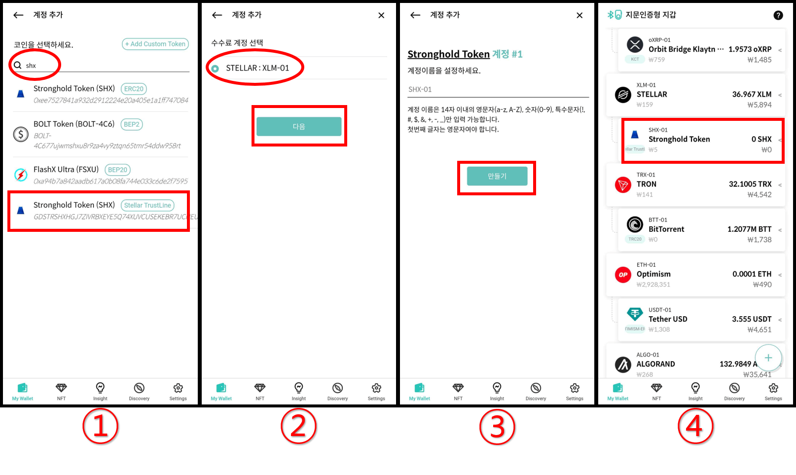
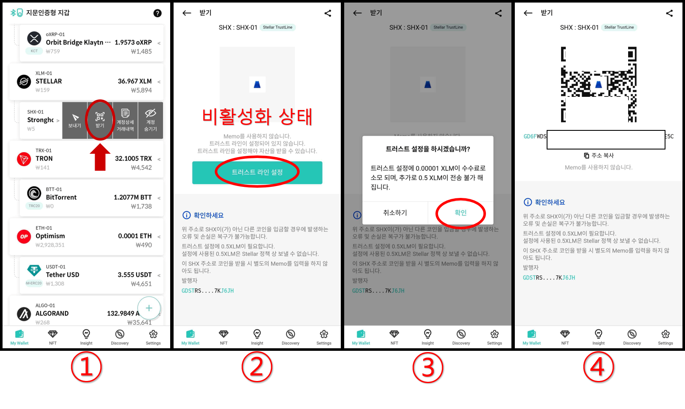
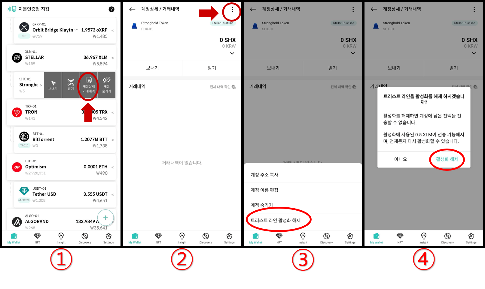

# 스텔라 Trustline 사용법

## 트러스트 라인 추가하는 방법 

**NOTE**: 스텔라 (XLM) 원장에 트러스트 라인을 추가하게되면 0.5 XLM이 계정에 락(lock)됩니다.

**1.** 트러스트 라인은 계정을 추가하려면 자산 이름을 검색하시면 쉽게 추가할 수 있습니다. 예시로 **Stronghold Token (SHX)**을 추가하겠습니다.

**2.** 선택한 트러스트 라인과 연결할 스텔라(XLM) 메인넷 계정을 선택합니다. 트러스트 라인을 사용할 때(거래 전송과 같은 활동)는 스텔라 메인넷 계정에서 수수료가 지불됩니다. **"다음"** 버튼을 클릭합니다.

**3.** "**만들기"** 버튼을 클릭합니다.

**4.** Stronghold Token (SHX) 트러스트 라인 계정이 추가된 것을 My Wallet 화면에서 확인하실 수 있습니다.

### (중요!!) 트러스트 라인 활성화하는 방법 

단순히 트러스트 라인을 추가한다고 해서 이 계정으로 신탁 자산(발행 통화)을 받을 수 있는 것은 아닙니다. 트러스트 라인 계정에 자금을 받으려면 먼저 Trustline을 설정(활성화)해야 합니다.

**1.** 트러스트 라인 계정(예: SHX)을 클릭하고 "**받기"** 버튼을 클릭합니다.

**2.** 비활성화된 계정은 주소가 표시되지 않는것을 확인하실 수 있습니다. 화면에서 **"트러스트 라인 설정"** 버튼을 클릭합니다.

**3.** 트러스트 라인을 설정(활성화)하려면 **0.5 XLM**이 락(lock)됩니다. 트러스트 라인 활성화를 진행하려면 **"확인"** 버튼을 클릭합니다.

**4.** 트러스트 라인이 활성화되었다면 주소가 표시됩니다.

## 트러스트 라인 비활성화(해제)하는 방법 

잔액이 존재하지 않는 트러스트 라인 계정은 언제든지 비활성화 할 수 있습니다. **비활성화를 진행하면 기존에 락(lock)되었던 0.5 XLM을 다시 사용하실 수 있습니다.**

**1.** 비활성화 하려는 트러스트 라인 계정을 (예: SHX) 클릭하고 **"계정상세/거래내역"**을 클릭합니다.

**2.** 상단 오른쪽에 위치한 **"더보기 (3점)"** 버튼을 클릭합니다.

**3.** **"트러스트 라인 활성화 해제"**를 클릭합니다.

4\. **"활성화 해제"**를 클릭하면 트러스트 라인 비활성화가 진행됩니다.

### 사용하지 않는 트러스트 라인 계정 숨기는 방법 

지갑의 메인 화면에서 더 이상 사용하지 않는 트러스트 라인 계정을 제거하려면 해당 계정을 클릭하고 **"숨기기"** 버튼을 클릭합니다.
