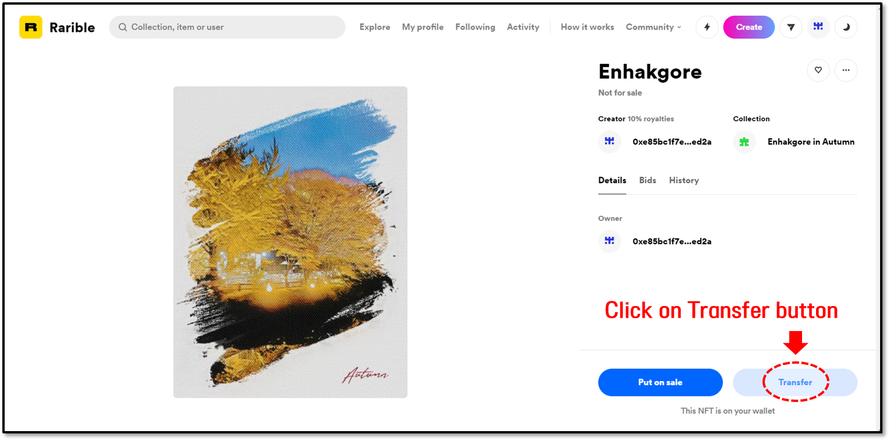

# How to receive or send an NFT token

## Receiving an NFT token to D'CENT Wallet

Let’s see how to send NFTs from another wallet to D'CENT Wallet. In our example, we have NFTs using Metamask at Rarible, an NFT marketplace. At this time, the situation is where you want to send NFT to D'CENT Wallet. The process of transferring an NFT from other exchanges and wallets to D'CENT Wallet is similar.

**1.** Check the NFT you currently have. In this example, we have an NFT in the MetaMask wallet connected to the Rarible Marketplace. To transfer this NFT token to the D'CENT Wallet, click on  Transfer.

**2.** The MetaMask (or wallet that is currently linked to the service) screen will be triggered, and you will have to create a send transaction. After entering the address, set the fee and click OK. This will send the NFT transfer transaction to the blockchain network (Ethereum in the example).

**3.** When the NFT transfer transaction gets completed from the blockchain network, you will see that an NFT received to your D'CENT Wallet will be displayed on the Collectibles Tab.

## Sending an NFT token from D'CENT Wallet to another wallet

Let’s see how to send out an NFT token from D'CENT Wallet to another wallet or exchange. In the example, the situation is where the MetaMask will receive the NFT token while connected to Rarible, an NFT marketplace. Sending from D'CENT Wallet to other exchanges and wallets is a similar process.

**1.** From the Collectibles Tab of your D'CENT Wallet, select your NFT collection and then click the Send button. When the screen changes, enter the recipient's address.

.png>)

**2.** After checking the recipient's address, set the fee and finally check the transaction details to be sent to the blockchain network.

.png>)

**3.** After the transaction is transmitted to the blockchain network, you will need to wait a certain period of time for the transaction to be completed. When the transaction is completed, you will see that the NFT token that was sent will no longer appear in the collectibles list.

.png>)
