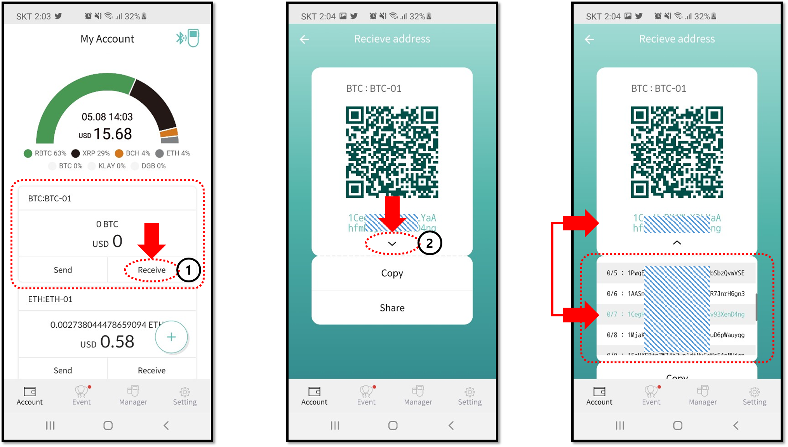

# How to view all the BTC public addresses

### Why does my BTC public address change?

The public address of Bitcoin stems from the wallet's **xPub** \(Extended Public Key\), this means that a new public address can be derived from it. Once your Bitcoin public address **receives an incoming payment**, a new address will automatically be generated. 

### Viewing all the BTC addresses

When your BTC account is created on D'CENT Wallet, it will automatically generate 15 public addresses that you can use. To see the full list of BTC public addresses, run the mobile app and do the following:

1\) Press the "Receive" button on your Bitcoin account.  
  
2\) On the next screen press the **down arrow** \( **∨** \) under the current BTC address. 

In the last screen shot, you can see a list of your public addresses. The current BTC address is highlighted in "mint" color.

