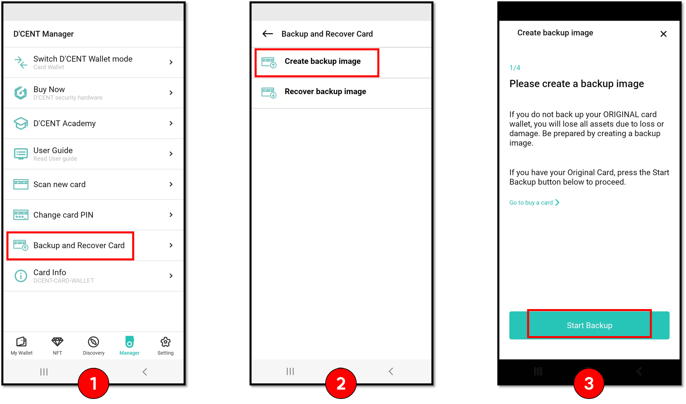

# NFT 토큰 받기 및 보내기

## 디센트 지갑으로 NFT 토큰 받기

다른 지갑에서 디센트 지갑으로 NFT를 보내기 위한 방법을 알아보겠습니다. 예시에서는 NFT 마켓 플레이스인 라리블에서 메타마스크를 이용해서 NFT를 가지고 있는 경우입니다. 이 때, 디센트 지갑으로 NFT를 보내고자 하는 상황이며, 다른 거래소 및 지갑에서 디센트로 가져오는 것도 유사한 과정입니다.

**1) **현재 보유중인 NFT를 확인합니다. 본 예시에서는 라리블 마켓 플레이스에서 메타마스크 지갑으로 NFT를 가지고 있습니다. 디센트 지갑으로 NFT를 옮기기 위하여, 전송하기(Transfer)를 클릭합니다.

**2)** 메타마스크(혹은 현재 서비스에 연동중인 지갑) 화면이 뜨면서, 수신자의 주소 입력하는 과정이 나타납니다. 주소를 입력하고 수수료를 설정 후 확인을 클릭하면, 네트워크 (예시에서는 이더리움)로 NFT를 이전하는 거래가 전송됩니다.

.png>)

**3) **디센트 지갑을 확인하면, 원래는 보유하지 않았던 NFT가 네트워크에 거래가 성사되면서 수집품 목록에 표기됨을 확인합니다.

.png>)

## 디센트 지갑에서 다른 지갑으로 NFT 토큰 보내기

디센트 지갑에서 다른 지갑 혹은 거래소로 NFT를 내보내는 방법을 알아보겠습니다. 예시에서는 NFT 마켓 플레이스인 라리블에서 메타마스크를 이용해서 받는 경우입니다. 다른 거래소 및 지갑에서 디센트로부터 내보내는 것도 유사한 과정입니다.

**1)** 디센트 지갑의 수집품 탭에서 수집품을 선택합니다. 이 후, 수집품 정보에서 보내기 버튼을 클릭합니다. 화면이 바뀌면 받는 사람의 주소를 입력합니다.

**2)** 받는 주소를 확인 후, 수수료를 설정하고 최종적으로 네트워크에 보낼 거래내역을 확인합니다.

**3)** 거래내역이 네트워크로 전송되면 일정 시간이 지난 후, 거래가 완료되었다는 화면으로 전환됩니다. 이후에는 수집품 목록에 내보낸 수집품이 사라진 것을 확인할 수 있습니다.

