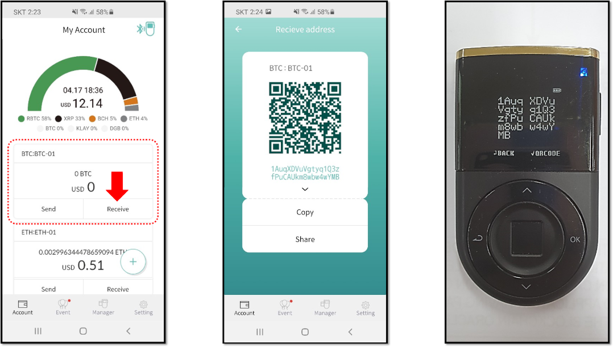

# How to receive coin

## Receive coin using Biometric Wallet

D'CENT Biometric Wallet offers a convenient feature of showing the account address in the QR code.    

* From the main screen select the coin account you want and press OK button to see the account info. 
* Press OK button again to see the address in hex\(numbers + characters\) form.
* Press OK button for one last time to see the address in the QR code.

* Present the QR code to the sender to scan with the mobile camera.
* If QR code is read correctly, your address will be automatically inserted in the sender's wallet.

## Receive coin using Mobile App

Run the mobile app and you will see your accounts in the main screen.

* From your coin account, click "**Receive**" to view your account address.
* Your account address in QR code can be scanned by the sender's camera.
* To share the hex address to your sender, use the "**Copy**" or "**Share**" function. 


You can just run the mobile app to see the account address. 

You can use it more safely if you check the address once again from the Biometric Wallet.


