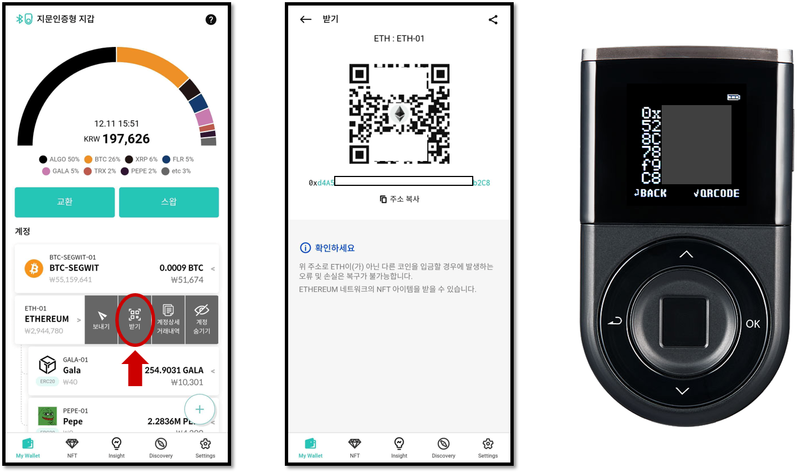

# 코인 받기 사용법

암호화폐 자산을 받으려면 먼저 해당 계정이 생성되어 있어야 내가 받을 수 있는 주소를 확인할 수 있습니다.


**반드시 코인을 보내는 곳과 같은 네트워크의 코인 계정을 디센트 지갑에 추가했는 지 확인하시기 바랍니다. 지원 네트워크가 다르다면 코인을 받을 수 없습니다.**



[create-account](../mobile-app/create-account/)


## 지문인증형 콜드월렛을 사용하여 코인 받기 

디센트 콜드월렛은 내 코인 계정의 주소를 QR 코드 형식로 변환하여 표시해주는 편리한 기능을 제공합니다.   &#x20;

* 콜드월렛의 메인 화면에서 원하는 코인 계정을 선택하고 OK 버튼을 입력하면 지갑 계정의 정보가 표시됩니다.&#x20;
* OK 버튼을 한번 더 입력하면 hex형(숫자 및 알파벳 조합)의 주소가 표시됩니다.
* 마지막으로 OK 버튼을 한번 더 입력하면 QR 코드 형태의 주소가 표시됩니다.

* 화면에 표시된 내 계좌 주소 (QR 코드)를 보여주면 상대방은 모바일폰의 카메라로 QR 코드를 읽습니다.
* QR 코드가 정상적으로 인식될 경우 상대방의 지갑앱에서는 내 코인 계 주소가 자동으로 입력됩니다.&#x20;

## 디센트 모바일 앱을 사용하여 코인 받기 

디센트 모바일 앱을 실행하면 My Wallet 에 내가 추가한 코인 계정이 표시됩니다. &#x20;

* 내 코인 계정의 주소를 확인하려면 **"받기"**&#xB97C; 눌러줍니다.
* 화면에 표시되는 내 계정 주소 (QR 코드 형태)는 송금을 보내주려는 상대방의 카메라로 읽을 수 있습니다.
* Hex 형태의 내 계정 주소는 "**복사**" 또는 "**공유**"가 가능합니다.&#x20;
  * 복사한 주소는 문자 메시지 작성 시 붙여넣기 하여 상대방에게 주소를 전달할 수 있습니다.
  * 주소 공유를 선택하면 사용하고 계시는 SNS 앱을 통해 상대방에게 주소를 전달할 수 있습니다.


모바일 앱만 사용하여 내 코인 계정의 주소 확인이 가능합니다.&#x20;

지문인증 콜드월렛과 연동한 상태에서 주소가 올바른지 다시 한번 확인하시면 보다 안전하게 사용이 가능합니다.

