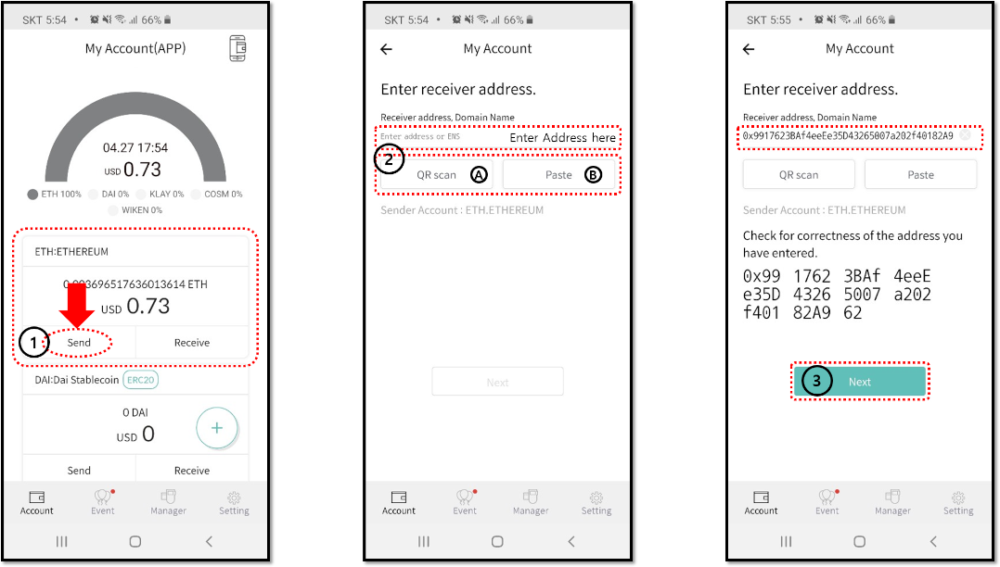
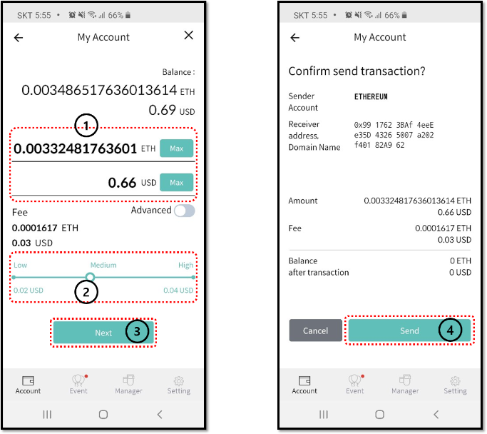
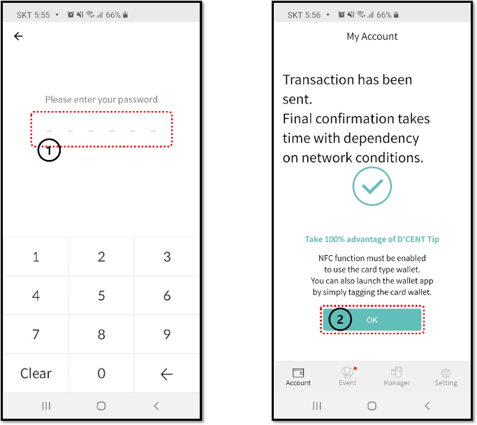

# Software Wallet mode


App Wallet is a software wallet that can be used free of charge without a hardware wallet. If you want more secure asset management, please purchase D'CENT Wallet.


### Enter the Recipient address

1\) From the mobile app, press the “Send” button of the coin account to be used for the transaction.

2\) You can directly enter the address of the other party (recipient) in the address field, or \
&#x20;    A. Press **QR Scan** to operate the camera. \
&#x20;    B. Click **Paste** to enter the copied address.

3\) When the address is entered, click the "**Next**" button.\

### Enter the amount to send and set the fee

1\) Enter the number of cryptocurrency you want to send, or enter the amount in local currency.

2\) Set the transaction fee. (Economic / Normal / Fast) \
By setting it to "fast" and paying more fees, it is likely that the processing time of the transfer transaction will be reduced.

3\) Once you have set the amount and fee, click the "**Next**" button.

4\) Check if the transaction details displayed on the screen are correct and click the "**Send**" button.\

### Final confirmation from your App Wallet

1\) Enter the 6-digit password you've set to protect access to your mobile app.&#x20;

2\) When the transaction data is transmitted to the blockchain, the mobile app displays a message that the transaction has been completed. Click the "**OK**" button to return to the main screen.
