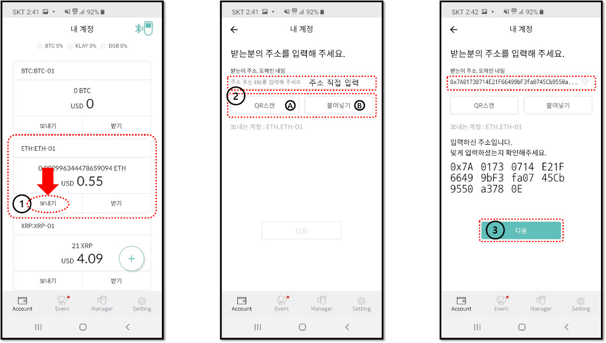
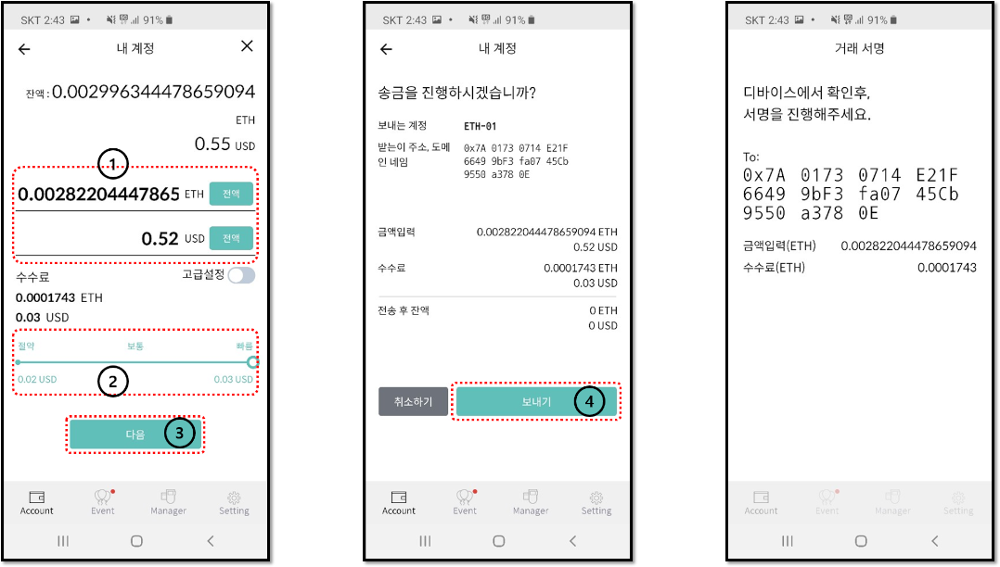
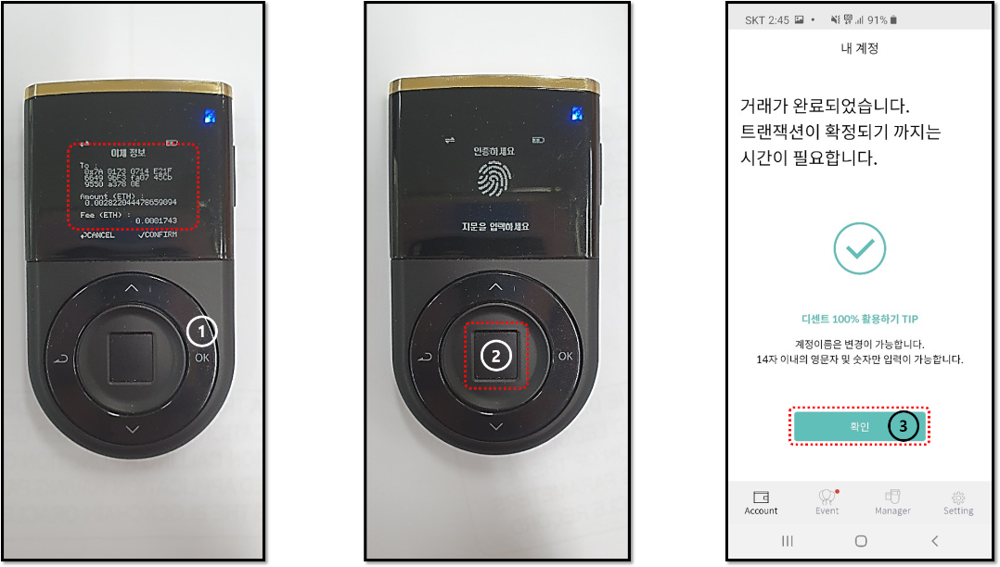

# 지문인증형 콜드월렛 사용


지문인증형 콜드월렛을 사용하는 경우 모바일앱과 연동된 상태에서만 코인 보내기가 가능합니다. 


### 상대방의 주소 입력

1. 모바일앱에서 거래에 사용할 코인 계정의 “**보내기**” 버튼를 눌러줍니다. 
2. 주소 입력란에 상대방\(받는이\)의 주소를 직접 입력이 가능합니다.

   A. QR스캔을 누르면 카메라가 작동합니다.  
   B. 붙여넣기를 누르면 복사한 주소가 입력됩니다.  

3. 주소가 입력되으면 "**다음**" 버튼을 눌러줍니다. 

### 보내는 금액 및 수수료 입력

1. 보내려는 암호화폐 개수를 입력하거나 또는 현지 통화 금액을 입력합니다. 
2. 수수료를 설정합니다. \(절약 / 보통 / 빠름\) "**빠름**"으로 설정하여 더 많은 수수료를 지불하면 송금 거래의 처리 시간이 단축될 가능성이 높습니다. 
3. 보내려는 금액과 수수료를 설정하였으면 "**다음**" 버튼을 눌러줍니다.  
4. 화면에 표시된 거래 내용이 올바른지 확인하고 "**보내기**" 버튼을 눌러줍니다. 

### 지문인증형 콜드월렛에서 최종 승인

1. 지문인증형 콜드월렛에서 표시되는 이체 정보를 한번 더 확인합니다. 정보가 올바른 경우 "**OK**" 버튼을 눌러줍니다. 
2. 이체 거래의 최종 승인을 위해 사용자의 지문을 입력합니다. 지문을 등록하지 않은 경우 PIN 번호를 입력하여 최종 승인합니다.    
3. 거래\(트랜잭션\) 정보가 블록체인으로 전송되면 모바일앱에서 거래가 완료되었다는 메시지를 표시합니다. "**확인**" 버튼을 눌러 메인 화면으로 돌아갑니다. 

