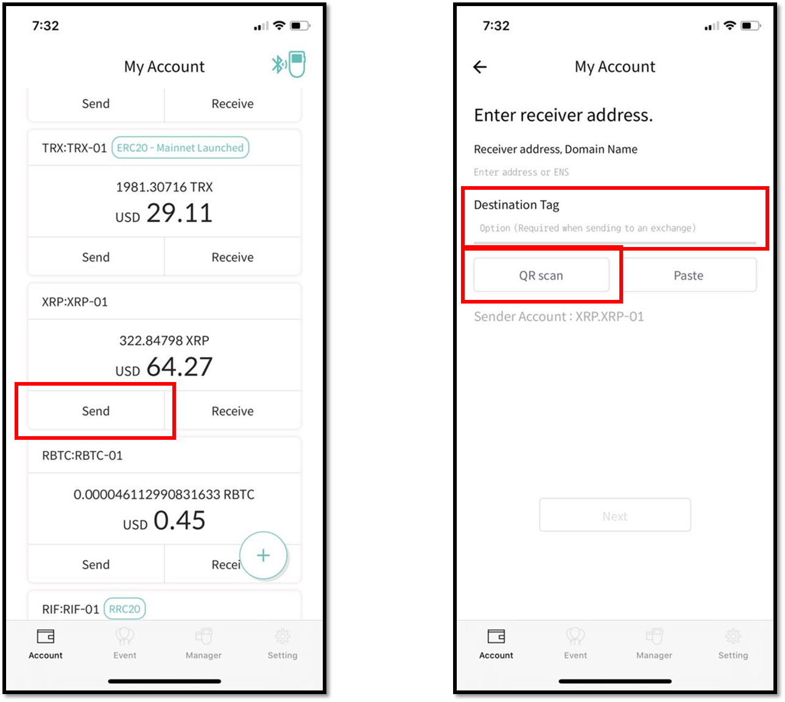
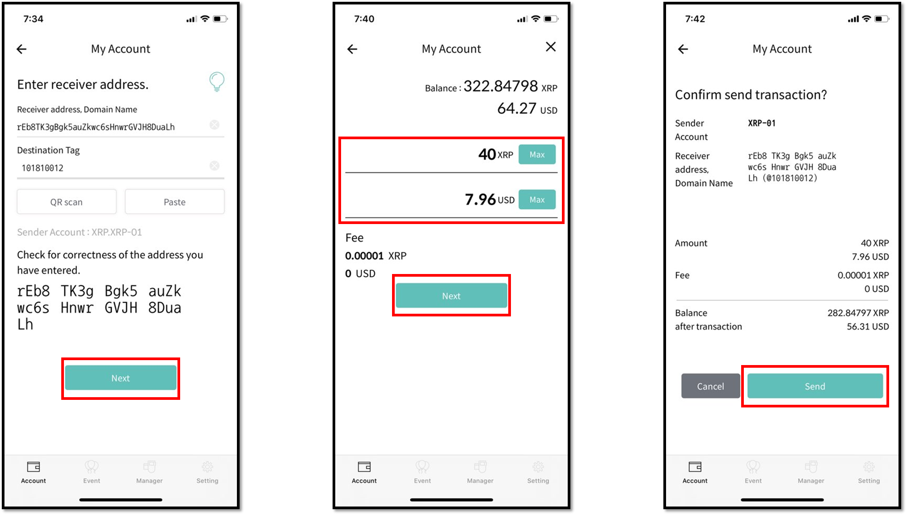
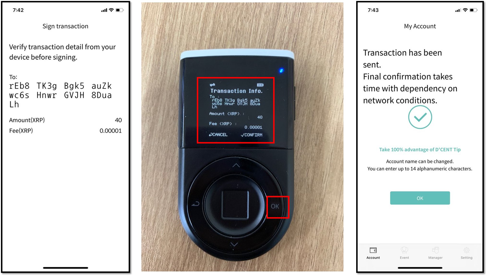
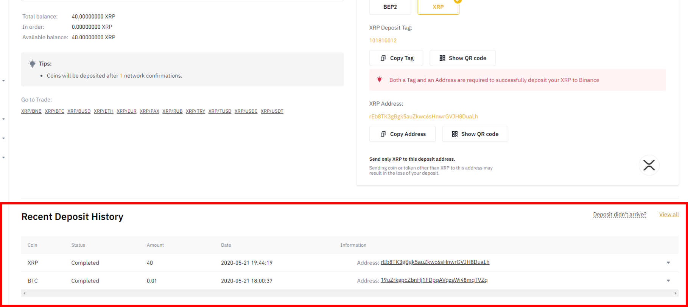
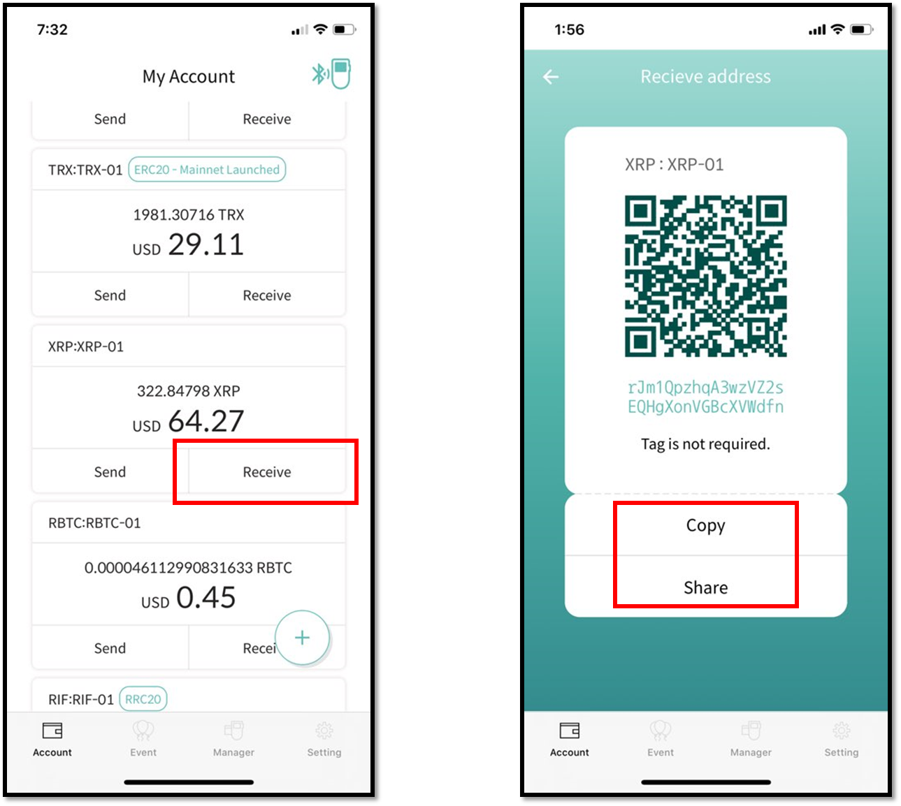
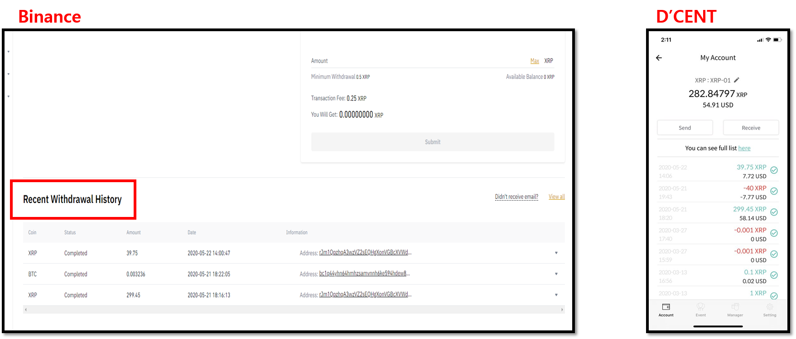

# Using Binance exchange for transfers (XRP example)

## Sending fund to your Binance wallet account

### Check the receiving address on Binance

To send cryptocurrency to your Binance account, you need to know the address. \
First, login to your Binance account and choose a wallet of your choice such as '**Spot Wallet**'.

1\) Select '**Deposit**'

2\) Select your cryptocurrency type from the drop down list (ie: **XRP**).

3\) Notice the 9-digit XRP Deposit Tag. **This Tag is absolutely required when sending fund to an exchange's wallet address**.&#x20;

4\) Also notice the XRP account address. This is the recipient address where you send the XRP fund to.

### Preparing for a Send transaction from D'CENT Wallet

Run the D'CENT mobile app on your phone and make sure your smartphone is connected together with the D'CENT Biometric Wallet.&#x20;

1\) From your cryptocurrency account(ie: XRP), press the '**Send**' button.\
\
2\) Press the '**QR scan**' button to scan the QR code presented by Binance. This will automatically enter the recipient address.

3\) You **MUST** enter the destination tag (or deposit tag) assigned to your XRP account by Binance exchange.

4\) When you have entered both the recipient address and the destination tag, press '**Next**' to continue.

5\) Enter the amount to send in either in XRP amount or by fiat value.

6\) Press '**Next**' to continue.

7\) Review the transaction details and press '**Send**' to continue.

8\) On your D'CENT Biometric Wallet, check the details and press the '**OK**' button to confirm. You will also need to **authenticate using either your fingerprint or PIN**.

9\) Once authenticated, your Send transaction will be broadcasted to the blockchain network.

10\) Go back to your Binance account and check that you have received the fund sent from your D'CENT Wallet. Look under the section '**Recent Deposit History**' for details of your transaction history.

## Sending fund to your D'CENT wallet account

### Check the receiving address on D'CENT wallet

To send cryptocurrency to your D'CENT wallet account, you need to know the address. \
From the mobile, press the '**Receive**' button to see the account address.

There are 2 options to copy your account address(in hex form):\
Option1) **Copy** - this will copy the address for pasting it to a message or email.\
Option2) **Share** - this will copy the address and give you an option to share it through a SNS app of choice if installed on your phone.

### Preparing for a Send transaction from your Binance account

Login to your Binance account, and click on '**Spot Wallet**'.

1\) Select '**Withdraw**'

2\) Select your cryptocurrency type from the drop down list (ie: **XRP**).

3\) Paste D'CENT account address into the line '**Recipient's XRP Address**'.

4\) Check enable the '**No Tag**' box. Note that private wallet such as D'CENT wallet does not have a destination tag.

5\) Enter the amount to send.

6\) Click the '**Submit**' button to continue.

If you have setup a second factor authentication, you will be asked to authenticate for the second time through a different channel. Below is an example of Google Authentication supported by Binance exchange.

7\) Confirm the 2nd authentication and your withdraw request will be processed by the Binance exchange.

8\) Check for status of your transaction from Binance. You can also check from D'CENT wallet.

