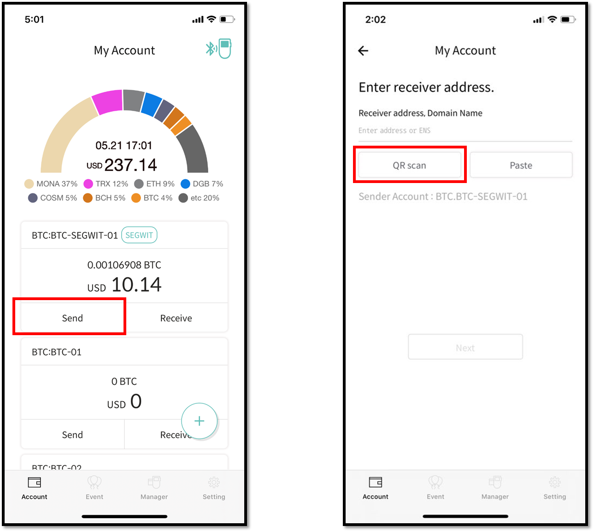
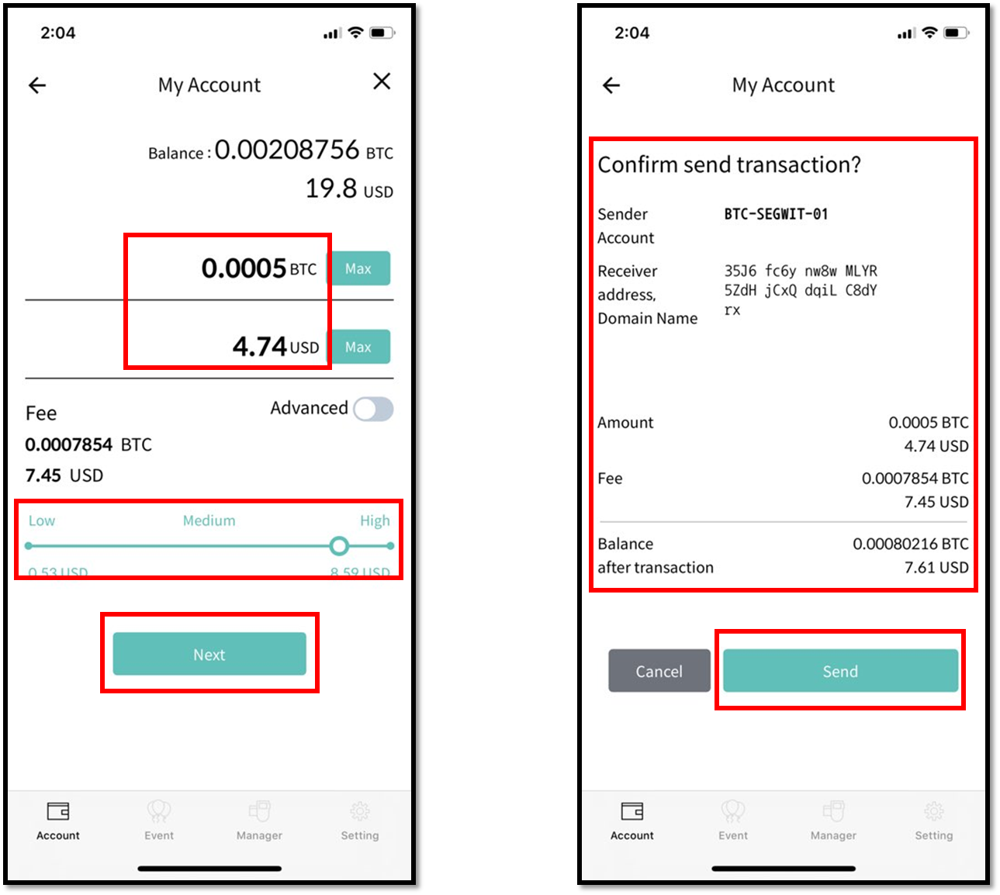
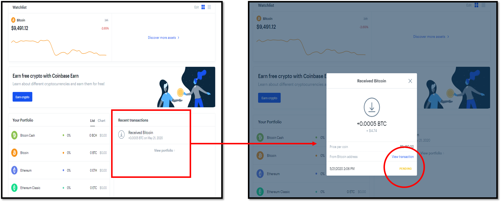

# Using Coinbase exchange for transfers (Bitcoin example)

## Sending fund to your Coinbase wallet account

### Check the receiving address on Coinbase

To send cryptocurrency to your Coinbase account, you need to know the address. \
First, login to your Coinbase account and then press the '**Receive**' button.

The picture below is an example of how Coinbase displays your account address, for example Bitcoin.\
The upper portion is the Bitcoin address shown in QR code and just below it is the same address in hex format.\
\
You can switch to a different cryptocurrency account by making your selection from the '**Currency**' section.

### Preparing for a Send transaction from D'CENT Wallet

Run the D'CENT mobile app on your phone and make sure you connect your phone together with the D'CENT Biometric Wallet.&#x20;

1\) From your cryptocurrency account(ie: Bitcoin), press the '**Send**' button.\
\
2\) Press the '**QR scan**' button to scan the QR code presented by Coinbase.

3\) If the QR code is read correctly, you will see that the recipient address has been entered automatically. It is always a good practice to double check the recipient address and make sure it is the correct address that you want to send fund to.\
\
4\) Press '**Next**' button to continue.


If the **'Next' button is disabled** while a red text message 'Address format is incorrect' is shown, this means that the address is incorrectly entered. Notice that there is extra '**bitcoin:**' text in the beginning of the address. If this ever happens, just delete the extra text and the 'Next' button will be enabled.


5\) Set the transaction fee first. Fee amount can be changed by using the slider button. If you set the fee to 'High', it is more likely that your transaction will be accepted with priority and processed faster by the blockchain network.

6\) Next, set the amount to Send. You can enter the number of cryptocurrency to send or enter the amount by the fiat value. If you intend to send the whole available amount, then just press the '**Max**' button.

7\) Press the '**Next**' button to continue.

8\) In the next screen, double check the transaction details of the recipient address and the sending amount. Press the '**Send**' button when details are correct.

&#x20;9\) On your D'CENT Biometric Wallet, check the details and press the '**OK**' button to confirm. You will also need to **authenticate using either your fingerprint or PIN**.

10\) Once authenticated, your Send transaction will be broadcasted to the blockchain network.

11\) Go back to your Coinbase account and check that you have received the fund sent from your D'CENT Wallet.&#x20;

From Coinbase, you can check the history of Recent Transactions. If the status is showing as 'PENDING', this means that your fund is still being processed by the blockchain network to get more confirmations. To view the detailed transaction history, you can click '**View Transaction**', which will open a new window redirecting you to the block explorer where you can check the status.

## Sending fund to your D'CENT wallet account

### Check the receiving address on D'CENT wallet

To send cryptocurrency to your D'CENT wallet account, you need to know the address. \
From the mobile, press the '**Receive**' button to see the account address.

There are 2 options to copy your account address(in hex form):\
Option1) **Copy** - this will copy the address for pasting it to a message or email.\
Option2) **Share** - this will copy the address and give you an option to share it through a SNS app of choice if installed on your phone.

### Preparing for a Send transaction from your Coinbase account

From your Coinbase account, press the '**Send**' button.

Below are the screenshots of Coinbase wallet interface.

1\) Enter the amount to send

2\) Paste in the D'CENT account address where '**To**' is shown.

3\) Write something on the '**Note**' section if you want to keep track of what the transaction was for (ie: dcentwallet).

4\) Press the '**Send**' button to continue.

5\) The second screenshot on the right will show the detailed information of the Send transaction that you are about to submit. Press the '**Send now**' button to continue.

6\) Enter the 2-step verification code from SMS that you received.

7\) Press '**Confirm**' button to submit the Send transaction request.
