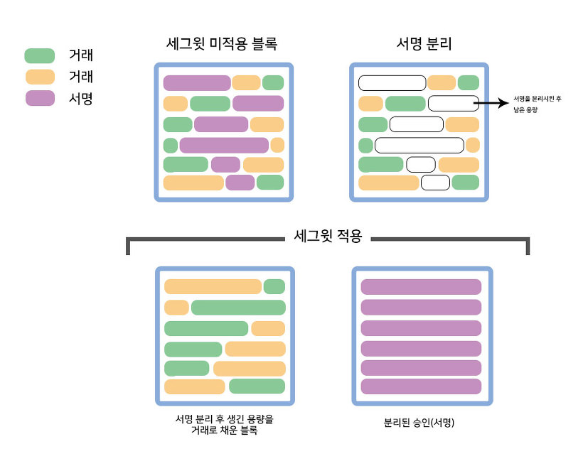

# 세그윗 (SegWit)

세그윗은 Segregated Witness의 약자로서, 직역하면 ‘분리된 증인’ 이라 할 수 있습니다. 세그윗은 거래 시 데이터 용량을 줄이기 위하여 거래기록의 서명부분만 따로 저장하는 방식입니다.

세그윗 채택 당시 비트코인 블록 사이즈의 포화로 전송 수수료가 지속적으로 오르는 상황이었기 때문에 거래 가변성을 원천 차단하는 보안 강화 효과보다 블록 사이즈 해소가 더 큰 주목을 받았습니다.&#x20;

비트코인 블록에서 서명은 의외로 많은 부분을 차지합니다. 블록에서 서명을 따로 저장하면 기존 서명이 차지한 자리만큼 공간이 늘어나므로 세그윗은 전자서명을 입력 값(Input)에 포함하지 않고 별도로 모아 1MB 블록을 따로 만들어서 저장합니다. 이렇게 하면 기존 비트코인이 사용하는 1MB 블록 영역에 서명 부분이 제외된 만큼 더 많은 거래를 담을 수 게 됩니다.

세그윗 도입으로 주요 네트워크는 일부 작업 처리 시간이 빠르게 단축 되었고 수수료 또한 낮아졌습니다.
