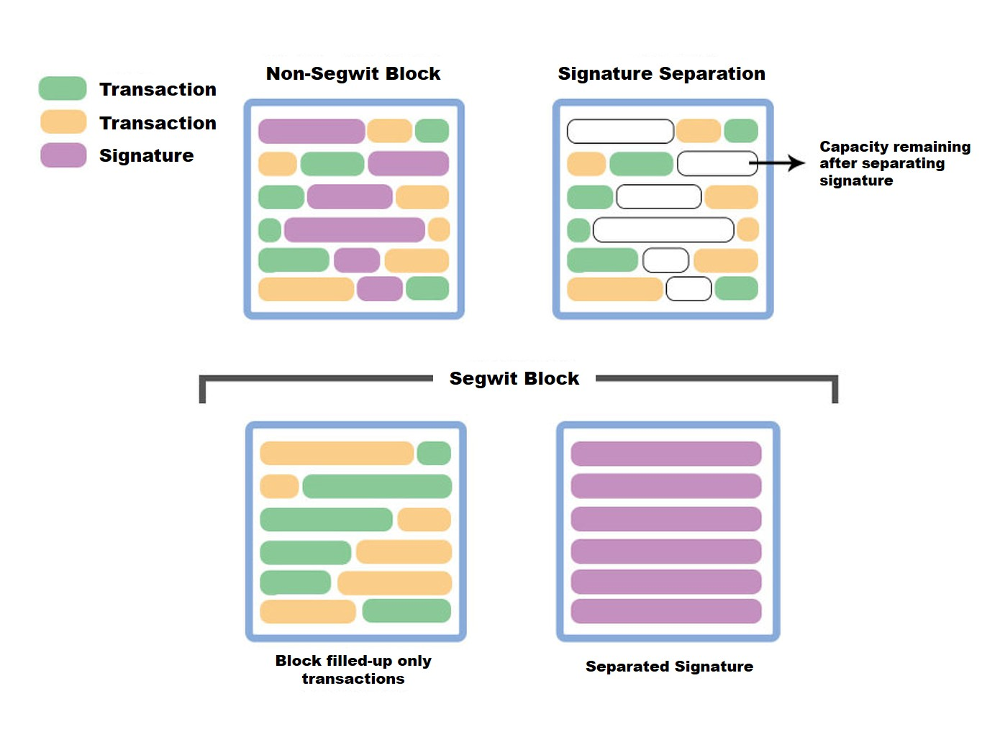

# SegWit

SegWit stands for Segregated Witness and, is a method of separately storing the signature part of the transaction record in order to reduce the data size stored in the block.

At the time SegWit was proposed, there were too many bitcoin transaction, it caused higher transaction fee. It was very important to solve bitcoin's block size limitation. This proposal has been adopted, 

Before adopting SegWit, the saturation of the bitcoin block size caused the transaction fee to continue to rise. A resolution to reduce the block size received greater attention than the security enhancement effect to prevent transaction volatility.

In Bitcoin blocks, signatures take up surprisingly large amount of data space. If you save the signature separately in the block, more transactions data can be included in the data space that was once previously occupied by the signature data. In SegWit block, digital signature is collected separately to save 1MB of data space in a block, this will allow adding more transactions into that data space.

With the introduction of SegWit, major networks have shortened the processing time of tasks and lowered the transaction fees.

