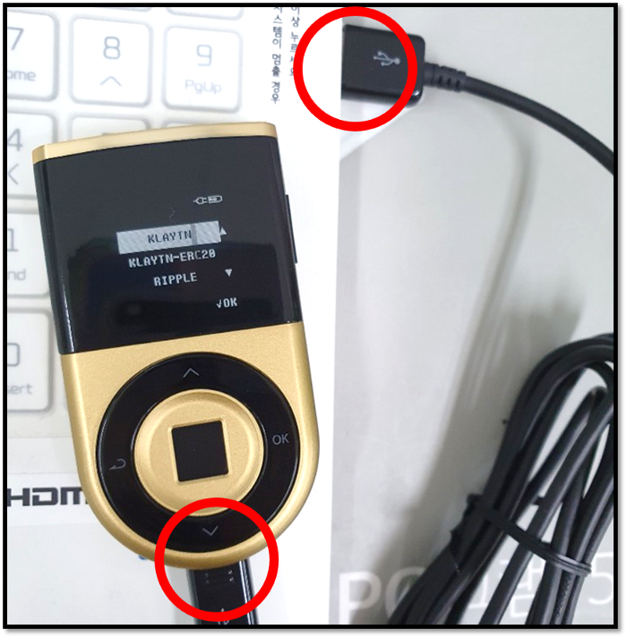
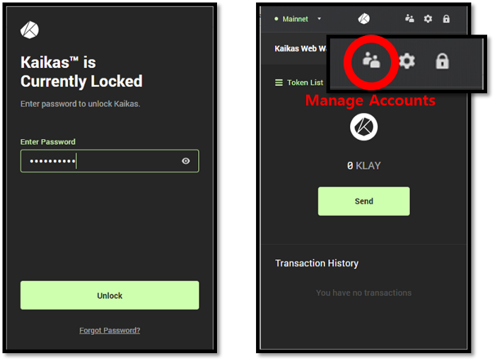
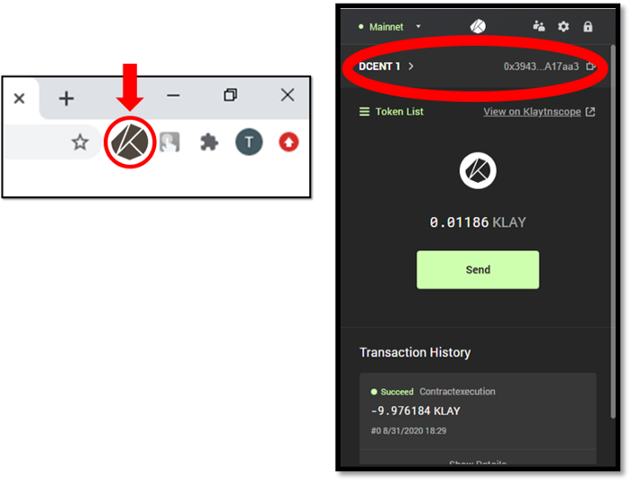

# Connect with Kaikas wallet extension

## Using Kaikas extension with Biometric wallet

Kaikas is a PC browser based extension wallet for the Klaytn platform. Users will be able to interact with the Kaikas wallet to perform Klaytn-based transactions including KLAY and BApps, while the owner verification and authorization are performed through biometric authentication on the D’CENT Biometric hardware wallet.

\[**Kaikas is available here**\]  
[Download Kaikas from Chrome Web Store](https://chrome.google.com/webstore/detail/kaikas/jblndlipeogpafnldhgmapagcccfchpi?h)  
[Download Kaikas from Firefox Add-on Store](https://addons.mozilla.org/ko/firefox/addon/kaikas/?src=search)

### How to connect Kaikas with Biometric wallet

**Step 1\)** Download and install the D’CENT bridge program on your PC. Installing the bridge program will enable communication between the PC browser and the hardware wallet.

\[**D’CENT bridge program**\]  
[Download D’CENT bridge program](https://bridge.dcentwallet.com/v2/download)

**Step 2\)** Plug in your D’CENT Biometric Wallet to the USB port on your PC and authenticate yourself to unlock the hardware wallet.

**Step 3\)** From your browser, click on the **Kaikas extension** icon.

**Step 4\)** Unlock Kaikas wallet and click the **Manage Accounts** icon on the top menu.

**Step 5\)** From the Manage Accounts screen, click on **Connect**. In the next screen, select **D’CENT** as your hardware wallet and click **Connect**.

**Step 6\)** From your browser, click on the **Kaikas extension** icon again to open the wallet service. You will notice that the ****Kaikas wallet now displays the **Klaytn account from the D’CENT Biometric Wallet.**


 You can always switch between multiple Klaytn wallet accounts by pressing the **Manage Accounts** icon.


