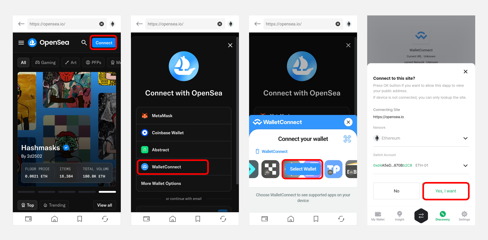

# How to connect to OpenSea

## Connecting from D'CENT mobile app's Dapp browser (Discovery)

Blockchain based Dapp services can be accessed via the **"Discovery"** Tab.

In case of Android, **"OpenSea"** can be found in the list.

For iOS, you will need to do a search by entering **"opensea"** in the search bar. From the search result, click on the [**OpenSea**](https://opensea.io/) site link.

.png)

Access the OpenSea website and click the **"Connect"** button at the top right.
\
Select **"WalletConnect",** then tap **"Select Wallet"** and click **"Yes, I want"** button.

<figure><figcaption></figcaption></figure>

OpenSea supports connections to various networks such as **Ethereum, Polygon, Base**, and **Optimism**.\
To switch to a different network, tap the network icon at the top right, click **"Switch"**, and then select the desired network.

.png)

## Connecting from PC (Using WalletConnect)

If you are accessing OpenSea site from a PC environment, you can use **"WalletConnect"** to connect with your account on D'CENT Wallet.&#x20;

From the OpenSea site, click the **"Connect"** button and select **"WalletConnect"**. A QR code will be displayed on your PC screen.

<figure><figcaption></figcaption></figure>

.png)

Open the D'CENT mobile app and tap the **QR code scan icon** at the top of the **"My Wallet"** or **"Discovery"** tab to scan the QR code shown on the PC screen. Your wallet will then be connected via WalletConnect.


Starting from D'CENT Mobile App version **v7.6.2 or higher**, you can also connect via the **"My Wallet"** tab using WalletConnect.


.png)

For more details on how to use WalletConnect, please refer to the user guide below.


[using-wallet-connect.md](../native-service/dapp-browser/using-wallet-connect.md)

