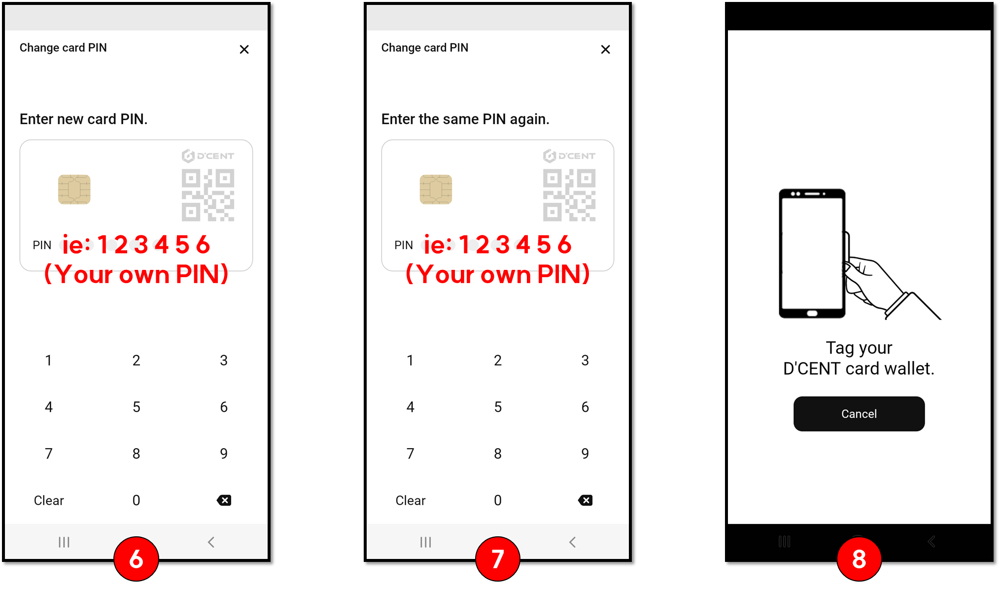

# 오픈씨에 연결하기

## 디센트 앱의 디앱 브라우저(디스커버리)를 통해 연결하기

오픈씨와 같은 블록체인 기반의 디앱 서비스는 디스커버리 탭을 통해서 접속이 가능합니다.

안드로이드의 경우 디스커버리 탭의 목록에 오픈씨가 있습니다.

아이폰의 경우 디스커버리 탭 상단의 검색란에 opensea를 입력하여 검색합니다. 검색된 결과에서 오픈씨를 찾아서 사이트에 접속합니다.

.png>)

오픈씨 사이트에 접속하면 자동으로 지갑 연결 요청의 메세지가 나타납니다. 일반적으로 대부분의 디앱 서비스에서는 이더리움 네트워크를 우선적으로 사용할 네트워크로 인식합니다.

이더리움이 아닌 다른 네트워크로 변경하여 지갑을 연결하려면 요청 메세지의 취소 버튼을 누르고 상단 오른쪽에 위치한 네트워크 아이콘을 클릭하여 원하는 네트워크를 선택하면 됩니다. &#x20;

 (1) (1).png>)

### 오픈씨 클레이튼 연결 문제 해결하는 방법

오픈씨에서는 현재(2022년 4월) 이더리움, 폴리곤, 및 클레이튼 네트워크 연결을 지원합니다.&#x20;

오픈씨에서 클레이튼 네트워크를 선택했을 때 지갑 연결이 정상적으로 인식되지 않는 문제가 발생하는 경우가 있습니다. 이를 해결하려면 아래와 같이 오픈씨 사이트를 책갈피(즐겨찾기)로 저장 후 해당 책갈피를 통해서 오픈씨에 접속하면 클레이튼 계정을 안정적으로 연결하실 수 있습니다.&#x20;

**(1)** 접속한 오픈씨 사이트에서 하단 메뉴에 위치한 **책갈피 아이콘**을 클릭하여 네트워크 설정에 “**Klaytn**”을 선택 후 **추가** 버튼을 클릭하여 저장합니다.

**(2)** 즐겨찾기에 추가한 오픈씨 (책갈피) 페이지를 클릭하여 사이트에 접속합니다.

**(3)** 오픈씨 사이트에서 클레이튼 지갑이 정상적으로 인식되었다면 지갑 연결 승인을 요청합니다.

## WalletConnect로 연결하기 (이더리움 / 폴리곤)

PC환경에서 오픈씨 사이트에 접속하는 경우 디센트 앱의 WalletConnect를 사용하면 디센트 지갑의 계정으로 연결할 수 있습니다. **현재 WalletConnect로 오픈씨 연결에 사용할 수 있는 네트워크는 이더리움과 폴리곤입니다.**

오픈씨 홈페이지에서 WalletConnect를 선택하면 QR코드를 표시해줍니다.

 (1) (1).png>)

디센트 앱의 디스커버리 탭에서 왼쪽 상단에 위치한 WalletConnect 아이콘을 클릭하면 핸드폰의 카메라 기능이 작동합니다. 카메라를 PC 모니터 화면을 향해 표시된 QR코드가 인식되면 WalletConnect를 통한 지갑 연결이 진행됩니다.

 (1).png>)

이더리움에서 폴리곤 네트워크로 변경이 필요하다면 디스커버리 탭 상단 오른쪽에 위치한 네트워크 아이콘을 클릭하여 폴리곤을 선택하고 WalletConnect를 사용하시면 됩니다.

## 카이카스와 연동하여 연결하기 (클레이튼 / 지문인증형 지갑)&#x20;

**PC환경에서 오픈씨 사이트에 접속하여 클레이튼 계정을 연결하려면 카이카스(크롬 연장 프로그램)와 디센트 지문인증형 지갑을 연동하여 사용할 수 있습니다.**

먼저 디센트 지문인증형 지갑과 카이카스를 연결해주세요. 연동 방법은 아래 사용자 가이드를 참고해주세요.


[kaikas.md](kaikas.md)


오픈씨 사이트에 접속한 후 지갑 연결하기에서 Kaikas를 선택합니다. 카이카스 지갑에서 서비스 연결 요청이 새 창으로 뜹니다. 내용을 읽어보시고 연결 버튼을 누릅니다.

 (1).png>)

연결이 완료되었다면 오픈씨 사이트 상단 오른쪽의 지갑 아이콘을 누르면 카이카스가 확인되고 디센트의 주소가 확인이 됩니다.

 (1).png>)
