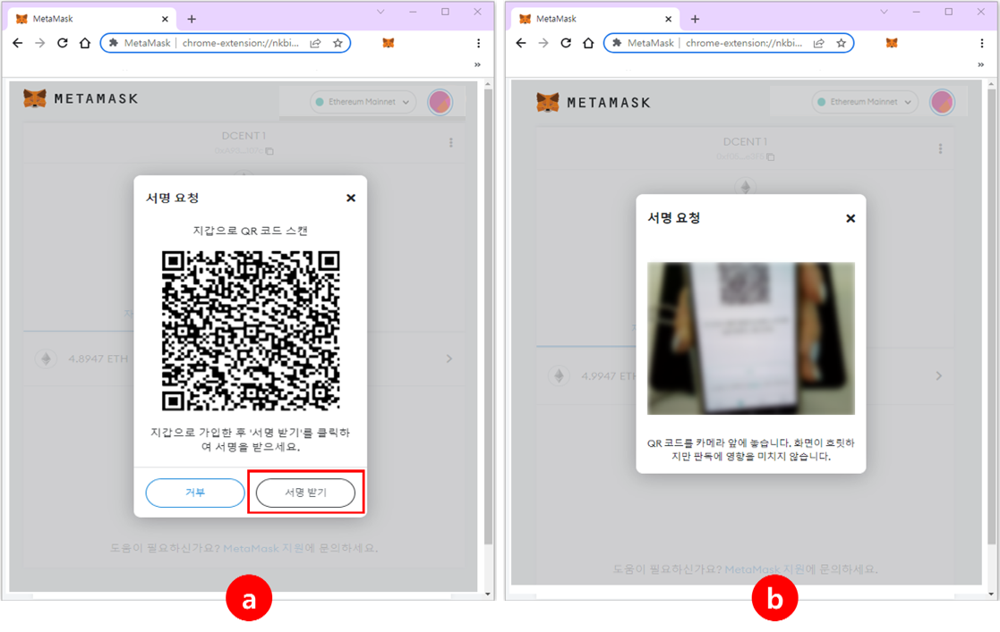

# How to connect to OpenSea

## Connecting from D'CENT Wallet's Dapp browser (Discovery)

Blockchain based Dapp services can be accessed via the Discover Tab.

In case of Android, OpenSea can be found in the list.

For iOS, you will need to do a search by entering "opensea" in the search bar. From the search result, click on the OpenSea site link.

.png>)

Once you land on the OpenSea site, a message will be displayed asking for approval for connection. In general, most Dapp sites prioritize recognizing Ethereum address as the wallet account to connect with.

If you need to choose a different network to connect to the site, press the cancel button on the message and click on the network icon located at the top-right corner to select the network of your choice.

.png>)

### How to bypass Klaytn connection issue at OpenSea site

Currently(April 2022), OpenSea supports connection to Ethereum, Polygon, and Klaytn networks.

When using Klaytn network with OpenSea site, you may experience that Klaytn address does not get recognized well, resulting in inability to connect wallet. To solve this issue, you can bookmark the visiting OpenSea page to add the site to your Favorites list. By accessing OpenSea site through the bookmark, you can stably connect Klaytn account with OpenSea.

 (1).png>)

**(1)** At OpenSea site, click on the **bookmark icon** located at the bottom menu. Set the network as “**Klaytn**” and click on **Add** button to save.

**(2)** Under Favorites, click on the OpenSea bookmarked page.

**(3)** At OpenSea site, Klaytn wallet connection will be triggered.

## Using WalletConnect (Ethereum / Polygon)

If you are accessing OpenSea site from a PC environment, you can use WalletConnect to connect with your account on D'CENT Wallet. **Currently, WalletConnect supports Ethereum and Polygon networks to connect with OpenSea.**&#x20;

From the OpenSea site, click on WalletConnect to see a screen with QR code.&#x20;

.png>)

On the top-left corner of the Discovery Tab, click on the WalletConnect icon to activate the camera function on your phone. Point your camera to the PC monitor screen to read the QR code. Once recognized, WalletConnect will proceed to connect your D'CENT wallet account with OpenSea.

If you need to change the network from Ethereum to Polygon, click on the network icon located at the top-right corner to change. Then, use WalletConnect to connect your Polygon account with OpenSea.

## Using Kaikas (Klaytn / Biometric Wallet)&#x20;

**From a PC environment, you can use Kaikas (Chrome extension program) together with Biometric Wallet to connect Klaytn account with OpenSea.**

First, connect your Biometric wallet with Kaikas. Detailed instructions can be found in the User Guide below.


[kaikas.md](kaikas.md)


Go to the OpenSea site and click on the Wallet icon and select Kaikas from the list. From Kaikas wallet, you will see a pop-up message asking for approval on connecting to this site. Read all details and press **Connect(OK)** button.&#x20;

Once connection is successful, click on the wallet icon located at the top-right corner of the OpenSea site. Here, you will see that wallet used to connect is Kaikas and your D'CENT Klaytn account address.&#x20;

